# CryptoLab

CryptoLab 是一个基于 **Rust PyO3 + FastAPI + React** 的密码算法实验平台，用手写 Rust 密码原语支撑可审计的 Web API、教学可视化界面、漏洞演示和综合安全文件传输场景。

**License:** MIT · **Rust:** 1.75+ · **Python:** 3.11+ · **Frontend:** React 18 + Vite

## 项目亮点

- **Rust 手写核心算法**：`rust_core/` 实现 AES、SM4、RC6、SHA、HMAC、PBKDF2、Base64、UTF-8、RSA、ECC、ECDSA 等能力，并通过 PyO3 暴露 `cryptolab_core`。
- **完整服务化链路**：FastAPI 将 Rust 扩展包装为 `/api/v1/*` REST API，包含 JWT、限流、审计、密钥存储和统一响应模型。
- **React 教学界面**：`frontend/` 是 React 18 + Vite + Tailwind + Radix UI 前端，包含 Dashboard、Symmetric、Hash、Encoding、RSA/ECC、Keys、Audit、Benchmark、Demos、Scenarios 等页面。
- **安全工程实践**：密钥材料经 HKDF-SHA256 派生 KEK 后用 AES-256-GCM 信封加密落库；敏感比较使用常时间比较；审计日志只存摘要和元数据。
- **可验证交付**：已有 Rust 单测、API 测试、交叉验证矩阵、AES verbose FIPS 197 对照、前端 TypeScript/build 验证记录、27 张前端截图和 Fig.1-Fig.6 报告图表资产。

## 项目展示

以下图片均来自仓库内 `docs/report_assets/`，用于展示当前真实界面与报告材料；完整索引见 [SCREENSHOT_INDEX.md](./docs/report_assets/SCREENSHOT_INDEX.md) 和 [FIGURE_INDEX.md](./docs/report_assets/FIGURE_INDEX.md)。

| Dashboard | AES-GCM 加密 |
| --- | --- |
| 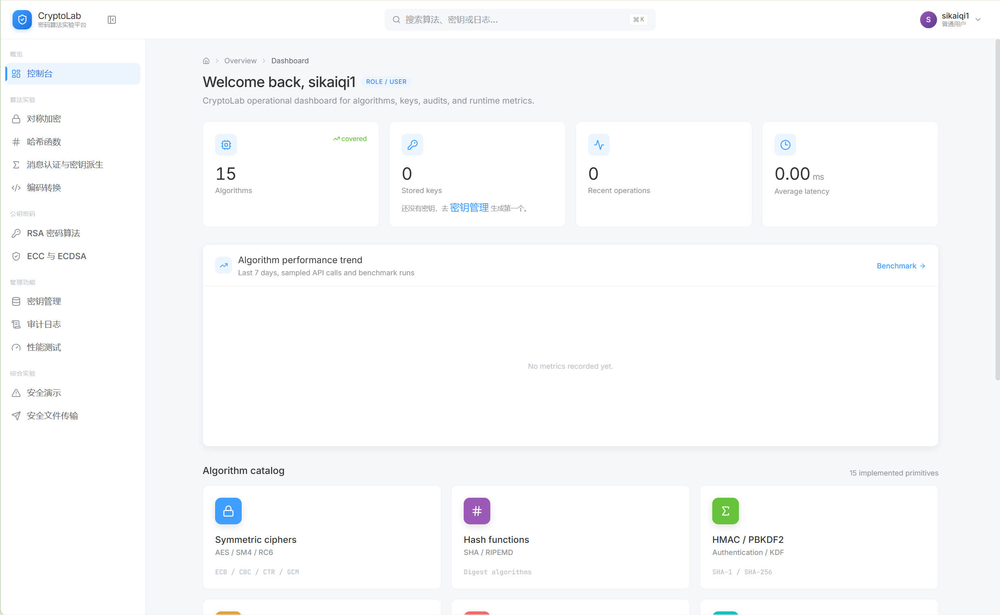 | 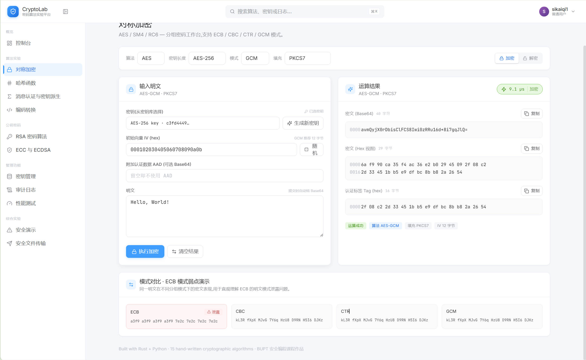 |

| 漏洞 Demo | 审计详情 |
| --- | --- |
| 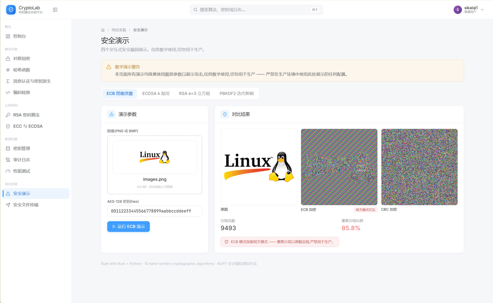 | 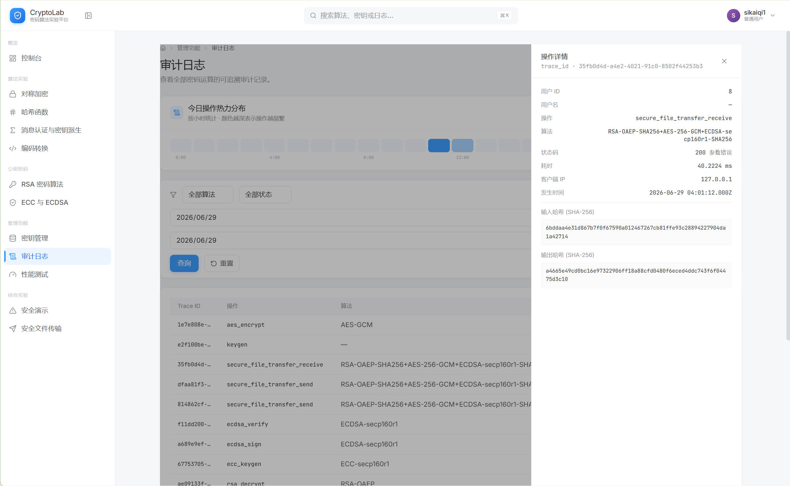 |

## 系统架构

系统设计相关图已归档到 [docs/report_assets/system_design/](./docs/report_assets/system_design/)，其中六层架构图来自报告第 2 章设计材料。

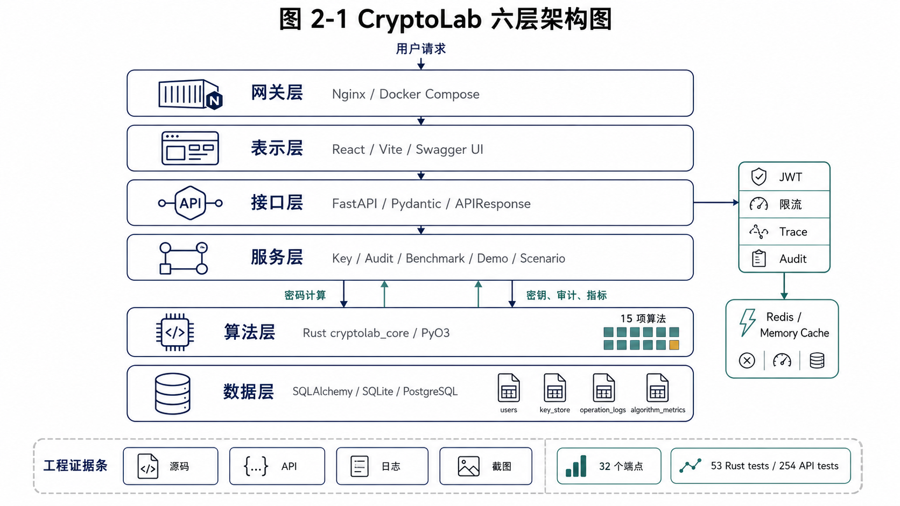

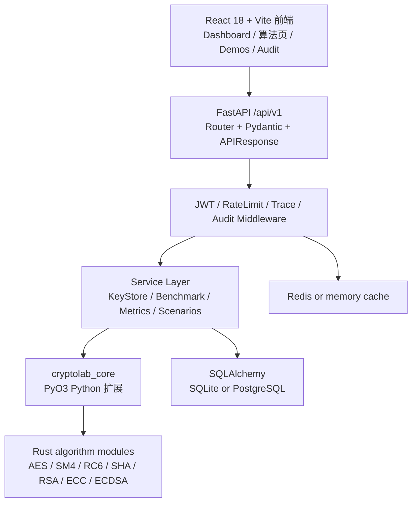

```text
React 18 views
  -> frontend/src/api/*.ts
  -> HTTP /api/v1/...
  -> FastAPI routers + Pydantic schemas
  -> service layer: auth / key store / audit / metrics / orchestration
  -> import cryptolab_core
  -> PyO3 bindings in rust_core/src/ffi.rs
  -> Rust algorithm modules in rust_core/src/*
  -> SQLAlchemy models + PostgreSQL/SQLite, Redis or memory cache
```

部署视角采用六层结构：

```text
L6  React 18 + Vite + Tailwind + Radix UI / Swagger UI
L5  Nginx reverse proxy and static frontend hosting
L4  FastAPI + JWT + Pydantic + unified APIResponse
L3  Services: key wrapping, audit, metrics, demos, scenarios
L2  Rust cryptolab_core exposed through PyO3
L1  PostgreSQL/SQLite persistence + Redis/memory cache
```

更多系统设计图：

| 图 | 内容 |
| --- | --- |
| [数据库实体关系图](./docs/report_assets/system_design/fig2_2_database_entity_relationship.png) | `users`、`key_store`、`operation_logs`、`algorithm_metrics` 与密钥封装关系 |
| [请求信任边界与数据流](./docs/report_assets/system_design/fig2_3_trust_boundary_data_flow.png) | JWT、限流、鉴权、schema 校验、service、Rust core 和审计写入 |
| [JWT 鉴权与黑名单时序](./docs/report_assets/system_design/fig5_1_jwt_blacklist_sequence.png) | 登录签发、受保护访问、登出拉黑和 Redis/memory cache |
| [请求-响应链路数据流](./docs/report_assets/system_design/fig5_2_request_response_data_flow.png) | trace_id、状态码、输入/输出 hash、审计记录和统一响应 |
| [安全文件传输协议序列](./docs/report_assets/system_design/secure_file_transfer_sequence.png) | AES-GCM、SHA-256、ECDSA、RSA-OAEP 组合流程 |

## 功能矩阵

| 模块 | 当前能力 |
| --- | --- |
| 认证 | 注册、登录、登出、`/auth/me`，JWT HS256，登出 jti 黑名单 |
| 对称加密 | AES/SM4/RC6 keygen、加密、解密；AES/SM4 支持 ECB/CBC/CTR/GCM，RC6 支持 ECB/CBC |
| AES verbose | AES + ECB + 单 16 字节分组加密 trace，返回每轮状态、轮密钥和计时信息 |
| Hash | SHA1、SHA224、SHA256、SHA384、SHA512、SHA3-256、SHA3-512、RIPEMD160 |
| HMAC/KDF | HMAC-SHA1、HMAC-SHA256、PBKDF2-HMAC-SHA256 |
| 编码 | Base64 encode/decode，UTF-8 encode/decode |
| 公钥密码 | RSA-1024 OAEP/PSS，ECC secp160r1 keygen，ECDSA sign/verify |
| 密钥管理 | 用户级 key store、KEK 信封加密、列出密钥、导出公钥、软删除 |
| 审计 | trace_id、用户、算法、状态码、耗时、输入/输出摘要等元数据查询 |
| 漏洞 Demo | ECB 图片泄露、ECDSA k 复用、RSA e=3 低指数、PBKDF2 迭代影响 |
| 综合场景 | secure file transfer：RSA-OAEP 包装会话密钥、AES-GCM 加密文件、SHA-256 摘要、ECDSA 签名 |
| Benchmark | 支持 AES/SM4/RC6、Hash、HMAC、PBKDF2、RSA、ECC/ECDSA 的进程内小型测量 |
| Metrics | `algorithm_metrics` 采样记录和 `/api/v1/metrics` 查询，Dashboard 展示趋势图 |

## 算法覆盖清单

| 类别 | 覆盖 |
| --- | --- |
| 对称密码 | AES-128/192/256，SM4，RC6 |
| 分组模式 | ECB，CBC，CTR，GCM；RC6 当前限制为 ECB/CBC |
| 填充 | PKCS7，Zero，ANSI X9.23，None |
| Hash | SHA1，SHA224，SHA256，SHA384，SHA512，SHA3-256，SHA3-512，RIPEMD160 |
| MAC/KDF | HMAC-SHA1，HMAC-SHA256，PBKDF2-HMAC-SHA256 |
| 编码 | Base64，UTF-8 |
| 公钥 | RSA-1024，OAEP 加密，PSS 签名，ECC secp160r1，ECDSA |
| 教学/演示 | AES round trace，ECB leak，ECDSA nonce reuse，raw RSA e=3，PBKDF2 iteration timing |

## 技术栈

| 层 | 技术 |
| --- | --- |
| Rust core | Rust 1.75，PyO3 0.20，num-bigint，subtle，rand/OsRng，zeroize，serde |
| API | Python 3.11，FastAPI 0.110，Pydantic 2.6，SQLAlchemy 2.0，Alembic，PyJWT，Redis，structlog |
| Frontend | React 18.3，Vite 6.3，TypeScript 5.7，Tailwind CSS 4.1，Radix UI，axios，Recharts |
| 数据与部署 | PostgreSQL/SQLite，Redis 或 memory cache，Docker Compose，Nginx |
| 测试验证 | cargo test，pytest，cryptography/gmssl/hashlib/base64 交叉验证，TypeScript build |

## 目录结构

```text
CryptoLab/
├── rust_core/                  # Rust 原语与 PyO3 扩展 cryptolab_core
│   ├── Cargo.toml
│   └── src/
│       ├── ffi.rs              # Python 绑定入口
│       ├── symmetric/          # AES, SM4, RC6
│       ├── hash/               # SHA, RIPEMD, HMAC, PBKDF2
│       ├── encoding/           # Base64, UTF-8
│       ├── pubkey/             # RSA, ECC, ECDSA, demos
│       ├── modes/              # ECB, CBC, CTR, GCM
│       └── bigint/             # 公钥算法所需大数辅助
├── api_server/                 # FastAPI 服务端
│   ├── app/
│   │   ├── routers/            # auth, symmetric, hash, encoding, pubkey, ...
│   │   ├── schemas/            # Pydantic DTO
│   │   ├── services/           # 业务编排、密钥、审计、metrics、demo
│   │   ├── middleware/         # trace, rate limit, JWT, audit
│   │   ├── models/             # users, key_store, operation_logs, algorithm_metrics
│   │   └── core/               # config, security, KEK, exceptions
│   ├── alembic/
│   └── tests/
├── frontend/                   # React 18 + Vite + Tailwind + Radix UI
│   └── src/
│       ├── api/                # axios client and typed API calls
│       ├── views/              # 12 个 API-backed 页面
│       ├── components/         # Shell and shared UI components
│       └── stores/             # auth state
├── docs/                       # 交叉验证、AES verbose、截图材料
├── scripts/                    # env/setup/build/test/bench 脚本
├── deploy/                     # Dockerfiles, docker-compose, nginx
├── benchmarks/                 # benchmark 文档与预留目录
├── CLAUDE.md                   # 项目状态快照
└── README.md
```

## 快速启动

Windows PowerShell 是当前工作区的优先启动方式。每个新终端都先加载项目内隔离环境：

```powershell
cd D:\Nnutural\Desktop\BUPT_6\SecureProgrammingTechnologyandCaseDevelopment\期中作业\CryptoLab
. .\scripts\env.ps1
```

首次安装依赖：

```powershell
powershell -ExecutionPolicy Bypass -File .\scripts\setup.ps1
```

构建 Rust Python 扩展：

```powershell
powershell -ExecutionPolicy Bypass -File .\scripts\build-rust.ps1
```

应用数据库迁移：

```powershell
cd api_server
alembic upgrade head
cd ..
```

启动 API：

```powershell
uvicorn app.main:app --reload --app-dir api_server
```

启动前端：

```powershell
cd frontend
npm run dev
```

常见地址：

- API health check: `http://127.0.0.1:8000/health`
- OpenAPI docs: `http://127.0.0.1:8000/docs`
- Vite frontend: `http://127.0.0.1:5173`

## 常用命令

| 任务 | PowerShell |
| --- | --- |
| 加载隔离环境 | `. .\scripts\env.ps1` |
| 首次安装 | `powershell -ExecutionPolicy Bypass -File .\scripts\setup.ps1` |
| 构建 Rust 扩展 | `powershell -ExecutionPolicy Bypass -File .\scripts\build-rust.ps1` |
| Rust 测试 | `cargo test --manifest-path rust_core/Cargo.toml` |
| Rust release 测试 | `cargo test --manifest-path rust_core/Cargo.toml --release` |
| Rust lint | `cargo clippy --manifest-path rust_core/Cargo.toml --all-targets -- -D warnings` |
| Rust format | `cargo fmt --manifest-path rust_core/Cargo.toml --all` |
| 启动 API | `uvicorn app.main:app --reload --app-dir api_server` |
| API 测试 | `pytest api_server/tests -q` |
| API lint/types | `ruff check api_server; mypy api_server/app` |
| 启动前端 | `cd frontend; npm run dev` |
| 前端构建 | `cd frontend; npm run build` |
| 前端类型检查 | `cd frontend; npx tsc --noEmit` |
| 全量测试脚本 | `powershell -ExecutionPolicy Bypass -File .\scripts\test-all.ps1` |
| Benchmark 脚本 | `powershell -ExecutionPolicy Bypass -File .\scripts\bench.ps1` |
| Docker stack | `docker compose -f deploy/docker-compose.yml up -d` |

> 说明：`scripts/setup.ps1` 的提示文本仍保留早期兼容说明；当前 README 以源码、测试和最新 Workout 记录为准。

## API 模块概览

所有业务 API 默认挂载在 `/api/v1`。

| 模块 | 路径 | 说明 |
| --- | --- | --- |
| Auth | `/auth/register`, `/auth/login`, `/auth/logout`, `/auth/me` | 用户与 JWT |
| Symmetric | `/symmetric/keygen`, `/symmetric/{aes|sm4|rc6}/encrypt`, `/decrypt` | key_id 模式对称加解密，verbose 仅限 AES/ECB/16 bytes |
| Hash | `/hash/{algo}`, `/hash/hmac/{algo}`, `/hash/pbkdf2` | 摘要、HMAC、PBKDF2 |
| Encoding | `/encoding/base64/{encode|decode}`, `/encoding/utf8/{encode|decode}` | 编码转换 |
| Pubkey | `/pubkey/rsa/*`, `/pubkey/ecc/keygen`, `/pubkey/ecdsa/*` | RSA、ECC、ECDSA |
| Keys | `/keys`, `/keys/{key_id}/public`, `DELETE /keys/{key_id}` | 密钥列表、公钥导出、软删除 |
| Audit | `/audit/logs` | 操作日志查询 |
| Demos | `/demos/ecb_image_leak`, `/ecdsa_k_reuse`, `/rsa_low_exponent`, `/pbkdf2_iteration_impact` | 漏洞演示 |
| Scenarios | `/scenarios/secure_file_transfer/send`, `/receive` | 安全文件传输 |
| Benchmark | `/benchmark/{algo}` | 进程内算法测量，需登录 |
| Metrics | `/metrics` | 查询 algorithm_metrics 趋势数据，需登录 |

当前 `benchmark_service.py` 支持的参数包括：

```text
aes, aes_ecb, aes_gcm, sm4, sm4_ecb, rc6, rc6_ecb,
sha1, sha256, sha512, sha3_256, ripemd160,
hmac, hmac_sha256, pbkdf2,
rsa_keygen, rsa_encrypt, rsa_enc, rsa_decrypt, rsa_dec, rsa_sign, rsa_verify,
ecc_keygen, ecdsa_keygen, ecdsa_sign, ecdsa_verify
```

## 安全设计

- **JWT 鉴权**：`api_server/app/core/security.py` 签发和校验 HS256 access token，包含 `sub`、`exp`、`iat`、`jti`；登出后 jti 进入 Redis/memory blacklist。
- **限流**：`RateLimitMiddleware` 依赖 Redis 或内存 cache 做固定窗口限流，登录等高风险路径可使用更严格阈值。
- **审计**：`AuditMiddleware` 记录 trace_id、用户、路径、算法、状态码、耗时、摘要等元数据，不记录明文、密钥、JWT 或私钥材料。
- **KEK 与密钥封装**：`CRYPTOLAB_MASTER_KEY_HEX` 经 HKDF-SHA256 派生 32 字节 KEK；密钥材料落库前使用 Rust AES-256-GCM 加密，key UUID bytes 作为 AAD。
- **常时间比较**：Python 密码校验使用 `hmac.compare_digest`；Rust 侧引入 `subtle` 用于 MAC/tag/signature/digest 等敏感比较场景。
- **安全随机数**：Rust 使用 OS CSPRNG，Python 使用 `secrets` 生成密钥、IV、盐和测试材料。
- **生产路径与 demo 隔离**：RSA 正常路径使用 OAEP/PSS 和 e=65537；raw RSA/e=3、ECDSA 固定 k 等只位于 `/demos/*` 教学路径。
- **输入边界**：Pydantic schema 校验算法、模式、padding、key_id、Base64/hex、IV 长度和 PBKDF2 参数范围。

## 测试与验证结果

最新 Workout 记录显示当前工程已完成以下验证；这些是本仓库本地验收记录，不等同于持续集成承诺。

| 验证项 | 记录结果 |
| --- | --- |
| Rust release tests | `cargo test --manifest-path rust_core/Cargo.toml --release`: 53 passed, 3 ignored |
| API tests | `pytest api_server/tests/ -q`: 254 passed, 1 deselected |
| Cross validation | `pytest api_server/tests/test_cross_validation.py -v`: 135 passed |
| AES verbose tests | `pytest api_server/tests/test_aes_verbose.py -v`: 8 passed |
| Frontend smoke test | `npm test`: `tsc -b --pretty false` 退出码 0 |
| Frontend typecheck | `npx tsc --noEmit`: 0 errors |
| Frontend build | `npm run build`: 成功，仅 Vite chunk size warning |
| Rust extension | `scripts/build-rust.ps1` 通过，`cryptolab_core` 可导入 |
| API health | 临时 Uvicorn `/health`: 200 |
| Alembic | current `0002_algorithm_metrics (head)`，upgrade/downgrade 往返通过 |
| Docker | `docker compose config` 可解析；Docker build 当前只有失败日志，不写作成功 |

交叉验证矩阵见 [docs/cross_validation_matrix.md](./docs/cross_validation_matrix.md)。AES verbose 的 FIPS 197 对照说明见 [docs/verbose_mode.md](./docs/verbose_mode.md)。

API 测试建议使用项目虚拟环境执行：

```powershell
api_server\.venv\Scripts\python.exe -m pytest --tb=no -q
```

裸 `pytest` 可能因为未加载项目依赖而失败；这属于运行环境差异，不代表 `.venv` 下的历史 API 验收结果失效。

## 报告与可视化资产

当前 35 页 PDF 报告材料已整理到 `docs/report/` 和 `docs/report_assets/`。其中 [FINAL_REPORT.md](./docs/report/FINAL_REPORT.md) 是主稿，[STATS.md](./docs/report_assets/STATS.md) 汇总源码、端点、测试、Docker 和截图统计；Fig.1-Fig.6 是实验统计图，系统设计图位于 [system_design/](./docs/report_assets/system_design/)。

| Fig.1 验证总览 | Fig.2 算法覆盖 | Fig.3 交叉验证 |
| --- | --- | --- |
| 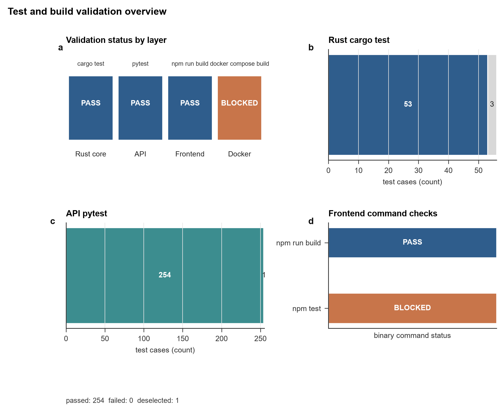 | 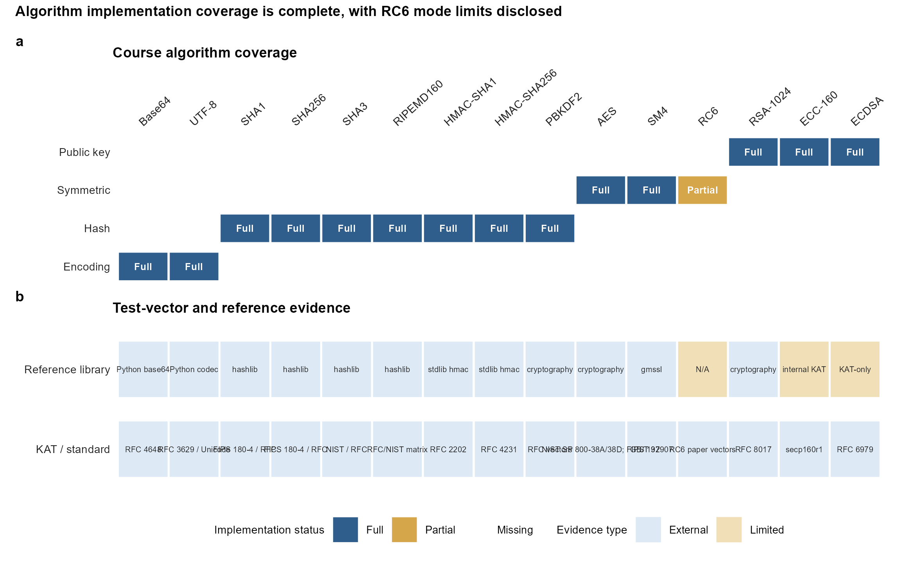 | 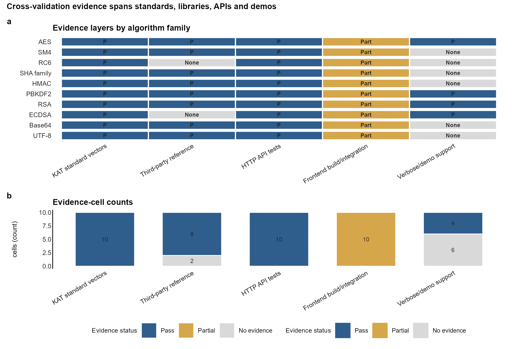 |

| Fig.4 Benchmark | Fig.5 AES verbose | Fig.6 安全 Demo |
| --- | --- | --- |
| 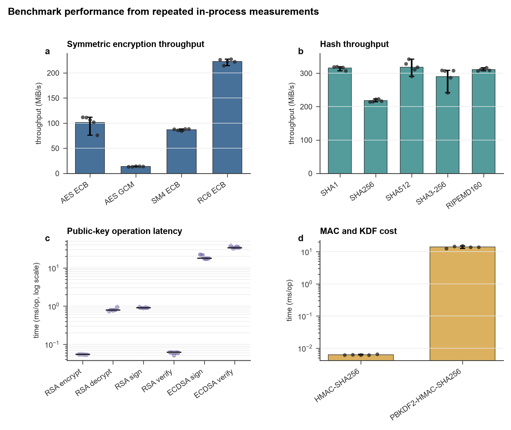 | 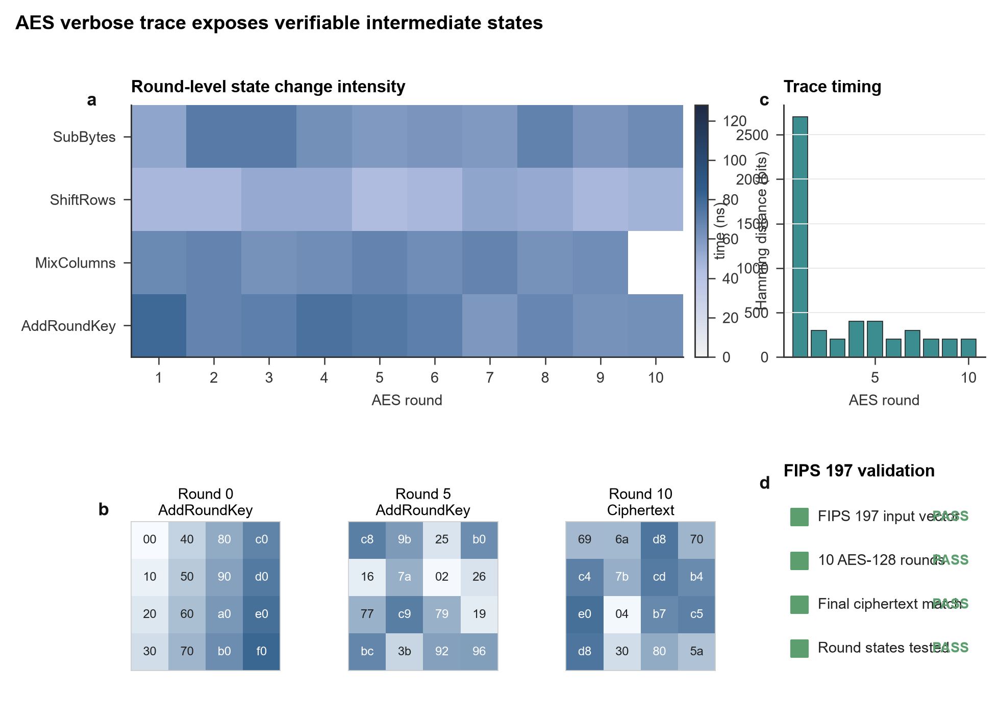 | 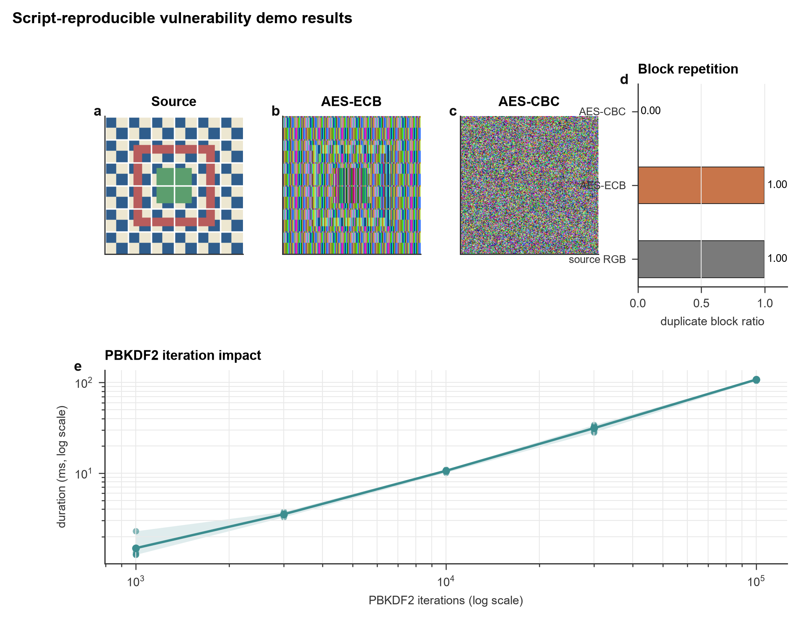 |

> 说明：`FIGURE_INDEX.md` 明确 Fig.1-Fig.6 是实验数据图；架构、ER、信任边界、JWT 时序和请求链路图单独归档在 `docs/report_assets/system_design/`。

## 特色功能

### AES verbose mode

AES verbose 是教学路径，不是普通加密 API 的通用开关。它只支持 AES + ECB + 单个 16 字节明文分组。后端返回每轮 `SubBytes`、`ShiftRows`、`MixColumns`、`AddRoundKey` 后状态、轮密钥和计时信息；普通加密路径保持不变，并且 verbose trace 不进入 audit log 或 metrics。

### 漏洞 demo

`/api/v1/demos` 提供四类教学演示：

- ECB 图像模式泄露
- ECDSA k 复用恢复私钥
- RSA e=3 低指数短消息恢复
- PBKDF2 迭代次数对耗时的影响

这些端点用于展示风险，不能作为生产加密路径复用。

### Secure file transfer

安全文件传输场景串联 RSA-OAEP、AES-GCM、SHA-256、ECDSA 和 Base64：

```text
sender file
  -> random AES-256 session key
  -> AES-GCM encrypt file
  -> SHA-256 digest
  -> ECDSA sign digest
  -> RSA-OAEP wrap session key with receiver public key
  -> envelope
  -> receiver unwraps key, verifies GCM tag and ECDSA signature
```

### Metrics dashboard

算法调用可按采样率写入 `algorithm_metrics`；benchmark 强制记录。`/api/v1/metrics` 支持按算法、操作和时间范围查询，Dashboard 通过 Recharts 展示性能趋势。

## 已知限制与后续工作

- Benchmark 是进程内小型测量，适合课程展示和趋势对比，不等同于严谨微基准或压测结果。
- `benchmark_service.py` 已覆盖多个算法分支，但并未覆盖所有模式、padding 和公钥组合。
- RC6 当前仅支持 ECB/CBC；GCM 在 schema 层对 RC6 禁用。
- RSA 当前按课程要求使用 1024-bit 演示参数；真实生产系统应使用更高安全强度并依赖成熟密码库。
- `frontend/fontend-figmamake/` 是设计生成资产目录，实际前端入口是 `frontend/src/`。
- AES verbose 的前端截图 `P0_03_frontend_symmetric_aes_verbose_trace.png` 当前仍未归档；仓库已提供 `docs/report_assets/figures/fig5_aes_verbose_trace.png` 和 `docs/aes_verbose_trace_fips197.json` 作为 Rust/API 层过程证据。
- API 文档、数据库、测试和 Docker 截图仍以日志证据为主；截图索引中保留人工补拍项。
- 浏览器自动化截图在 Workout 记录中曾受本机 Chrome/Playwright 权限限制，前端以 TypeScript 检查、生产构建和真实数据源作为替代验证。
- 后续可继续扩展 benchmark 覆盖、端到端 UI 测试、Docker 全栈验收和更多标准测试向量。

## 许可证

MIT — 详见 [LICENSE](./LICENSE)。
