# CryptoLab：基于 Rust × Python 异构架构的密码算法工程实现与安全分析

## 摘要

密码算法课程作业常停留在单算法脚本和静态输出层面，难以体现真实工程中的内存安全、接口契约、密钥保护和可观测性问题。针对这一问题，CryptoLab 采用 Rust × Python 异构架构：底层以 Rust 实现 15 项编码、哈希、对称加密和公钥密码算法，通过 PyO3 暴露给 FastAPI 服务层，并以 SQLAlchemy、React/Vite 和审计日志形成可调用、可展示、可验证的实验平台。根据项目统计，当前 14 项算法为已完成状态，RC6 为部分完成状态；系统提供 32 个 API 端点，Rust 测试记录为 `53 passed, 0 failed, 3 ignored`，API `.venv` 测试记录为 `254 passed, 1 deselected`。报告进一步整合前端截图、benchmark 图、标准向量、交叉验证矩阵和安全 demo，说明系统不仅能返回密码结果，也能呈现 AES verbose、ECDSA `k` 复用、ECB 泄露和安全文件传输等过程证据。上述工作表明，CryptoLab 将课程算法实现扩展为具备分层设计、测试证据、接口调用和安全分析的工程化交付物。

**关键词**：密码算法工程；Rust；PyO3；FastAPI；AES；SM4；RSA；ECDSA；HMAC；PBKDF2；安全审计

## Abstract

Course projects on cryptographic programming often focus on isolated algorithms and final outputs, leaving implementation risks such as memory safety, API contracts, key protection, and observability underexplored. CryptoLab addresses this gap with a heterogeneous Rust × Python architecture. Its Rust core implements 15 encoding, hashing, symmetric, and public-key algorithms, exposes them to Python through PyO3, and integrates them with FastAPI, SQLAlchemy, React/Vite, and audit logging. Project evidence shows that 14 algorithms are complete, RC6 is partially complete because only ECB/CBC are exposed, 32 API endpoints are available, Rust tests report `53 passed, 0 failed, 3 ignored`, and API tests in the project virtual environment report `254 passed, 1 deselected`. The report combines standard vectors, cross-validation matrices, frontend screenshots, benchmark figures, and security demos to show not only cryptographic outputs but also process-level evidence such as AES verbose traces, ECDSA nonce-reuse recovery, ECB leakage, and secure file transfer. The result is an engineering-oriented deliverable that connects algorithm implementation with system design, verification, API invocation, and security analysis.

**Keywords**: cryptographic engineering; Rust; PyO3; FastAPI; AES; SM4; RSA; ECDSA; HMAC; PBKDF2; security audit
# 第 1 章 引言

## 1.1 研究背景与意义

密码算法的安全性通常由两个层面共同决定：首先是算法、模式和协议本身是否具有可证明或长期分析支撑的安全属性 [18]，其次是工程实现是否正确处理内存、随机数、边界条件、密钥生命周期和错误返回。Heartbleed 暴露的越界读取问题说明，即使底层协议设计目标明确，C 语言内存边界错误仍可能导致服务端内存中密钥、会话和用户数据泄漏 [28]；Cloudbleed 进一步显示，代理、解析器和缓存等周边工程组件也可能把敏感数据暴露给非预期请求 [29]。与此相对，ROCA 不是传统缓冲区缺陷，而是 RSA 密钥生成中的数学结构偏差，使大量设备生成的模数可被实际分解 [30]；PS3 ECDSA 事件则表明，签名算法中的一次性随机数 `k` 若重复使用，私钥会从两条签名中被恢复 [31]。由此可见，密码算法编程不能只验证“输入输出是否看起来正确”，还必须把安全事件中反复出现的实现风险转化为工程约束。

在课程作业场景中，密码算法实现具有双重目标。首先，系统需要展示 AES、SM4、RC6、SHA、HMAC、PBKDF2、Base64、UTF-8、RSA、ECC 和 ECDSA 等算法的原理与执行过程，因此不能完全依赖黑盒库调用；其次，系统又需要支持第三方接口调用、状态码返回和执行结果可测，因此必须具备后端服务、统一响应、鉴权、审计和测试证据。CryptoLab 采用 Rust × Python 异构架构的核心原因正在于此：Rust 在内存安全和性能方面适合承载底层算法，Python/FastAPI 在接口编排和测试生态方面适合承载服务层，React 前端则用于展示输入、输出、中间过程和漏洞 demo。具体而言，报告后文把 Rust 内存安全、常时间比较、KEK 信封加密、trace_id 和审计日志放入统一分析框架，目的是把课程要求转化为可验证的软件工程交付物，而不是只给出静态代码片段。

## 1.2 国内外现状

国际主流密码工程生态通常围绕“标准算法、稳定 API、持续验证、谨慎暴露内部状态”展开。OpenSSL 长期作为 TLS 和通用密码库基础，具备广泛算法覆盖和硬件优化，但其历史也显示复杂 C 代码库需要持续审计和补丁治理 [38]。BoringSSL 则面向 Google 内部和 Chromium 生态，强调可维护性、删减不必要接口和工程可控性 [39]。RustCrypto 提供 Rust 生态中的密码原语实现，借助所有权、借用检查和类型系统降低一类内存错误风险 [40]。与此同时，PyO3 将 Rust 函数以 Python 扩展模块形式暴露，适合把计算密集、边界敏感的算法层嵌入 Python Web 服务 [41]。相较之下，单纯使用 Python 标准库或 `cryptography` 可以降低实现成本，却难以满足课程对算法细节、执行过程和自实现代码的考核要求；这一分类也与通用密码学教材对分组密码、哈希、公钥密码和消息认证的组织方式一致 [37]。

标准化方面，AES 由 FIPS 197 定义，分组模式由 NIST SP 800-38A 和 SP 800-38D 规定 [1][5][6]；SHA-1、SHA-2 和 SHA-3 分别由 FIPS 180-4 与 FIPS 202 管理 [2][3]；RSA 的现代填充和签名方案由 RFC 8017 描述 [8]；HMAC 与 PBKDF2 分别由 RFC 2104、RFC 4231、RFC 8018 和 NIST SP 800-132 支撑 [7][9][10][11]；Base64 与 UTF-8 则对应 RFC 4648 与 RFC 3629 [12][13]。国内标准方面，SM4 对应 GB/T 32907-2016，是本项目对称密码模块中必须覆盖的国家密码算法 [16]。因此，CryptoLab 的算法实现不是按个人偏好任意定义输入输出，而是把标准向量、第三方库对照和 HTTP 层交叉验证作为正确性依据，后文第 4 章将对这些证据进行集中呈现。

## 1.3 课题任务与挑战

课程要求覆盖四大类别共 15 项算法：对称加密包括 AES、SM4、RC6；哈希与认证包括 SHA1、SHA256、SHA3、RIPEMD160、HMAC-SHA1、HMAC-SHA256 和 PBKDF2；编码包括 Base64 与 UTF-8；公钥密码包括 RSA-1024、ECC-160、RSA-SHA1 或 RSA 签名能力以及 ECDSA。根据 `docs/report_assets/data/algorithm_implementation.csv`，CryptoLab 对上述 15 项均提供实现证据和测试证据，其中 RC6 当前状态为“部分完成 (Partial)”，原因是 ECB/CBC 已实现但 GCM 不暴露；其余 14 项记录为“已完成 (Complete)”。这一区分对报告写作较为重要，因为 RC6 的实现状态不能被简化为“全模式完成”，否则会掩盖模式支持边界，并削弱后续安全分析的可信度。

除算法数量外，课程还要求输入输出及执行过程可见、第三方程序可通过接口调用并返回结果及状态代码。与此对应，CryptoLab 的实际挑战首先在于跨语言边界：Rust core 需要通过 PyO3 暴露给 Python，错误类型、字节数组和返回对象必须被清晰映射；其次在于服务化边界：FastAPI 需要对请求 schema、响应 schema、鉴权、限流、状态码和审计进行统一治理；再次在于展示边界：React 前端需要把 AES-GCM、Hash、HMAC、PBKDF2、RSA、ECDSA、编码转换、漏洞 demo、benchmark 和审计日志以真实截图进入报告。由此可见，本报告的评分点并不只来自第 3 章代码开发，还来自第 2 章设计、第 4 章执行结果、第 5 章接口调用和第 7 章参考文献的合力。

## 1.4 本报告主要工作

本报告围绕课程评分细则和项目现有证据，形成以下五项主要工作。首先，报告整理了 Rust core 中 15 项算法的实现状态、源码位置、测试向量和权威库差异，明确 RC6 的模式边界。其次，报告以 ADR 风格记录 Rust、PyO3、FastAPI/SQLAlchemy 和 KEK 信封加密的关键选型，使技术路线具有可追溯性。再次，报告整合 `cargo test`、pytest、前端 TypeScript smoke、交叉验证矩阵和 benchmark CSV，形成数据驱动的执行结果章节。进而，报告把 14 张已归档前端截图和 6 张 QA PASS 实验图纳入主文，使算法过程和系统结果可见。最后，报告诚实记录 Docker build、AES verbose 前端截图、裸 pytest、metrics 稀疏和 demo response_model 等剩余问题，为后续完善提供明确清单。

## 1.5 报告组织结构

本报告的结构如图 1-1 所示。首先，第 1 章界定研究背景、课程任务和报告贡献；其次，第 2 章将任务转化为系统设计、架构分层、ADR、数据库和安全设计；进而，第 3 章展开算法实现，按统一五段式分析每个算法；在此基础上，第 4 章呈现测试、前端截图、AES verbose、性能和漏洞 demo；随后，第 5 章说明接口设计、状态码、鉴权、限流、审计和第三方调用；最后，第 6 章总结创新和不足，第 7 章给出参考文献，附录集中放置 API、状态码、测试向量、图表、截图和运行说明。

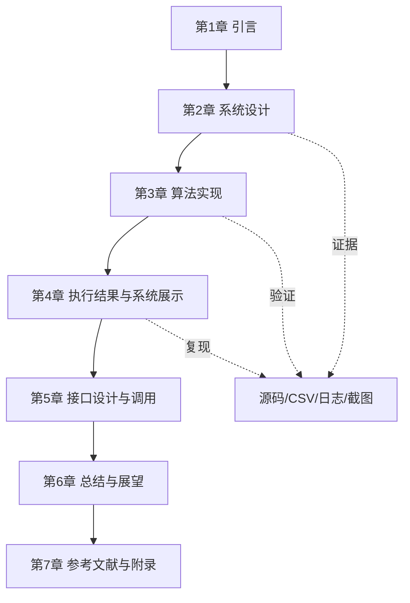
```mermaid
flowchart TD
  A[第1章 引言] --> B[第2章 系统设计]
  B --> C[第3章 算法实现]
  C --> D[第4章 执行结果与系统展示]
  D --> E[第5章 接口设计与调用]
  E --> F[第6章 总结与展望]
  F --> G[第7章 参考文献与附录]
  B -.证据.-> H[源码/CSV/日志/截图]
  C -.验证.-> H
  D -.复现.-> H
```

**图 1-1 报告章节关系图**

如图 1-1 所示，本文不是按算法清单孤立堆叠内容，而是先建立架构与决策，再展示源码实现，随后用测试、截图和接口证据回到课程评分点。由此，后文第 2 章将首先讨论需求与系统设计。

# 第 2 章 系统设计

## 2.1 需求分析

承接第 1 章对课程任务的拆解，本节把“实现 15 种算法”和“支持第三方接口调用”进一步转化为功能性需求与非功能性需求。首先，功能性需求强调系统必须能完成密码算法输入、处理、输出和状态返回；其次，非功能性需求强调系统必须能够被测试、被观察、被维护，并在安全失败时给出可解释的错误。根据 `docs/report_assets/STATS.md`，项目当前具备 Rust core、API application、API tests、Frontend source、Docs 和 Scripts 六类代码资产，其中 Rust core 29 个文件、6093 行，API application 61 个文件、5106 行，Frontend source 48 个文件、6577 行。这些规模数据说明系统已经超过单脚本演示的复杂度，因此报告必须采用工程化叙事而不是简单代码说明。

**表 2-1 功能性需求映射表**

如表 2-1 所示，该表将课程算法、接口、展示、验证和综合场景要求拆解为可核验的功能项，并列出对应项目证据和当前状态。

| 编号 | 功能性需求 | 项目证据 | 状态 |
|---|---|---|---|
| FR-01 | 覆盖课程要求 15 项算法 | `algorithm_implementation.csv` | 15/15 有证据 |
| FR-02 | 支持 API 调用和状态码 | `api_endpoints.csv`、`status_codes.csv` | 32 端点、28 状态码 |
| FR-03 | 支持执行结果展示 | `screenshots/frontend/*.png` | 27 张前端 PNG |
| FR-04 | 支持测试与交叉验证 | `test_summary.csv`、`cross_validation_matrix.md` | Rust/API/前端均有证据 |
| FR-05 | 支持漏洞演示和综合场景 | `demos_service.py`、`scenario_service.py` | 4 个 demo、1 个安全文件传输场景 |

**表 2-2 非功能性需求映射表**

如表 2-2 所示，该表从性能、安全、可观测性和可移植性四个维度说明系统约束，并说明每类约束在项目材料中的追溯来源。

| 编号 | 非功能性需求 | 设计落点 | 证据 |
|---|---|---|---|
| NFR-01 | 安全性 | Rust 内存安全、KEK、JWT、限流、审计 | `kek.py`、`auth.py`、`rate_limit.py` |
| NFR-02 | 性能 | Rust core、benchmark 分面统计 | `fig4_benchmark_summary.csv` |
| NFR-03 | 可观测性 | trace_id、operation_logs、metrics | `trace.py`、`operation_log.py` |
| NFR-04 | 可移植性 | SQLite/PostgreSQL 适配、Docker compose | `session.py`、Docker 日志 |
| NFR-05 | 可复现性 | CSV、日志、图表脚本、测试命令 | `STATS.md`、`logs/*` |

## 2.2 总体架构

CryptoLab 采用六层分层架构，如图 2-1 所示。首先，表示层由 React 18 [44]、Vite [45] 和前端 API 模块构成，负责接收用户输入并展示算法结果；其次，接口层由 FastAPI router、Pydantic schema 和统一响应模型构成，负责把 HTTP 请求转换为受控服务调用；进而，服务层完成密钥取用、KEK 解包、审计记录、benchmark 和场景编排；在此基础上，算法层由 Rust core 和 PyO3 绑定构成，负责执行密码原语；最后，数据层由 SQLAlchemy 模型、SQLite/PostgreSQL 和 Redis/内存缓存构成，负责持久化、限流和黑名单。这样的分层使算法实现不直接依赖 HTTP，接口层也不需要理解 AES S 盒或 RSA CRT 的细节。

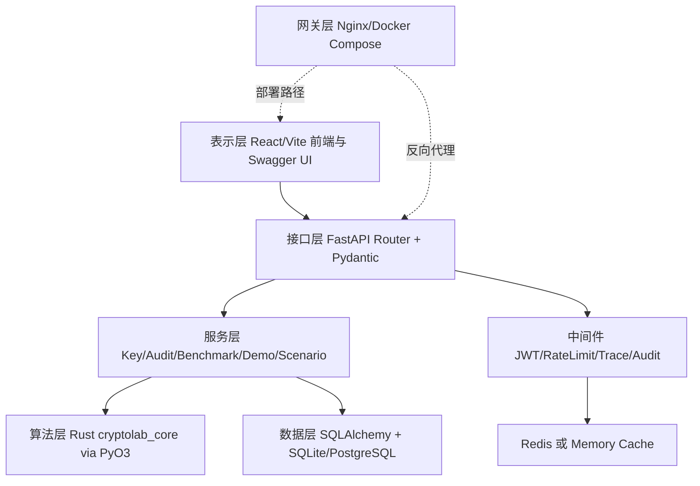
```mermaid
flowchart TB
  L6[表示层 React/Vite 前端与 Swagger UI] --> L4[接口层 FastAPI Router + Pydantic]
  L4 --> L3[服务层 Key/Audit/Benchmark/Demo/Scenario]
  L3 --> L2[算法层 Rust cryptolab_core via PyO3]
  L3 --> L1[数据层 SQLAlchemy + SQLite/PostgreSQL]
  L4 --> M[中间件 JWT/RateLimit/Trace/Audit]
  M --> C[Redis 或 Memory Cache]
  G[网关层 Nginx/Docker Compose] -.部署路径.-> L6
  G -.反向代理.-> L4
```

**图 2-1 CryptoLab 六层架构图**

如图 2-1 所示，图中网关层在本地报告证据中主要体现为 `deploy/docker-compose.yml` [46] 与 `nginx.conf`，而运行验证方面应区分 compose config 与 build：前者有通过日志，后者存在失败日志，因此后文不会把容器构建写成完成。值得注意的是，`rust_core/src/ffi.rs` 的 `register` 函数集中注册 AES、SM4、RC6、SHA、HMAC、PBKDF2、Base64、UTF-8、RSA、ECC、ECDSA 和 demo 函数，这使 Python 服务端能够用稳定符号调用 Rust 实现；与此同时，`api_server/app/main.py` 负责装配 router 与中间件，使所有业务端点保持 `/api/v1` 前缀和统一响应格式。

## 2.3 关键技术选型

### 2.3.1 ADR-001：核心算法层采用 Rust

上下文方面，课程要求并不限制编程语言，但密码算法实现对字节处理、整数运算、错误边界和性能有较高要求。候选方案包括 C、Go、纯 Python 和 Rust。C 在密码库历史中占据重要位置，OpenSSL 即为典型代表，但 Heartbleed 说明内存安全缺陷会直接放大为密码系统泄漏 [28][38]。Go 具备较好的工程工具链和内存安全属性，但在本项目中 PyO3 与 Python/FastAPI 集成的直接性不如 Rust。纯 Python 能降低开发门槛，却很难在 AES、SM4、RC6、RSA 和 ECC 等实现中同时兼顾性能、字节级控制与教学可信度。相较之下，Rust 提供所有权模型、借用检查、强类型错误和接近 C 的性能，适合承载 `rust_core/src` 中 29 个文件和 6093 行算法代码。业界迁移趋势也支持这一判断：Android 安全团队公开披露 Rust 引入后新增内存安全漏洞比例下降，Microsoft Azure 安全演进文章将 Rust 作为替代 C/C++ 的内存安全路径之一，Linux kernel 已将 Rust 纳入内核开发文档，Cloudflare 也用 Rust 构建网络隧道组件以控制内存安全和并发风险 [50][52][53][54]。这些案例不能直接证明 CryptoLab 的实现达到工业库水平，但能说明 Rust 已经从研究性语言进入网络与系统安全工程实践。

**表 2-3 ADR-001 核心算法语言选型权衡表**

如表 2-3 所示，该表围绕内存安全、性能、生态和学习成本比较 Rust、C、Go 与纯 Python，并支撑核心算法层采用 Rust 的决策。

| 候选方案 | 内存安全 | 性能 | Python 集成 | 生态与学习成本 | 决策 |
|---|---|---|---|---|---|
| C | 依赖人工审计 | 高 | 可通过 C ABI | 生态成熟但风险高 | 不选 |
| Go | 较好 | 中高 | 需额外 FFI 或服务化 | 工具链稳定 | 不选 |
| 纯 Python | 较好 | 低到中 | 原生 | 易写但算法深度不足 | 不选 |
| Rust | 编译期约束强 | 高 | PyO3 成熟 | 学习成本较高 | 采用 |

决策结果是把密码核心放在 Rust crate `cryptolab_core` 中，并通过 PyO3 注册给 Python。该决策的后果有两面：首先，Rust 降低了越界读、use-after-free 和双重释放等内存风险，适合用来论证对 Heartbleed 类问题的工程防护；其次，Rust 并不能自动解决时序攻击、随机数复用和协议误用，因此项目仍需 `subtle::ConstantTimeEq`、`OsRng`、RFC 6979、KEK 和测试向量共同支撑。由此可见，Rust 是降低实现风险的基础选型，而不是安全性的唯一来源。

### 2.3.2 ADR-002：FFI 层采用 PyO3

上下文方面，FastAPI 服务端运行于 Python 生态，Rust core 必须以稳定方式暴露给 Python。候选方案包括 `ctypes`、`cffi`、独立 Rust HTTP 服务和 PyO3。`ctypes` 适合调用 C ABI，但需要手动管理指针、长度和错误码；`cffi` 比 `ctypes` 更灵活，但仍要求维护外部 ABI 和 Python 侧胶水层；独立 Rust HTTP 服务可以避免 FFI，但会引入双后端部署、网络调用和鉴权重复实现。PyO3 则允许直接把 Rust 函数包装为 Python 扩展模块，并让字节切片、元组、字典和 Python 异常在边界处被明确转换。

**表 2-4 ADR-002 FFI 方案权衡表**

如表 2-4 所示，该表比较 PyO3、ctypes、cffi 与独立微服务四类方案，并说明绑定层为何选择 PyO3 以保持类型边界和发布流程的可控性。

| 候选方案 | 类型安全 | 运行开销 | 部署复杂度 | 错误映射 | 决策 |
|---|---|---|---|---|---|
| `ctypes` | 弱 | 低 | 中 | 手动 | 不选 |
| `cffi` | 中 | 低 | 中 | 手动 | 不选 |
| 独立 Rust 服务 | 强 | 网络开销 | 高 | HTTP 映射 | 不选 |
| PyO3 | 强 | 低 | 中 | `PyResult` 显式 | 采用 |

`rust_core/src/ffi.rs` 第 19-80 行显示，项目在一个 `register` 函数中将对称、哈希、编码、公钥和 demo 函数全部注册进 Python 模块。这样的边界设计使 FastAPI service 可以像调用普通 Python 函数一样调用 `cryptolab_core.aes_encrypt`、`sha256_digest` 或 `ecdsa_sign`，同时把 Rust 的 `CryptoResult` 映射为 Python 异常。代价是构建链路需要 maturin/PyO3 支持，Docker build 也必须能处理 Rust wheel 构建；这正是 Docker build 当前失败会影响部署证据、但不影响本地算法与 API 测试结论的原因。

### 2.3.3 ADR-003：后端采用 FastAPI + SQLAlchemy

上下文方面，课程要求第三方程序可通过接口调用并返回结果及状态代码，因此后端需要提供清晰 OpenAPI、请求校验、错误语义、鉴权和测试支持。候选方案包括 Flask、Django、FastAPI 和自写 ASGI。Flask 简洁但类型校验和 OpenAPI 需要额外工具；Django 生态完整但对本项目的算法服务而言框架较重；自写 ASGI 可控性高但维护成本较高。FastAPI 结合 Pydantic schema 可直接生成 OpenAPI 文档，并能与 pytest/httpx 异步测试配合；SQLAlchemy 则提供模型定义、迁移适配和 SQLite/PostgreSQL 双环境支持。

**表 2-5 ADR-003 后端框架与数据层选型权衡表**

如表 2-5 所示，该表比较 FastAPI、Flask、Django 和 Node.js Express 在类型契约、文档生成、异步支持和项目匹配度上的差异。

| 候选方案 | OpenAPI | 类型校验 | 测试便利性 | 数据层适配 | 决策 |
|---|---|---|---|---|---|
| Flask | 需扩展 | 需扩展 | 高 | 依赖扩展 | 不选 |
| Django | 可扩展 | 较强 | 中 | 重框架 | 不选 |
| 自写 ASGI | 手动 | 手动 | 中 | 手动 | 不选 |
| FastAPI + SQLAlchemy | 原生 | 强 | 高 | 强 | 采用 |

项目当前 `api_endpoints.csv` 记录 32 个端点，覆盖 auth、symmetric、hash、encoding、pubkey、keys、audit、benchmark、demos、scenarios 和 metrics。数据层方面，`users`、`key_store`、`operation_logs`、`algorithm_metrics` 四张核心表均有 SQLAlchemy 模型 [43]；然而，报告必须如实说明当前本地数据和部署状态：SQLite 适配下部分字段类型不是 PostgreSQL 字面类型，metrics 表本地数据可能稀疏，Docker build 也存在失败日志。因此，FastAPI + SQLAlchemy 的决策后果是接口契约和测试更可控，但生产级运行仍需要容器构建稳定、数据库迁移和长期监控补充。

### 2.3.4 ADR-004：密钥保护采用 master key 派生 KEK 与 AES-GCM 信封加密

上下文方面，系统需要生成并保存对称密钥、RSA/ECC 私钥和公钥材料。如果把密钥明文保存到数据库，任何数据库泄漏都会直接转化为密码材料泄漏；如果用用户口令直接加密密钥，口令修改、找回和离线破解会引入复杂风险；如果直接接入外部 KMS，课程环境和本地复现成本会显著上升。CryptoLab 采用折中方案：从 `CRYPTOLAB_MASTER_KEY_HEX` 读取 master key，经 `HKDF-SHA256(salt="cryptolab-kek-v1", info="master-kek")` 派生 32 字节 KEK，再用 AES-256-GCM 加密密钥材料，且以 `key_id` bytes 作为 AAD 参与认证。

**表 2-6 ADR-004 密钥保护方案权衡表**

如表 2-6 所示，该表比较 KEK 加密入库、明文数据库、仅环境变量和外部 KMS 四种方案，并说明课程环境下的安全边界选择。

| 候选方案 | 安全性 | 本地复现 | 运维成本 | 与课程目标匹配 | 决策 |
|---|---|---|---|---|---|
| 明文入库 | 低 | 高 | 低 | 不匹配 | 不选 |
| 用户口令直接加密 | 中 | 中 | 中 | 复杂 | 不选 |
| 外部 KMS/HSM | 高 | 低 | 高 | 超出作业环境 | 不选 |
| master key -> KEK -> GCM | 中高 | 高 | 中 | 匹配 | 采用 |

实现证据集中在 `api_server/app/core/kek.py`：`derive_kek` 使用 HKDF-SHA256，`get_kek` 读取配置并缓存 KEK，`envelope_encrypt` 和 `envelope_decrypt` 调用 Rust AES-GCM 完成密钥材料包装与解包。该设计的后果是数据库中保存的是 `key_material_encrypted`、`iv` 和 `auth_tag`，而非明文私钥；同时，AAD 将密钥 ID 与密文绑定，降低密文搬移风险。然而，本方案仍不是生产 KMS 的替代品，master key 的安全存储、轮换、备份和访问控制仍属于未来工作，后文第 6 章会把这一点作为局限性说明。

## 2.4 数据库设计

数据库设计围绕用户身份、密钥生命周期、审计追踪和性能指标四类实体展开。首先，`users` 表保存用户名、密码哈希、salt、角色和登录时间，密码验证使用 PBKDF2-HMAC-SHA256 与 `hmac.compare_digest`；其次，`key_store` 表保存密钥 ID、用户 ID、算法、密钥类型、加密材料、IV、认证标签、配对关系、标签、过期时间和软删除时间；再次，`operation_logs` 表保存 trace_id、用户、操作、算法、key_id、输入输出 hash、状态码、耗时、客户端 IP 和 user_agent；最后，`algorithm_metrics` 表保存算法、操作、输入大小、耗时、内存和记录时间。根据 `database_snapshot.txt` 与 `PROGRESS.md`，本地审计数据存在，但 metrics 数据稀疏，因此正文只说明具备采集模型和接口，不夸大长期观测能力。

**表 2-7 核心数据表职责与安全意义表**

如表 2-7 所示，该表概括 users、keys、audit_logs 与 crypto_operations 四张核心表的职责、关键字段和对应安全意义。

| 表 | 关键字段 | 安全意义 | 证据 |
|---|---|---|---|
| `users` | `username`、`password_hash`、`salt`、`role` | 身份认证与权限区分 | `models/user.py` |
| `key_store` | `key_material_encrypted`、`iv`、`auth_tag`、`paired_key_id` | 密钥信封加密和公私钥配对 | `models/key_store.py` |
| `operation_logs` | `trace_id`、`input_hash`、`output_hash`、`status_code`、`duration_ms` | 不存明文的审计追踪 | `models/operation_log.py` |
| `algorithm_metrics` | `algorithm`、`operation`、`data_size_bytes`、`duration_ns` | benchmark 与可观测性 | `models/algorithm_metric.py` |

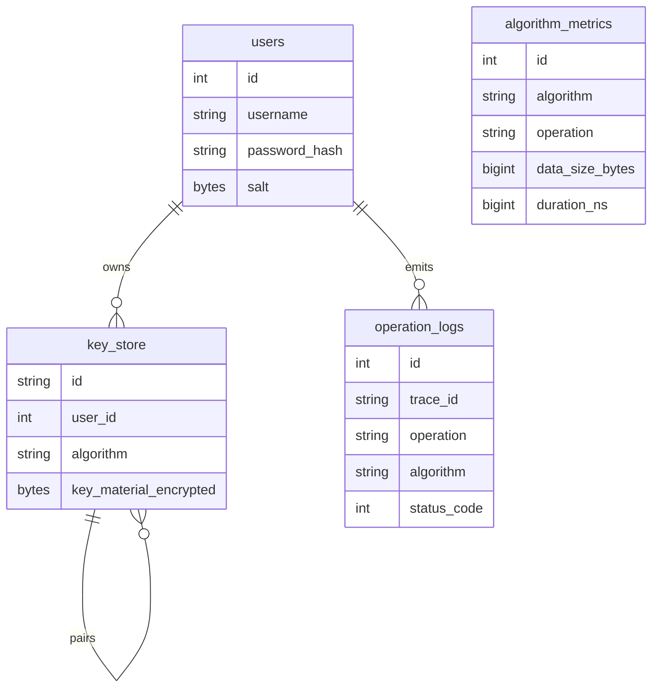
```mermaid
erDiagram
  users ||--o{ key_store : owns
  users ||--o{ operation_logs : emits
  key_store ||--o{ key_store : pairs
  algorithm_metrics {
    int id
    string algorithm
    string operation
    bigint data_size_bytes
    bigint duration_ns
  }
  users {
    int id
    string username
    string password_hash
    bytes salt
  }
  key_store {
    string id
    int user_id
    string algorithm
    bytes key_material_encrypted
  }
  operation_logs {
    int id
    string trace_id
    string operation
    string algorithm
    int status_code
  }
```

**图 2-2 数据库实体关系图**

如图 2-2 所示，该 ER 图反映的是当前模型结构，而不是理想化 PostgreSQL DDL。值得注意的是，SQLite 本地适配会导致 `id`、`client_ip` 等字段类型与设计方案中的 PostgreSQL 字面类型不同；因此报告后续只引用模型字段和迁移事实，不把早期方案中的 `BIGSERIAL` 或 `INET` 当作当前本地数据库的实际类型。

## 2.5 安全设计

CryptoLab 的安全设计以 STRIDE 为分析框架，并与 OWASP API Top 10 对身份、访问控制和数据暴露风险的提醒相互对应 [47]。首先，伪造身份风险由 JWT、短期 token、`jwt_blacklist:{jti}` 和受保护路径控制；其次，篡改风险由 Pydantic schema、GCM tag、密钥 AAD 和统一错误码缓解；进而，抵赖风险由 `trace_id`、`operation_logs` 和状态码记录缓解；与此同时，信息泄露风险由私钥不导出、密钥信封加密、审计只存 hash、敏感字段脱敏降低；再次，拒绝服务风险由 `rate_limit:{ip}:{path_prefix}` 固定窗口计数缓解；最后，权限提升风险由用户密钥归属检查、公私钥类型检查和私钥导出拒绝控制。该框架使安全设计能够直接追溯到源码，而不是停留在抽象原则。

**表 2-8 STRIDE 威胁与缓解措施映射表**

如表 2-8 所示，该表按照 STRIDE 框架列出系统面临的主要威胁，并给出已经落地或需要在后续阶段补强的缓解机制。

| STRIDE 类别 | 代表风险 | 缓解措施 | 源码证据 |
|---|---|---|---|
| Spoofing | 伪造用户或 token | JWT 校验、黑名单 | `middleware/auth.py` |
| Tampering | 篡改密钥或密文 | AES-GCM tag、AAD、schema 校验 | `core/kek.py`、`schemas/*.py` |
| Repudiation | 否认操作 | trace_id 与审计日志 | `middleware/trace.py`、`middleware/audit.py` |
| Information Disclosure | 泄漏私钥或明文 | KEK、私钥不可导出、日志脱敏 | `key_service.py`、`security.py` |
| Denial of Service | 高频调用接口 | Redis/内存限流 | `middleware/rate_limit.py` |
| Elevation of Privilege | 访问他人密钥 | `KEY_NOT_OWNED`、类型检查 | `key_service.py` |

在 Tampering 类风险中，密钥材料和认证数据绑定是高风险点。具体而言，若密钥入库时只加密 `key_material`，却没有把 `key_id`、`user_id`、`algorithm` 等上下文作为 Additional Authenticated Data (AAD) 绑定，攻击者一旦具备数据库写入能力，就可能尝试把密文 A 的认证元数据搬到密文 B 上，诱发服务层在错误上下文中解包密钥。CryptoLab 的 KEK 设计把算法和标识纳入服务侧校验，并通过 GCM tag 检测密文与认证数据不一致；然而，这类防护只有在数据库字段、服务校验和审计日志共同保持一致时才成立。因此，第 2.6 节的 fail-closed 原则并非抽象口号，而是要求任何 tag 校验、key ownership 或 algorithm mismatch 都必须直接失败，不能降级为兼容路径。

在 Information Disclosure 类风险中，更实际的场景不是“数据库整体被公开”这一极端假设，而是日志、审计、异常和前端响应逐步泄露敏感上下文。首先，审计日志若保存明文输入、完整密钥或可逆参数，将直接扩大泄露面；其次，异常消息若包含私钥字段、内部路径或 token 内容，会让调试信息变成攻击辅助材料；进而，前端若允许私钥明文导出，就会削弱 KEK 入库带来的保护。CryptoLab 采用输入输出 hash、私钥不可导出、敏感字段脱敏和统一错误码来降低泄露概率，但 metrics 数据稀疏和 demo response_model 不完整也说明观测能力仍处在课程项目阶段，尚不能等同于长期生产监控。
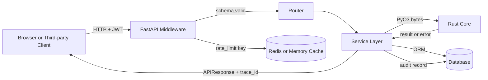
```mermaid
flowchart LR
  U[Browser or Third-party Client] -->|HTTP + JWT| A[FastAPI Middleware]
  A -->|schema valid| R[Router]
  R --> S[Service Layer]
  S -->|PyO3 bytes| C[Rust Core]
  S -->|ORM| D[(Database)]
  A -->|rate_limit key| Redis[(Redis or Memory Cache)]
  S -->|audit record| D
  C -->|result or error| S
  S -->|APIResponse + trace_id| U
```

**图 2-3 请求信任边界与数据流**

如图 2-3 所示，客户端输入必须穿过中间件、schema、服务层和 Rust core，每一层都有不同职责：中间件处理认证、限流和追踪，router 处理契约，service 处理密钥与审计，Rust core 处理密码运算。由此，系统把安全边界分散到多个小模块，而不是把所有判断堆叠在算法函数中。

## 2.6 设计原则与权衡

CryptoLab 的设计原则可以概括为 fail-closed、最小信任和职责分离。首先，fail-closed 体现在状态码体系和异常处理上，算法不支持、密钥长度非法、padding 错误、认证失败、签名无效和限流都返回明确业务状态码；其次，最小信任体现在用户密钥归属检查、私钥材料不可导出、审计不保存明文、JWT 黑名单和固定窗口限流；进而，职责分离体现在 Rust core 不感知 HTTP、FastAPI router 不直接实现 AES 轮函数、service 层不直接构造 SQL 字符串、前端不接触私钥明文。这样的设计提升了可维护性，也使报告证据能够按层次索引，并与 AWS Well-Architected Framework 对安全性、可靠性和可运维性的分层审视相呼应 [49]。

然而，工程化设计也带来代价。Rust × Python 异构链路需要 PyO3 构建、wheel 安装和 ABI 兼容；Docker build 当前失败说明容器化路径仍依赖网络、镜像源和 Rust 依赖版本；metrics 表与 `/metrics` 端点存在，但本地长期运行数据不足；前端 `npm test` 当前只是 TypeScript smoke，不等同于浏览器级 UI 自动化测试。由此可见，CryptoLab 的系统设计已经具备课程验收所需的完整边界，但后续仍需在部署稳定性和长期观测方面补强。下一章将进入算法实现，说明这些设计如何落到 Rust core 的具体代码中。

# 第 3 章 算法实现

## 3.1 工程结构与构建系统

第 3 章承接系统设计，重点回答“代码开发”评分点中的算法实现深度。CryptoLab 的 Rust core 以模块划分组织：`encoding` 负责 Base64 与 UTF-8，`hash` 负责 SHA、RIPEMD、HMAC 与 PBKDF2，`symmetric` 与 `modes` 负责 AES、SM4、RC6 及 ECB/CBC/CTR/GCM，`bigint` 和 `pubkey` 负责 RSA、ECC、ECDSA 与攻击 demo。`traits.rs` 提供 `SymmetricCipher`、`HashAlgorithm` 和 `PublicKeyAlgorithm` 等抽象，`ffi.rs` 则将 Rust 函数注册到 Python 模块。根据 `STATS.md`，Rust core 29 个文件、6093 行，测试文件分布在算法模块内部，Rust 测试日志记录为 `53 passed, 0 failed, 3 ignored`。

```rust
// rust_core/src/ffi.rs:19-80
pub fn register(_py: Python<'_>, m: &PyModule) -> PyResult<()> {
    m.add_function(wrap_pyfunction!(aes_encrypt, m)?)?;
    m.add_function(wrap_pyfunction!(aes_encrypt_with_trace, m)?)?;
    m.add_function(wrap_pyfunction!(aes_decrypt, m)?)?;
    m.add_function(wrap_pyfunction!(sm4_encrypt, m)?)?;
    m.add_function(wrap_pyfunction!(sm4_decrypt, m)?)?;
    m.add_function(wrap_pyfunction!(rc6_encrypt, m)?)?;
    m.add_function(wrap_pyfunction!(rc6_decrypt, m)?)?;
    m.add_function(wrap_pyfunction!(sha1, m)?)?;
    m.add_function(wrap_pyfunction!(sha256_digest, m)?)?;
    m.add_function(wrap_pyfunction!(sha3_256_digest, m)?)?;
    m.add_function(wrap_pyfunction!(ripemd160_digest, m)?)?;
    m.add_function(wrap_pyfunction!(hmac_sha1, m)?)?;
    m.add_function(wrap_pyfunction!(hmac_sha256, m)?)?;
    m.add_function(wrap_pyfunction!(pbkdf2_hmac_sha256, m)?)?;
    m.add_function(wrap_pyfunction!(base64_encode, m)?)?;
    m.add_function(wrap_pyfunction!(base64_decode, m)?)?;
    m.add_function(wrap_pyfunction!(utf8_encode, m)?)?;
    m.add_function(wrap_pyfunction!(utf8_decode, m)?)?;
    m.add_function(wrap_pyfunction!(rsa_generate_keypair, m)?)?;
    m.add_function(wrap_pyfunction!(rsa_encrypt_oaep, m)?)?;
    m.add_function(wrap_pyfunction!(rsa_decrypt_oaep, m)?)?;
    m.add_function(wrap_pyfunction!(rsa_sign_pss, m)?)?;
    m.add_function(wrap_pyfunction!(rsa_verify_pss, m)?)?;
    m.add_function(wrap_pyfunction!(ecc_generate_keypair, m)?)?;
    m.add_function(wrap_pyfunction!(ecdsa_sign, m)?)?;
    m.add_function(wrap_pyfunction!(ecdsa_verify, m)?)?;
    m.add_function(wrap_pyfunction!(rsa_demo_unsafe_keygen, m)?)?;
    m.add_function(wrap_pyfunction!(rsa_demo_unsafe_encrypt_raw, m)?)?;
    m.add_function(wrap_pyfunction!(rsa_demo_cube_root, m)?)?;
    m.add_function(wrap_pyfunction!(ecdsa_demo_sign_with_k, m)?)?;
    m.add_function(wrap_pyfunction!(ecdsa_demo_recover_d_from_k_reuse, m)?)?;
    m.add("__version__", env!("CARGO_PKG_VERSION"))?;
    Ok(())
}
```

上述代码节选展示了 PyO3 边界的集中注册策略。首先，对称加密、哈希、编码、公钥和攻击演示函数被注册在同一个 Python 模块中，因此 Python 服务层可以用统一导入路径调用 Rust core；其次，AES verbose 被单独注册为 `aes_encrypt_with_trace`，说明教学模式不是前端伪造，而是来自 Rust 层真实中间状态；进而，demo 函数与生产函数同时暴露，但服务层和路由层可以通过不同 schema 与权限策略隔离教学攻击路径。该节选也揭示了异构架构的维护成本：任何新增算法都需要同时考虑 Rust 实现、PyO3 注册、Python service、schema、路由、测试和前端调用，否则会出现“算法已写但接口不可达”的断裂。


**图 3-1 算法覆盖与实现状态矩阵**

如图 3-1 所示，该图来自 `docs/report_assets/figures/fig2_algorithm_coverage_matrix.png`，对应数据为 `fig2_algorithm_coverage_matrix.csv`。图中最重要的信息不是“全部变绿”，而是将 RC6 的模式限制标记为部分状态；这种标记方式与后文差异表一致，能够避免将 ECB/CBC 已实现误写成 GCM 同样可用。

## 3.2 编码算法

### 3.2.1 Base64

Base64 是 RFC 4648 定义的二进制到文本编码方案，核心目标是在只允许文本字符的传输环境中保存任意字节序列 [12]。算法原理是把输入按 3 字节分组，将 24 bit 拆成 4 个 6 bit 索引，再映射到标准字母表；若输入长度不是 3 的倍数，则用 `=` 进行 padding。输出长度可按式 (3-1) 计算，其中 `n` 为输入字节数，`ceil` 表示向上取整。CryptoLab 的 `rust_core/src/encoding/base64.rs` 实现了严格编码和解码，解码阶段检查字母表、长度和 padding 位置，并通过 RFC 4648 Section 10 向量测试。

$$
L = 4 \times \left\lceil \frac{n}{3} \right\rceil
\tag{3-1}
$$

如式 (3-1) 所示，Base64 的输出长度一定是 4 的倍数，因此接口层可以用这一性质对异常输入做早期判断。其伪码如下：

```text
Algorithm 3-1 Strict Base64 Decode
Input: encoded string s
Output: decoded byte array b or encoding error
1. if len(s) mod 4 != 0, reject
2. for each 4-character block q in s:
3.     map each character to 6-bit value, except legal trailing '='
4.     reconstruct 24-bit group from four 6-bit values
5.     append one, two, or three bytes according to padding count
6. if '=' appears before final block, reject
7. return decoded bytes
```

**表 3-1 Base64 自实现与权威库差异表**

如表 3-1 所示，该表从完成状态、实现范围、教学可解释性和生产风险四个维度比较 CryptoLab Base64 实现与权威库。

| 项目 | CryptoLab 自实现 | 权威库差异 |
|---|---|---|
| 标准来源 | RFC 4648 | Python `base64` 同样遵循 RFC 4648 |
| 错误处理 | 严格拒绝非法字符和非法 padding | 标准库可通过参数调节严格性 |
| 教学价值 | 展示 6 bit 分组和 padding | 调库隐藏细节 |
| 状态 | `已完成 (Complete)` | 可作为对照库 |

### 3.2.2 UTF-8

UTF-8 是 RFC 3629 定义的 Unicode 转换格式，使用 1 至 4 个字节表示 Unicode scalar value [13]。具体而言，ASCII 字符直接以 1 字节表示，较大码点使用前导字节标识长度，并用后续字节保存剩余比特。安全实现必须拒绝 overlong encoding、surrogate 区间和非法 continuation byte，否则同一字符可能被多种字节序列表示，进而影响输入规范化、签名、访问控制或日志审计。CryptoLab 的 `rust_core/src/encoding/utf8.rs` 提供 `encode` 和 `decode`，测试包括 RFC 3629 宽度匹配和非法序列拒绝，`algorithm_implementation.csv` 标记为 `已完成 (Complete)`。

**表 3-2 UTF-8 自实现与权威库差异表**

如表 3-2 所示，该表说明 UTF-8 编解码在规范校验、错误处理和工程适用性方面与成熟标准库的差异。

| 项目 | CryptoLab 自实现 | 权威库差异 |
|---|---|---|
| 标准来源 | RFC 3629 | Python codec |
| 输入边界 | 显式检查尾字节、范围和非法码点 | 标准库默认成熟稳定 |
| 教学价值 | 展示字节宽度和拒绝规则 | 调库不展示细节 |
| 状态 | `已完成 (Complete)` | 用 Python codec 交叉验证 |

## 3.3 哈希算法、消息认证与密钥派生

### 3.3.1 SHA-1

SHA-1 属于 FIPS 180-4 中的 Merkle-Damgard 类哈希函数，输出 160 bit 摘要 [2]。其处理流程首先对消息填充，使长度满足式 (3-2)，其次按 512 bit 分组进入压缩函数，最后输出 5 个 32 bit 状态字。SHA-1 在工程上已不适合用于抗碰撞安全场景，Wang 等人的攻击和 SHAttered 碰撞已经证明完整 SHA-1 的碰撞安全边际不足 [25][26]。因此，CryptoLab 中 SHA-1 的定位是教学和兼容验证，报告不把它推荐为新系统的完整性保护方案。`rust_core/src/hash/sha1.rs` 包含 streaming hasher、one-shot digest、FIPS 180-4 classic vectors、million-a vector 和 1MB streaming 对照测试。

$$
l + 1 + k \equiv 448 \pmod{512}
\tag{3-2}
$$

如式 (3-2) 所示，SHA-1 与 SHA-256 的 padding 都会保留 64 bit 长度字段位置。这个结构便于分组处理，但也使 Merkle-Damgard 系列在特定构造中需要注意长度扩展攻击；因此，系统不直接把裸 SHA-1 或 SHA-256 当作消息认证码，而是通过 HMAC 提供密钥认证能力。

**表 3-3 SHA-1 自实现与权威库差异表**

如表 3-3 所示，该表在承认 SHA-1 碰撞安全性不足的前提下，说明本项目保留 SHA-1 的教学与兼容性边界。

| 项目 | CryptoLab 自实现 | 权威库差异 |
|---|---|---|
| 标准来源 | FIPS 180-4 | Python `hashlib.sha1` |
| 安全态势 | 教学/兼容，不推荐抗碰撞用途 | 权威库也不改变 SHA-1 安全事实 |
| 测试 | classic vectors、million-a | `hashlib` 交叉验证 |
| 状态 | `已完成 (Complete)` | 可对照 |

### 3.3.2 SHA-256

SHA-256 是 SHA-2 家族中使用最广的 256 bit 摘要算法，仍是 TLS、签名、证书、文件完整性和本项目审计 hash 的核心工具之一 [2]。CryptoLab 在 `rust_core/src/hash/sha2.rs` 中实现 SHA-224、SHA-256、SHA-384 和 SHA-512，其中报告重点讨论 SHA-256。算法首先生成 64 个消息调度字，然后在每轮使用 `Ch`、`Maj`、大 sigma 和小 sigma 函数更新 8 个工作变量。相较 SHA-1，SHA-256 的状态和轮常量设计提供了更大的安全边际，但它仍然是无密钥摘要，不能替代 HMAC。

```text
Algorithm 3-2 SHA-256 Compression Loop
Input: chaining state H[0..7], message block M
Output: updated state H
1. parse M into W[0..15]
2. for t = 16..63:
3.     W[t] = sigma1(W[t-2]) + W[t-7] + sigma0(W[t-15]) + W[t-16]
4. initialize a..h from H[0..7]
5. for t = 0..63:
6.     T1 = h + Sigma1(e) + Ch(e,f,g) + K[t] + W[t]
7.     T2 = Sigma0(a) + Maj(a,b,c)
8.     rotate working variables and set a = T1 + T2
9. add a..h back to H[0..7]
10. return H
```

**表 3-4 SHA-256 自实现与权威库差异表**

如表 3-4 所示，该表比较 SHA-256 自实现与主流库在轮函数透明性、性能优化和生产使用边界上的差异。

| 项目 | CryptoLab 自实现 | 权威库差异 |
|---|---|---|
| 标准来源 | FIPS 180-4 | Python `hashlib.sha256`、RustCrypto |
| 实现方式 | Rust streaming + one-shot | 权威库有更充分优化 |
| 测试 | NIST short vectors、1MB streaming、RustCrypto 对照 | 多库交叉 |
| 状态 | `已完成 (Complete)` | 可对照 |

### 3.3.3 SHA-3 / Keccak

SHA-3 来自 Keccak 海绵结构，与 SHA-1/SHA-2 的 Merkle-Damgard 路线不同 [3][24]。海绵结构包含吸收阶段和挤出阶段，内部状态由 rate 与 capacity 分割，安全性与 capacity 相关。CryptoLab 的 `rust_core/src/hash/sha3.rs` 暴露 SHA3-256 与 SHA3-512，并用 FIPS 202 向量测试。报告在此需要明确实现边界：SHA-3 的置换细节复杂，当前项目以 Rust 代码封装并验证标准向量为主，不把其全部置换轮展开为教学 trace；与 AES verbose 相比，SHA-3 的中间状态可视化不属于当前交付重点。`Keccak-f[1600]` 的 24 轮置换包含 theta、rho、pi、chi、iota 五类步骤，若从零实现并逐轮可视化，需要处理 5×5 lane 状态、位旋转常量、轮常量和 padding/domain separation 等细节。首先，这部分实现成本显著高于 SHA-256 压缩循环；其次，未经充分审计的置换实现更容易在字节序、padding 或 squeeze 阶段引入兼容性错误；因此，本项目把 SHA-3 定位为“标准能力覆盖 + 向量验证”，而把教学 trace 资源集中投入 AES 这类课程评分更直接、结构更容易观察的分组密码。

**表 3-5 SHA-3 自实现与权威库差异表**

如表 3-5 所示，该表说明 SHA-3 在项目中采用封装权威库的原因，并明确其实现边界与教学补充方式。

| 项目 | CryptoLab 自实现 | 权威库差异 |
|---|---|---|
| 标准来源 | FIPS 202 | Python `hashlib.sha3_256` |
| 结构 | 海绵函数 | 权威库通常含优化置换 |
| 测试 | SHA3-256/SHA3-512 vectors | `hashlib` 交叉验证 |
| 状态 | `已完成 (Complete)` | 可对照 |

### 3.3.4 RIPEMD-160

RIPEMD-160 输出 160 bit 摘要，历史上常见于部分区块链地址和兼容场景。CryptoLab 在 `rust_core/src/hash/ripemd.rs` 中提供 one-shot digest，并用原始 RIPEMD-160 测试向量验证。相较 SHA-256，RIPEMD-160 输出长度较短，现代新系统通常更偏向 SHA-256、SHA-512 或 SHA-3；然而课程要求覆盖 RIPEMD160，因此项目保留该算法用于教学和横向比较。前端哈希页面已归档 `P0_04_frontend_hash_multi_digest.png`，可展示 RIPEMD-160 与 SHA 系列摘要长度差异。实现边界方面，RIPEMD-160 的双线并行压缩结构包含左右两条消息调度、不同布尔函数顺序和常量序列，教学展开价值主要在比较 Merkle-Damgard 家族设计差异，而不是提供新的生产安全建议。首先，当前项目已经通过原始向量证明输出兼容；其次，若继续投入工程成本，应优先补充多块 streaming、OpenSSL 环境条件对照和更多边界测试，而不是把 RIPEMD-160 推广为新系统首选摘要算法。

**表 3-6 RIPEMD-160 自实现与权威库差异表**

如表 3-6 所示，该表比较 RIPEMD-160 自实现与权威库在双线压缩结构、兼容性和安全态势上的差异。

| 项目 | CryptoLab 自实现 | 权威库差异 |
|---|---|---|
| 标准来源 | RIPEMD-160 原始向量 | OpenSSL/hashlib 视环境支持 |
| 输出长度 | 160 bit | 相同 |
| 测试 | original vectors | `hashlib` 有条件对照 |
| 状态 | `已完成 (Complete)` | 可对照 |

### 3.3.5 HMAC

HMAC 是带密钥的消息认证构造 [22]，由 RFC 2104 定义，并在 RFC 4231 中给出 HMAC-SHA-256 等测试向量 [9][10]。其核心公式如式 (3-3) 所示，其中 `K'` 为按块长处理后的密钥，`ipad` 和 `opad` 分别为内部与外部填充值。HMAC 的安全意义在于它避免把裸 hash 当作 MAC 使用，并能抵抗 Merkle-Damgard 长度扩展类问题。CryptoLab 在 `rust_core/src/hash/hmac.rs` 中以泛型方式支持 HMAC-SHA1 和 HMAC-SHA256，并使用 `subtle::ConstantTimeEq` 验证 HMAC-SHA256 tag。

$$
\mathrm{HMAC}(K,m)=H((K'\oplus opad)\parallel H((K'\oplus ipad)\parallel m))
\tag{3-3}
$$

```text
Algorithm 3-3 HMAC-SHA256
Input: key K, message m
Output: tag t
1. if len(K) > block_size, set K = SHA256(K)
2. pad K with zeros to block_size
3. ipad = K xor 0x36 repeated block_size
4. opad = K xor 0x5c repeated block_size
5. inner = SHA256(ipad || m)
6. t = SHA256(opad || inner)
7. return t
```

```rust
// rust_core/src/hash/hmac.rs:10-60
pub fn hmac<H: HashAlgorithm>(key: &[u8], message: &[u8]) -> Vec<u8> {
    let mut key_block = vec![0u8; H::BLOCK_SIZE];
    if key.len() > H::BLOCK_SIZE {
        let hashed_key = H::digest(key);
        key_block[..hashed_key.len()].copy_from_slice(&hashed_key);
    } else {
        key_block[..key.len()].copy_from_slice(key);
    }
    let mut ipad = vec![0x36u8; H::BLOCK_SIZE];
    let mut opad = vec![0x5cu8; H::BLOCK_SIZE];
    for i in 0..H::BLOCK_SIZE {
        ipad[i] ^= key_block[i];
        opad[i] ^= key_block[i];
    }
    let mut inner = H::default();
    inner.update(&ipad);
    inner.update(message);
    let mut inner_digest = vec![0u8; H::DIGEST_SIZE];
    let inner_result = inner.finalize_into(&mut inner_digest);
    debug_assert!(inner_result.is_ok());
    let mut outer = H::default();
    outer.update(&opad);
    outer.update(&inner_digest);
    let mut tag = vec![0u8; H::DIGEST_SIZE];
    let outer_result = outer.finalize_into(&mut tag);
    debug_assert!(outer_result.is_ok());
    tag
}

pub fn hmac_sha1(key: &[u8], message: &[u8]) -> [u8; 20] {
    let tag = hmac::<Sha1>(key, message);
    let mut out = [0u8; 20];
    out.copy_from_slice(&tag);
    out
}

pub fn hmac_sha256(key: &[u8], message: &[u8]) -> [u8; 32] {
    let tag = hmac::<Sha256>(key, message);
    let mut out = [0u8; 32];
    out.copy_from_slice(&tag);
    out
}

pub fn verify_hmac_sha256(key: &[u8], message: &[u8], tag: &[u8]) -> bool {
    hmac_sha256(key, message).ct_eq(tag).into()
}
```

该代码首先处理超长密钥，使其被 hash 到摘要长度；其次构造 `ipad` 和 `opad`，并分别完成内部与外部 hash；最后使用 `ct_eq` 做 tag 比较。值得注意的是，`debug_assert!` 只用于内部不变量检查，真正的安全路径在于输出 tag 的常时间比较。前端截图 `P0_05_frontend_hmac_sha256.png` 展示了 HMAC-SHA256 的输入、输出和结果卡片，说明该功能已经通过 API 和 UI 暴露。

**表 3-7 HMAC 自实现与权威库差异表**

如表 3-7 所示，该表围绕 RFC 定义、常时间比较和可替换哈希核心说明 HMAC 自实现的工程边界。

| 项目 | CryptoLab 自实现 | 权威库差异 |
|---|---|---|
| 标准来源 | RFC 2104、RFC 4231 | Python `hmac` |
| 安全比较 | Rust `subtle::ConstantTimeEq` | Python `hmac.compare_digest` |
| 测试 | RFC 2202、RFC 4231 | 标准库对照 |
| 状态 | `已完成 (Complete)` | 可对照 |

### 3.3.6 PBKDF2

PBKDF2 是 RFC 8018 与 NIST SP 800-132 定义的基于口令的密钥派生函数 [7][11]。它通过重复调用伪随机函数增加离线猜测成本，其中 PBKDF2-HMAC-SHA256 的块函数如式 (3-4) 所示。`c` 为迭代次数，`U_1 = PRF(P, S || INT(i))`，`U_j = PRF(P, U_{j-1})`，最终输出为多个块的截断拼接。CryptoLab 的 Rust 实现允许配置 `iterations` 和 `key_len`，服务层和前端对低迭代参数做限制或提示，漏洞 demo 则展示迭代次数对耗时的影响。

$$
F(P,S,c,i)=U_1 \oplus U_2 \oplus \cdots \oplus U_c
\tag{3-4}
$$

```text
Algorithm 3-4 PBKDF2-HMAC-SHA256
Input: password P, salt S, iterations c, desired length dkLen
Output: derived key DK
1. hLen = 32, blocks = ceil(dkLen / hLen)
2. for i = 1..blocks:
3.     U = HMAC(P, S || INT32_BE(i))
4.     T = U
5.     repeat j = 2..c:
6.         U = HMAC(P, U)
7.         T = T xor U
8.     append T to DK
9. truncate DK to dkLen
10. return DK
```

```rust
// rust_core/src/hash/pbkdf2.rs:16-62
pub fn pbkdf2_hmac_sha256(
    password: &[u8],
    salt: &[u8],
    iterations: u32,
    key_len: usize,
) -> CryptoResult<Vec<u8>> {
    if iterations == 0 {
        return Err(CryptoError::InvalidParameter(
            "PBKDF2 iterations must be at least 1".to_string(),
        ));
    }
    if key_len == 0 {
        return Err(CryptoError::InvalidParameter(
            "PBKDF2 key_len must be greater than 0".to_string(),
        ));
    }
    let max_len = (u32::MAX as u64) * (H_LEN as u64);
    if (key_len as u64) > max_len {
        return Err(CryptoError::InvalidParameter(format!(
            "PBKDF2 key_len must be <= {max_len}"
        )));
    }
    let blocks = key_len.div_ceil(H_LEN);
    let mut derived = Vec::with_capacity(blocks * H_LEN);
    let mut salt_block = Vec::with_capacity(salt.len() + 4);
    for block_index in 1..=blocks {
        salt_block.clear();
        salt_block.extend_from_slice(salt);
        salt_block.extend_from_slice(&(block_index as u32).to_be_bytes());
        let mut u = hmac_sha256(password, &salt_block);
        let mut t = u;
        for _ in 1..iterations {
            u = hmac_sha256(password, &u);
            for i in 0..H_LEN {
                t[i] ^= u[i];
            }
        }
        derived.extend_from_slice(&t);
    }
    derived.truncate(key_len);
    Ok(derived)
}
```

该代码首先拒绝 0 次迭代和 0 长度输出，随后根据 HMAC-SHA256 的 32 字节输出长度计算派生块数。循环中 `salt_block` 追加大端块索引，`u` 保存当前 PRF 输出，`t` 保存按位异或累积值。值得注意的是，代码没有把 PBKDF2 伪装成加密算法，而是明确输出派生密钥；前端截图 `P0_06_frontend_pbkdf2_derive.png` 展示了密码、盐、迭代次数和输出长度的输入界面，安全 demo 图 4-17 则展示迭代次数与耗时的关系。

**表 3-8 PBKDF2 自实现与权威库差异表**

如表 3-8 所示，该表说明 PBKDF2 自实现对迭代链条的可解释性，同时指出参数升级和硬件攻击成本评估仍需结合实际场景。

| 项目 | CryptoLab 自实现 | 权威库差异 |
|---|---|---|
| 标准来源 | RFC 8018、SP 800-132 | `hashlib.pbkdf2_hmac`、`cryptography` |
| 参数 | password、salt、iterations、key_len | 权威库参数类似 |
| 安全边界 | 成本随迭代次数增长 | 仍需口令强度支持 |
| 状态 | `已完成 (Complete)` | 可对照 |

## 3.4 对称加密

### 3.4.1 AES

AES 由 FIPS 197 定义，是 128 bit 分组的替代置换网络（Substitution-Permutation Network, SPN）算法，支持 128/192/256 bit 密钥 [1][23]。CryptoLab 的 AES 模块实现 `encrypt_block`、`decrypt_block`、ECB/CBC/CTR/GCM 调度和 verbose trace。AES 的有限域运算基于不可约多项式，如式 (3-5) 所示；MixColumns 则按式 (3-6) 在 `GF(2^8)` 上完成矩阵乘法。与只输出最终密文的实现不同，本项目保存了 FIPS 197 AES-128 示例向量的每轮 `after_sub_bytes`、`after_shift_rows`、`after_mix_columns` 和 `after_add_round_key`，并生成图 4-15。

$$
m(x)=x^8+x^4+x^3+x+1
\tag{3-5}
$$

$$
\begin{bmatrix}
s'_0\\s'_1\\s'_2\\s'_3
\end{bmatrix}
=
\begin{bmatrix}
02&03&01&01\\
01&02&03&01\\
01&01&02&03\\
03&01&01&02
\end{bmatrix}
\begin{bmatrix}
s_0\\s_1\\s_2\\s_3
\end{bmatrix}
\tag{3-6}
$$

```text
Algorithm 3-5 AES Block Encryption
Input: 16-byte block P, expanded round keys RK
Output: 16-byte ciphertext C
1. state = P
2. state = AddRoundKey(state, RK[0])
3. for round = 1..Nr-1:
4.     state = SubBytes(state)
5.     state = ShiftRows(state)
6.     state = MixColumns(state)
7.     state = AddRoundKey(state, RK[round])
8. state = SubBytes(state)
9. state = ShiftRows(state)
10. state = AddRoundKey(state, RK[Nr])
11. return state
```

```rust
// rust_core/src/symmetric/aes.rs:355-428
fn expand_key(key: &[u8], nk: usize, rounds: usize) -> Vec<u8> {
    let total_words = 4 * (rounds + 1);
    let mut words = vec![[0u8; 4]; total_words];
    for i in 0..nk {
        words[i].copy_from_slice(&key[i * 4..i * 4 + 4]);
    }
    for i in nk..total_words {
        let mut temp = words[i - 1];
        if i % nk == 0 {
            temp = sub_word(rot_word(temp));
            temp[0] ^= RCON[i / nk];
        } else if nk > 6 && i % nk == 4 {
            temp = sub_word(temp);
        }
        for (j, value) in temp.iter().enumerate() {
            words[i][j] = words[i - nk][j] ^ value;
        }
    }
    let mut out = Vec::with_capacity(total_words * 4);
    for word in words {
        out.extend_from_slice(&word);
    }
    out
}

fn rot_word(word: [u8; 4]) -> [u8; 4] { [word[1], word[2], word[3], word[0]] }

fn sub_word(mut word: [u8; 4]) -> [u8; 4] {
    for b in &mut word { *b = S_BOX[*b as usize]; }
    word
}

fn add_round_key(state: &mut [u8; BLOCK_SIZE], key: &[u8]) {
    for i in 0..BLOCK_SIZE { state[i] ^= key[i]; }
}

fn sub_bytes(state: &mut [u8; BLOCK_SIZE]) {
    for b in state { *b = S_BOX[*b as usize]; }
}

fn shift_rows(state: &mut [u8; BLOCK_SIZE]) {
    let tmp = *state;
    for r in 0..4 {
        for c in 0..4 {
            state[r + 4 * c] = tmp[r + 4 * ((c + r) % 4)];
        }
    }
}

fn mix_columns(state: &mut [u8; BLOCK_SIZE]) {
    for c in 0..4 {
        let i = 4 * c;
        let a0 = state[i];
        let a1 = state[i + 1];
        let a2 = state[i + 2];
        let a3 = state[i + 3];
```

该代码节选覆盖密钥扩展、字替换、行移位和列混淆入口。首先，`expand_key` 根据 `nk` 与 `rounds` 生成所有轮密钥，并在轮边界执行 `rot_word`、`sub_word` 与 `RCON` 异或；其次，`add_round_key` 直接将轮密钥异或到 state；进而，`shift_rows` 按行号决定循环位移，保持 AES state 的列主序布局；最后，`mix_columns` 读取每一列的 4 个字节，为后续 `gf_mul` 线性组合做准备。该实现与 FIPS 197 的轮结构保持一致，并通过 NIST SP 800-38A/38D 的 ECB、CBC、CTR、GCM 测试，以及 FIPS 197 verbose trace 中间状态测试。

**表 3-9 AES 自实现与权威库差异表**

如表 3-9 所示，该表比较 AES 自实现与 OpenSSL、RustCrypto 等权威实现，在轮变换透明性、模式覆盖和生产抗侧信道能力上的差异。

| 项目 | CryptoLab 自实现 | 权威库差异 |
|---|---|---|
| 标准来源 | FIPS 197、SP 800-38A、SP 800-38D | OpenSSL、RustCrypto、`cryptography` |
| 模式 | ECB/CBC/CTR/GCM | 权威库通常有硬件加速 |
| 教学能力 | AES verbose trace | 权威库一般不暴露每轮 state |
| 状态 | `已完成 (Complete)` | 可对照 |

### 3.4.2 SM4

SM4 是 GB/T 32907-2016 定义的 128 bit 分组密码，采用 32 轮迭代结构 [16]。相较 AES 的 SPN 设计，SM4 更接近 Feistel-like 迭代，每轮使用 S 盒、线性变换和轮密钥。其基本轮函数如式 (3-7) 所示，其中 `T` 包含非线性替换 `tau` 与线性变换 `L`。CryptoLab 的 `rust_core/src/symmetric/sm4.rs` 实现 `Sm4` 结构、加解密 block、ECB/CBC/CTR/GCM dispatch 和 GB/T 附录 A 单块向量测试。报告需要说明，SM4 的 GCM dispatch 以项目当前源码和测试为准，不能简单把早期设计方案中的状态照搬。

$$
X_{i+4}=X_i\oplus T(X_{i+1}\oplus X_{i+2}\oplus X_{i+3}\oplus rk_i)
\tag{3-7}
$$

```text
Algorithm 3-6 SM4 32-Round Transform
Input: 16-byte block X, round keys rk[0..31]
Output: transformed block Y
1. parse X into four 32-bit words X0..X3
2. for i = 0..31:
3.     tmp = X[i+1] xor X[i+2] xor X[i+3] xor rk[i]
4.     X[i+4] = X[i] xor L(tau(tmp))
5. output X[35], X[34], X[33], X[32]
```

**表 3-10 SM4 自实现与权威库差异表**

如表 3-10 所示，该表说明 SM4 自实现对国密标准结构的教学价值，并指出其与工业级国密库在认证、硬件适配和审计上的差距。

| 项目 | CryptoLab 自实现 | 权威库差异 |
|---|---|---|
| 标准来源 | GB/T 32907-2016 | gmssl、OpenSSL 新版本视配置支持 |
| 结构 | 32 轮迭代、S 盒、线性变换 | 权威库更注重平台优化 |
| 测试 | 附录 A 单块向量 | gmssl 交叉验证 |
| 状态 | `已完成 (Complete)` | 可对照 |

### 3.4.3 RC6

RC6 是 Rivest 等提出的分组密码候选算法，使用数据相关旋转、模加、异或和乘法构造轮函数。CryptoLab 的 `rust_core/src/symmetric/rc6.rs` 实现 key schedule、block 加解密、ECB/CBC dispatch，并用 RC6 paper appendix 向量测试。必须强调的是，`algorithm_implementation.csv` 将 RC6 标记为“部分完成 (Partial)”，原因是 ECB/CBC 已实现，GCM 不暴露。该状态不是算法完全缺失，也不是全模式完成，而是课程算法项实现与工作模式覆盖之间的中间状态。

**表 3-11 RC6 自实现与权威库差异表**

如表 3-11 所示，该表明确 RC6 当前仅完成 ECB/CBC 暴露，GCM 未暴露，因此不能按完全完成的分组密码套件处理。

| 项目 | CryptoLab 自实现 | 权威库差异 |
|---|---|---|
| 标准来源 | RC6 paper appendix | 主流 Python `cryptography` 不提供 RC6 |
| 模式 | ECB/CBC | GCM 未暴露 |
| 验证 | KAT-only | 无主流库完整对照 |
| 状态 | `部分完成 (Partial)` | 必须诚实标注 |

### 3.4.4 工作模式

分组密码模式决定分组算法如何处理多块消息。ECB 直接对每个分组独立加密，适合教学展示但会泄露重复明文结构；CBC 通过前一密文分组参与下一分组加密，要求不可预测 IV；CTR 将分组密码变成流式 keystream，要求 nonce/counter 不重复；GCM 在 CTR 基础上加入 GHASH 认证，能够同时提供机密性和完整性 [5][6]。CTR 的核心关系如式 (3-8) 所示，GCM tag 如式 (3-9) 所示。第 4 章 ECB 图像泄露 demo 将用前端截图和实验图证明模式选择对安全性的实际影响。

$$
C_i=P_i\oplus E_K(\mathrm{Nonce}\parallel i)
\tag{3-8}
$$

$$
T=E_K(J_0)\oplus GHASH_H(A,C)
\tag{3-9}
$$

**表 3-12 分组密码工作模式安全属性对比表**

如表 3-12 所示，该表比较 ECB、CBC、CTR 与 GCM 在随机数需求、完整性保护和典型适用场景上的差异。

| 模式 | 安全属性 | 典型风险 | 项目使用 |
|---|---|---|---|
| ECB | 无随机化、无认证 | 泄露重复结构 | 教学与 demo |
| CBC | 随机 IV 下隐藏重复结构 | padding oracle、IV 误用 | AES/SM4/RC6 |
| CTR | 可并行、近似流加密 | nonce 重用灾难 | AES/SM4 |
| GCM | 认证加密 | nonce 重用、tag 截断 | AES/SM4，RC6 不暴露 |

## 3.5 公钥密码

公钥密码小节首先需要界定 RSA-1024 与 ECC-160 的安全强度边界。根据 NIST SP 800-57 的等价安全强度框架，1024 bit RSA 与 160 bit 椭圆曲线大致对应 80 bit 安全强度 [51]。这解释了课程为何把 RSA-1024 和 ECC-160 放在同一组作业要求中：二者都适合教学展示大整数分解与椭圆曲线离散对数问题，但都不应被报告描述为现代生产系统的推荐强度。具体而言，RSA-2048 和 ECC-224/256 才更接近当前通用工程基线；因此，本项目将 RSA-1024 与 secp160r1 明确定位为课程实验参数。

**表 3-13 公钥密码安全强度对比表**

如表 3-13 所示，该表按 NIST SP 800-57 的等价安全强度思路比较 RSA 与 ECC 参数，说明 RSA-1024 和 ECC-160 在课程中配对出现的原因。

| 算法族 | 课程参数 | 约等价安全强度 | 工程定位 |
|---|---:|---:|---|
| RSA | 1024 bit modulus | 约 80 bit | 教学与兼容实验，不推荐新系统 |
| ECC | 160 bit curve order | 约 80 bit | 教学与兼容实验，不推荐新系统 |
| RSA | 2048 bit modulus | 约 112 bit | 常见最低工程基线之一 |
| ECC | 224-256 bit curve order | 约 112-128 bit | 现代工程更常用参数区间 |

### 3.5.1 大数运算基础

大数运算是 RSA、ECC 和 ECDSA 的共同基础。CryptoLab 的 `rust_core/src/bigint/mod.rs` 封装 `CryptoBigInt`，提供大端字节转换、模幂、扩展欧几里得模逆、最大公因数、Miller-Rabin 素性测试和随机素数生成。首先，RSA keygen 依赖 `random_prime` 生成两个不同素数，并用 `mod_inverse` 求私钥指数；其次，RSA 加解密、签名和验签依赖 `mod_pow` 完成指数运算；进而，ECC 点加、点倍和 ECDSA 签名依赖模逆与有限域加减乘法。Miller-Rabin 的意义在于用多轮随机基测试在可接受成本内筛选大素数。对奇合数 `n` 而言，单轮随机基误判为 probable prime 的概率至多为 `1/4`，进行 `t` 轮独立测试后误判概率满足式 (3-10)。这并不是数学上的确定性证明，但在 1024 bit RSA 教学参数下，配合足够轮数可以把随机合数通过测试的概率压到工程上可接受的范围。与此同时，报告应说明该实现服务课程实验，不等同于经过 FIPS 认证的素数生成器。

$$
P_{\mathrm{false\ prime}}\leq 4^{-t}
\tag{3-10}
$$

Montgomery 模幂的工程意义在于减少大整数模乘中的除法成本。普通模幂反复执行乘法后取模，若每次都进行大整数除法，RSA 私钥运算和验签会产生显著开销；Montgomery 表示把数映射到以 `R=2^w` 为基的剩余系中，使模乘可以通过移位、加法和条件减法完成。CryptoLab 当前 `mod_pow` 依赖 `num-bigint` 的成熟实现，而报告将 Montgomery 作为工程背景说明：首先，权威库通常在底层使用 Montgomery reduction、滑动窗口和常时间指数算法；其次，课程自实现更关注参数关系、CRT、盲化和填充，而不是重写所有大数算术优化；最后，这一边界有助于解释为什么本项目 RSA-1024 可用于教学展示，但性能和抗侧信道能力仍不能直接对标 OpenSSL。

**表 3-14 大数运算基础函数用途表**

如表 3-14 所示，该表列出 Miller-Rabin、扩展欧几里得、Montgomery 模幂和 CRT 在公钥密码实现中的核心作用。

| 函数 | 用途 | 源码位置 |
|---|---|---|
| `mod_pow` | RSA 加解密、签名验证 | `bigint/mod.rs` |
| `mod_inverse` | RSA 私钥、ECC 点运算 | `bigint/mod.rs` |
| `is_prime_miller_rabin` | RSA 素数生成 | `bigint/mod.rs` |
| `random_prime` | RSA keygen | `bigint/mod.rs` |

### 3.5.2 RSA-1024

RSA 的安全性依赖大整数分解困难性，基础参数关系如式 (3-11) 所示，加解密关系如式 (3-12) 所示 [8][17]。CryptoLab 的 RSA 模块支持 1024 bit 以上偶数位长密钥生成，要求公钥指数 `e >= 65537` 且为奇数；Lenstra 等人的批量密钥研究也说明，低熵或结构异常的密钥生成会削弱 RSA 安全边界 [27]；同时实现 OAEP 加密、PSS 签名、PKCS#1 v1.5 教学/兼容路径、CRT 私钥运算和盲化。与裸 RSA 相比，OAEP/PSS 解决了确定性和可塑性问题，因此 API 层重点暴露 OAEP/PSS，而低指数 raw RSA 仅用于 demo。

$$
n=pq,\quad \varphi(n)=(p-1)(q-1),\quad ed\equiv 1\pmod{\varphi(n)}
\tag{3-11}
$$

$$
c=m^e\bmod n,\quad m=c^d\bmod n
\tag{3-12}
$$

```text
Algorithm 3-7 RSA Key Generation and CRT Private Operation
Input: bit length bits, public exponent e
Output: key pair (n,e,d,p,q,dp,dq,qinv)
1. reject bits < 1024 or unsafe e
2. sample distinct random primes p and q
3. compute n = p * q and phi = (p - 1)(q - 1)
4. compute d = e^{-1} mod phi
5. compute dp, dq, qinv for CRT
6. private operation: m1 = c^dp mod p, m2 = c^dq mod q
7. recombine m = m2 + q * (qinv * (m1 - m2) mod p)
```

```rust
// rust_core/src/pubkey/rsa.rs:100-140
fn private_op_crt(&self, c: &BigUint) -> BigUint {
    let m1 = c.modpow(&self.dp, &self.p);
    let m2 = c.modpow(&self.dq, &self.q);
    let m2_mod_p = &m2 % &self.p;
    let diff = if m1 >= m2_mod_p {
        &m1 - &m2_mod_p
    } else {
        &m1 + &self.p - &m2_mod_p
    };
    let h = (&self.qinv * diff) % &self.p;
    &m2 + &self.q * h
}

fn private_op_crt_blinded(&self, c: &BigUint) -> CryptoResult<BigUint> {
    let two = BigUint::from(2u32);
    let one = BigUint::one();
    if self.n <= two {
        return Err(CryptoError::InvalidKey(
            "RSA modulus too small for blinding".to_string(),
        ));
    }
    let upper = CryptoBigInt(&self.n - &two);
    for _ in 0..128 {
        let r = CryptoBigInt::random_below(&upper)?.0 + &two;
        if r.gcd(&self.n) != one { continue; }
        let r_inv = CryptoBigInt(r.clone())
            .mod_inverse(&CryptoBigInt(self.n.clone()))
            .ok_or_else(|| CryptoError::BigIntError(
                "RSA blinding inverse missing".to_string()
            ))?.0;
        let blinded_c = (c * r.modpow(&self.e, &self.n)) % &self.n;
        let blinded_m = self.private_op_crt(&blinded_c);
        return Ok((blinded_m * r_inv) % &self.n);
    }
    Err(CryptoError::RandomError(
        "failed to sample invertible RSA blinding factor".to_string(),
    ))
}
```

该代码首先展示 CRT 私钥运算如何用 `dp`、`dq` 和 `qinv` 在 `p`、`q` 两个小模数上计算，再重组为完整明文；其次展示盲化路径如何随机采样可逆 `r`，对密文乘以 `r^e` 后再做 CRT 私钥运算，最后乘以 `r^{-1}` 去盲。盲化的目的不是改变数学结果，而是降低私钥运算耗时与原始密文之间的可观察相关性。由于 RSA 慢测在 `cargo test` 中有 2 个 ignored，报告应说明这是测试耗时控制，而不是实现缺失。

**表 3-15 RSA 自实现与权威库差异表**

如表 3-15 所示，该表说明 RSA-1024 自实现覆盖密钥生成、填充和盲化等教学重点，同时指出密钥长度和审计认证方面的生产限制。

| 项目 | CryptoLab 自实现 | 权威库差异 |
|---|---|---|
| 标准来源 | RFC 8017 | OpenSSL、`cryptography` |
| 填充 | OAEP、PSS、PKCS#1 v1.5 教学路径 | 权威库更成熟且含更多参数 |
| 防护 | CRT + blinding，拒绝低指数 | 权威库侧信道防护更充分 |
| 状态 | `已完成 (Complete)` | 可对照 |

### 3.5.3 ECC-160

ECC 的基础是有限域上的椭圆曲线群，短 Weierstrass 曲线可写为式 (3-13) [19][20]。CryptoLab 当前生产目标为 SEC 2 `secp160r1` [15]，实现曲线参数、基点、阶、点加、点倍、标量乘和密钥生成。点加时若两点不同，斜率与坐标更新如式 (3-14) 所示；点倍则需要使用切线斜率，如式 (3-15) 所示。由于模逆运算成本较高，实际工程通常会使用 Jacobian 坐标优化；本项目源码注释强调 scalar multiplication 采用 Montgomery ladder 形态，使每个标量 bit 具有相近的操作结构。

$$
y^2=x^3+ax+b \pmod p
\tag{3-13}
$$

$$
\lambda=\frac{y_2-y_1}{x_2-x_1},\quad x_3=\lambda^2-x_1-x_2,\quad y_3=\lambda(x_1-x_3)-y_1
\tag{3-14}
$$

$$
\lambda=\frac{3x_1^2+a}{2y_1},\quad x_3=\lambda^2-2x_1,\quad y_3=\lambda(x_1-x_3)-y_1
\tag{3-15}
$$

```rust
// rust_core/src/pubkey/ecc.rs:162-246
pub fn scalar_mul_point(curve: &Curve, point: &AffinePoint, k: &BigUint) -> CryptoResult<AffinePoint> {
    let mut r0 = AffinePoint::infinity();
    let mut r1 = point.clone();
    for i in (0..k.bits()).rev() {
        let add = point_add(curve, &r0, &r1)?;
        let dbl0 = point_double(curve, &r0)?;
        let dbl1 = point_double(curve, &r1)?;
        if k.bit(i) { r0 = add; r1 = dbl1; }
        else { r0 = dbl0; r1 = add; }
    }
    Ok(r0)
}

pub fn point_add(curve: &Curve, p1: &AffinePoint, p2: &AffinePoint) -> CryptoResult<AffinePoint> {
    if p1.infinity { return Ok(p2.clone()); }
    if p2.infinity { return Ok(p1.clone()); }
    if p1.x == p2.x {
        if mod_add(&p1.y, &p2.y, &curve.p).is_zero() { return Ok(AffinePoint::infinity()); }
        return point_double(curve, p1);
    }
    let numerator = mod_sub(&p2.y, &p1.y, &curve.p);
    let denominator = mod_sub(&p2.x, &p1.x, &curve.p);
    let lambda = (&numerator * mod_inv(&denominator, &curve.p)?) % &curve.p;
    let x3 = mod_sub(&mod_sub(&(&lambda * &lambda % &curve.p), &p1.x, &curve.p), &p2.x, &curve.p);
    let y3 = mod_sub(&(&lambda * mod_sub(&p1.x, &x3, &curve.p) % &curve.p), &p1.y, &curve.p);
    Ok(AffinePoint { x: x3, y: y3, infinity: false })
}

pub fn point_double(curve: &Curve, point: &AffinePoint) -> CryptoResult<AffinePoint> {
    if point.infinity || point.y.is_zero() { return Ok(AffinePoint::infinity()); }
    let numerator = (BigUint::from(3u32) * &point.x * &point.x + &curve.a) % &curve.p;
    let denominator = (BigUint::from(2u32) * &point.y) % &curve.p;
    let lambda = (numerator * mod_inv(&denominator, &curve.p)?) % &curve.p;
    let x3 = mod_sub(&mod_sub(&(&lambda * &lambda % &curve.p), &point.x, &curve.p), &point.x, &curve.p);
    let y3 = mod_sub(&(&lambda * mod_sub(&point.x, &x3, &curve.p) % &curve.p), &point.y, &curve.p);
    Ok(AffinePoint { x: x3, y: y3, infinity: false })
}
```

该代码首先采用 Montgomery ladder 形态组织标量乘法，每个标量 bit 都计算一次 `point_add` 和两次 `point_double`，再根据 bit 选择下一对累加器。相较朴素 double-and-add，这种结构使循环形态更稳定，也更容易解释“每一位标量驱动一次群运算状态转移”的过程；然而当前实现仍在分支处依赖 `k.bit(i)`，因此不能宣称达到工业级常时间标量乘法。其次，`point_add` 显式处理无穷远点、互为逆元和相同横坐标三类边界，避免在分母为 0 时继续求逆；再次，`point_double` 按式 (3-15) 使用切线斜率，并在 `y=0` 时返回无穷远点。该节选补足了 ECC-160 小节从数学公式到源码实现之间的证据链。

**表 3-16 ECC-160 自实现与权威库差异表**

如表 3-16 所示，该表比较 ECC-160 自实现与权威库在曲线参数、坐标系统和现代安全强度方面的差异。

| 项目 | CryptoLab 自实现 | 权威库差异 |
|---|---|---|
| 标准来源 | SEC 2 secp160r1 | OpenSSL/cryptography 对旧曲线支持有限 |
| 运算 | 点加、点倍、标量乘 | 权威库通常有更高性能和侧信道工程 |
| 测试 | 基点在曲线、阶乘基点为无穷远 | KAT 和域参数检查 |
| 状态 | `已完成 (Complete)` | secp160r1 第三方对照受限 |

### 3.5.4 ECDSA

ECDSA 是基于椭圆曲线离散对数问题的签名算法，FIPS 186-5 给出现代数字签名标准，RFC 6979 则定义确定性 nonce 生成方法 [4][14][21]。签名公式如式 (3-16) 所示，验签公式如式 (3-17) 所示。若两条签名复用同一个 `k`，攻击者可以从 `s_1`、`s_2`、`z_1`、`z_2` 和 `r` 推出 `k`，进而恢复私钥 `d`，这正是 PS3 ECDSA 事件的核心教训 [31]。CryptoLab 生产签名路径使用 RFC 6979 从私钥和消息确定性生成 `k`，同时提供 demo 路径故意复用 `k` 以展示攻击。

$$
r=(kG)_x\bmod n,\quad s=k^{-1}(z+rd)\bmod n
\tag{3-16}
$$

$$
u_1=zs^{-1}\bmod n,\quad u_2=rs^{-1}\bmod n,\quad R=u_1G+u_2Q
\tag{3-17}
$$

ECDSA `k` 重用攻击可以直接从式 (3-16) 推导。首先，对两条消息摘要分别记为 `z_1` 与 `z_2`，若签名过程错误复用同一 nonce `k`，则两条签名会共享同一个 `r=(kG)_x mod n`；其次，由 `s_i=k^{-1}(z_i+rd) mod n` 对两式相减，可得到 `s_1-s_2=k^{-1}(z_1-z_2) mod n`，进而恢复 `k`，如式 (3-18) 所示；在此基础上，再把 `k` 代回第一条签名方程，即可恢复私钥 `d`，如式 (3-19) 所示。由此可见，ECDSA 的安全性不仅依赖椭圆曲线离散对数问题，也依赖每次签名 nonce 的唯一性和不可预测性。

$$
k=(z_1-z_2)(s_1-s_2)^{-1}\bmod n
\tag{3-18}
$$

$$
d=(s_1k-z_1)r^{-1}\bmod n
\tag{3-19}
$$

式 (3-18) 和式 (3-19) 解释了安全 demo 能够恢复私钥的数学原因。具体而言，攻击者并不需要求解椭圆曲线离散对数，只需要观察两条共享 `r` 的签名并完成有限域模逆运算；因此，CryptoLab 在生产签名路径中采用 RFC 6979 确定性 `k`，而在 demo 路径中故意复用 `k`，两条路径的差异正好服务于安全教学。
```text
Algorithm 3-8 ECDSA Signing with RFC 6979 Nonce
Input: message m, private key d, curve order n
Output: signature (r, s)
1. z = bits2int(SHA256(m), qlen)
2. derive deterministic k using RFC 6979 HMAC process
3. R = k * G
4. r = R.x mod n; if r == 0, retry
5. s = k^{-1} * (z + r * d) mod n; if s == 0, retry
6. return (r, s)
```

```rust
// rust_core/src/pubkey/ecdsa.rs:107-160
fn rfc6979_generate_k(d: &BigUint, message: &[u8], n: &BigUint, retry: u32) -> BigUint {
    let qlen = n.bits() as usize;
    let rlen = order_len(n);
    let bx = int2octets(d, rlen);
    let bh = bits2octets(&sha256(message), n);
    let mut v = vec![0x01u8; 32];
    let mut k = vec![0x00u8; 32];
    let mut input = Vec::with_capacity(v.len() + 1 + bx.len() + bh.len());
    input.extend_from_slice(&v);
    input.push(0x00);
    input.extend_from_slice(&bx);
    input.extend_from_slice(&bh);
    k = hmac_sha256(&k, &input).to_vec();
    v = hmac_sha256(&k, &v).to_vec();
    input.clear();
    input.extend_from_slice(&v);
    input.push(0x01);
    input.extend_from_slice(&bx);
    input.extend_from_slice(&bh);
    k = hmac_sha256(&k, &input).to_vec();
    v = hmac_sha256(&k, &v).to_vec();
    for _ in 0..=retry {
        loop {
            let mut t = Vec::with_capacity(rlen);
            while t.len() < rlen {
                v = hmac_sha256(&k, &v).to_vec();
                t.extend_from_slice(&v);
            }
            let secret = bits2int(&t, qlen);
            if secret >= BigUint::one() && secret < *n {
                if retry == 0 { return secret; }
                break;
            }
            let mut retry_input = Vec::with_capacity(v.len() + 1);
            retry_input.extend_from_slice(&v);
            retry_input.push(0x00);
            k = hmac_sha256(&k, &retry_input).to_vec();
            v = hmac_sha256(&k, &v).to_vec();
        }
    }
    BigUint::one()
}
```

该代码将 RFC 6979 的 `V`、`K`、私钥 octets 和消息 hash 转换为 HMAC-SHA256 驱动的确定性 nonce 生成过程。首先，`bx` 绑定私钥，`bh` 绑定消息，因此相同私钥和相同消息会得到相同 nonce，而不同消息会改变 nonce；其次，循环确保输出落在 `[1,n-1]` 范围内；进而，`retry` 机制为罕见的 `r=0` 或 `s=0` 情况保留重新采样路径。该实现直接支撑第 4 章 ECDSA 签名/验签截图和 k 复用攻击 demo。

**表 3-17 ECDSA 自实现与权威库差异表**

如表 3-17 所示，该表说明 ECDSA 自实现采用确定性 k 的安全动机，并对比成熟库在随机源治理和曲线覆盖上的优势。

| 项目 | CryptoLab 自实现 | 权威库差异 |
|---|---|---|
| 标准来源 | FIPS 186、RFC 6979 | OpenSSL/cryptography |
| 曲线 | secp160r1 | 主流库对旧曲线支持有限 |
| nonce | 确定性 k | 权威库通常默认安全随机或 RFC 6979 |
| 状态 | `已完成 (Complete)` | secp160r1 对照受限 |

## 3.6 安全工程横切关注点

Rust 的内存安全是 CryptoLab 的基础防线，但不是完整安全证明。首先，所有权和借用检查可以降低越界读、悬垂指针和 use-after-free 等内存错误风险，这与 Heartbleed 类问题形成直接对照 [28]；其次，密码代码仍需处理时序攻击、随机数质量、错误语义和协议误用等非内存问题，因此项目在 HMAC、GCM、密码验证和文件传输校验中使用 `subtle::ConstantTimeEq` 或 `hmac.compare_digest`；进而，RSA 使用 blinding，ECDSA 使用 RFC 6979，PBKDF2 使用可配置迭代次数，密钥存储使用 KEK 信封加密。由此可见，安全工程是横切多个模块的约束，而不是某个单一库的功能；这一判断也与密码工程实践教材对实现风险、接口误用和密钥生命周期的强调一致 [36]。

**表 3-18 安全工程横切关注点表**

如表 3-18 所示，该表汇总 Rust 内存安全、常时间执行和密钥零化三类横切机制，并说明它们分别对应的源码和工程证据。

| 关注点 | 项目实现 | 剩余风险 |
|---|---|---|
| 内存安全 | Rust core、字节切片边界检查 | 逻辑错误仍需测试 |
| 常时间比较 | `subtle::ConstantTimeEq`、`hmac.compare_digest` | 不能覆盖全部控制流侧信道 |
| 随机数 | `OsRng`、RFC 6979 | OS 熵源与环境仍需信任 |
| 密钥保护 | HKDF-derived KEK + AES-GCM | master key 轮换未完善 |
| 审计 | trace_id、hash、状态码 | 长期 metrics 数据不足 |

本章从源码层说明了 15 项算法和横切安全关注点。下一章将从执行结果角度验证这些实现：首先看测试体系，其次看前端实际展示，再进一步看性能、AES verbose 和漏洞 demo。

# 第 4 章 执行结果、系统展示与性能分析

## 4.1 测试体系概述

CryptoLab 的测试体系采用三重验证逻辑。首先，自实现与标准测试向量对照，保证算法输出符合 NIST、FIPS、RFC、GB/T 或论文附录；其次，自实现与主流库对照，使用 `cryptography`、`hashlib`、Python `base64`、`hmac`、gmssl 等作为参考实现；进而，跨语言和接口层验证保证 Rust core、PyO3、FastAPI、数据库和前端构建之间没有契约断裂。`docs/cross_validation_matrix.md` 显示 AES 多模式、SM4、SHA、HMAC、PBKDF2、RSA、Base64、UTF-8 等均有 KAT 和库对照，RC6 与 ECDSA secp160r1 则因主流库支持限制标注为 KAT-only 或第三方对照受限。


**图 4-1 测试验证总览图**

如图 4-1 所示，该图来自 `docs/report_assets/figures/fig1_validation_overview.png`，对应数据为 `fig1_validation_overview.csv`。图中把 Rust、API、前端和 Docker 配置分开呈现，因此可以同时说明算法与接口测试通过、前端 TypeScript smoke 通过、Docker config 通过，以及 Docker build 未通过的事实。


**图 4-2 交叉验证证据矩阵**

如图 4-2 所示，该图来自 `docs/report_assets/figures/fig3_cross_validation_evidence.png`，对应数据为 `fig3_cross_validation_evidence.csv`。它的意义在于把“单元测试通过”扩展为多层证据：标准向量、第三方库、HTTP API、前端构建和教学/demo 能力共同支撑实现可信度。

```text
Algorithm 4-1 Three-Layer Cross Validation
Input: algorithm set A, implementation I, references R, HTTP endpoints E
Output: validation report V
1. for each algorithm a in A:
2.     run known-answer tests from NIST/RFC/GB/T/paper vectors
3.     if reference library exists:
4.         compare I(a, input) with R(a, input)
5.     call corresponding API endpoint in E when exposed
6.     record frontend/build evidence when applicable
7.     mark gaps as partial instead of converting them to pass
8. return V
```

## 4.2 正确性验证

正确性验证结果以 `docs/report_assets/data/test_summary.csv` 为主。Rust core 日志 `cargo_test_full.txt` 记录 `53 passed, 0 failed, 3 ignored`，其中 3 个 ignored 与 RSA 慢测有关；API 在项目 `.venv` 下执行 pytest 记录 `254 passed, 1 deselected`；前端 `npm test` 执行 `tsc -b --pretty false`，属于 TypeScript smoke check 而非浏览器自动化测试。与此同时，裸 pytest 日志因当前 shell Python 缺少 `jwt` 失败，Docker compose build 也存在失败日志。因此，本报告将 `.venv` pytest 作为 API 测试通过证据，把裸 pytest 和 Docker build 放入局限性而非成功项。

**表 4-1 测试结果汇总表**

如表 4-1 所示，该表汇总 Rust、API、前端和 Docker 配置四类验证结果，用于支撑第 4 章关于正确性和可复现性的结论。

| 层级 | 命令 | 结果 | 证据 |
|---|---|---|---|
| Rust core | `cargo test --manifest-path rust_core\Cargo.toml --no-fail-fast` | 53 passed, 0 failed, 3 ignored | `cargo_test_full.txt` |
| API `.venv` | `.\.venv\Scripts\python.exe -m pytest --tb=no -q` | 254 passed, 1 deselected | `pytest_venv_full.txt` |
| 裸 pytest | `pytest --tb=no -q` | errors=1，缺 `jwt` | `pytest_full.txt` |
| Frontend | `npm test` | TypeScript smoke check 通过 | `npm_test_full.txt` |
| Docker config | `docker compose ... config` | config parsed | `docker_compose_config.txt` |
| Docker build | `docker compose ... build` | 失败 | `docker_compose_build.txt` |

**表 4-2 测试向量来源汇总表**

如表 4-2 所示，该表列出各算法所依据的 NIST、RFC、GB/T 或项目交叉验证来源，并说明验证证据在报告资产中的位置。

| 算法 | 测试向量来源 | 测试文件 |
|---|---|---|
| Base64 | RFC 4648 | `rust_core/src/encoding/base64.rs` |
| UTF-8 | RFC 3629 / Unicode scalar widths | `rust_core/src/encoding/utf8.rs` |
| SHA1/SHA2 | FIPS 180-4 | `sha1.rs`、`sha2.rs` |
| SHA3 | FIPS 202 | `sha3.rs` |
| HMAC | RFC 2202 / RFC 4231 | `hmac.rs` |
| PBKDF2 | RFC 8018 / NIST SP 800-132 | `pbkdf2.rs` |
| AES | FIPS 197 / SP 800-38A/38D | `aes.rs` |
| SM4 | GB/T 32907 | `sm4.rs` |
| RSA/ECDSA | RFC 8017 / RFC 6979 | `rsa.rs`、`ecdsa.rs` |

## 4.3 前端密码算法过程与结果展示

前端展示证据以 `docs/report_assets/FRONT_SCREENSHOT_CLASSIFICATION.md` 为准，当前已归档前端 PNG 27 个，其中主文推荐图覆盖 Dashboard、AES-GCM、Hash、HMAC、PBKDF2、RSA、ECB demo、Audit、Benchmark、安全文件传输、密钥管理、ECDSA、Base64/UTF-8 和审计详情。首先，前端截图证明系统不是只提供后端日志，而是能把算法参数、输入、输出、状态和解释信息展示给用户；其次，截图中的密钥 ID、digest、tag、signature、trace_id 等字段与 API 设计相互印证；进而，这些截图支撑课程“输入输出及执行过程可见”的评分要求。


**图 4-3 主工作台与算法入口**

如图 4-3 所示，控制台首页、统计卡片、导航结构和近期活动入口，说明前端已经将算法、密钥、审计、benchmark 和场景功能组织为统一工作台。它支撑的结论是 CryptoLab 具备系统级演示入口，而不是多个分散脚本。


**图 4-4 AES-GCM 加密成功结果**

如图 4-4 所示， AES-256-GCM 的明文输入、密钥选择、密文 Base64/Hex、认证标签和成功状态。GCM 的认证标签对应式 (3-9)，说明系统不只输出密文，还把认证加密的关键结果展示给用户。

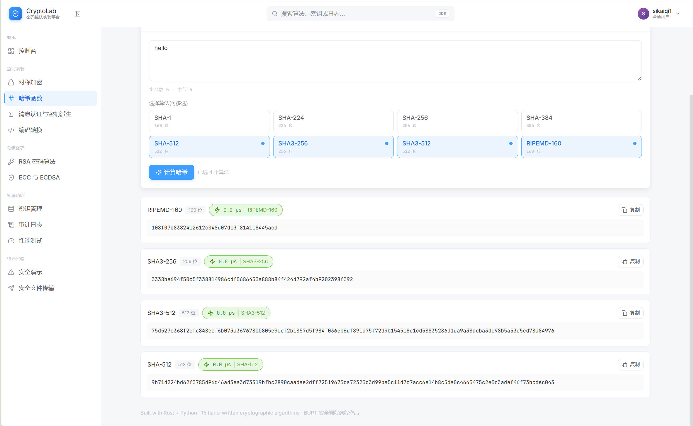

**图 4-5 多算法哈希摘要结果**

如图 4-5 所示， SHA-1、SHA-256、SHA3、RIPEMD-160 等摘要输出，使用户能够比较输出长度和算法标识。它支撑第 3.3 节关于哈希算法覆盖的结论，同时也提示 SHA-1 的教学属性与安全边界。

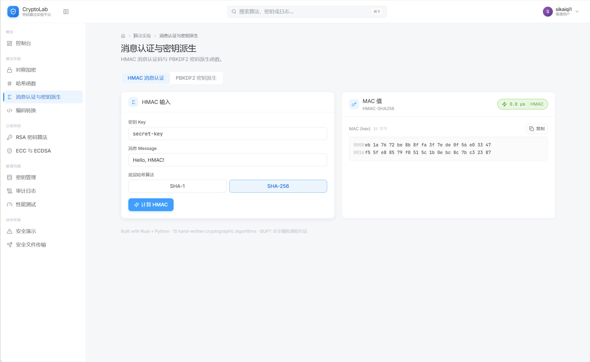

**图 4-6 HMAC-SHA256 计算结果**

如图 4-6 所示， key、message、算法选择和 MAC 输出，对应式 (3-3) 与 Code 3-2。它说明系统将“带密钥摘要”与裸 hash 分开，避免把 SHA-256 误用为消息认证码。

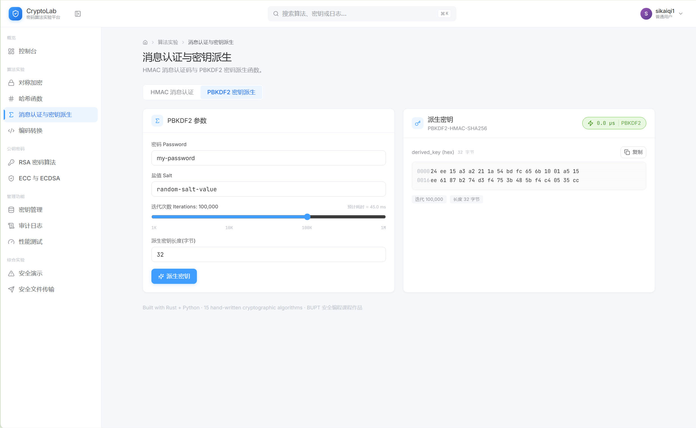

**图 4-7 PBKDF2 派生密钥结果**

如图 4-7 所示， password、salt、iterations、key_len 和 derived key，直接对应式 (3-4)。它支撑的结论是系统能够把口令派生参数显式暴露给用户，并用于解释迭代次数对成本的影响。

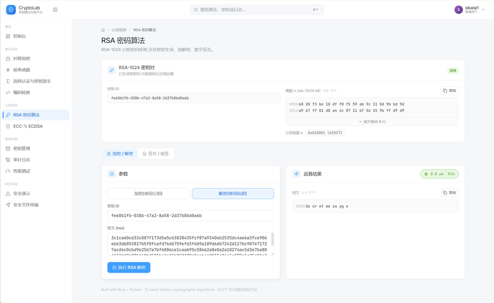

**图 4-8 RSA-1024 操作结果**

如图 4-8 所示， RSA 密钥 ID、公钥参数和加密或签名结果，说明公钥密码模块已经通过前端接入后端。它与 `rsa.rs` 中 OAEP/PSS、CRT 和盲化实现共同支撑第 3.5.2 节。

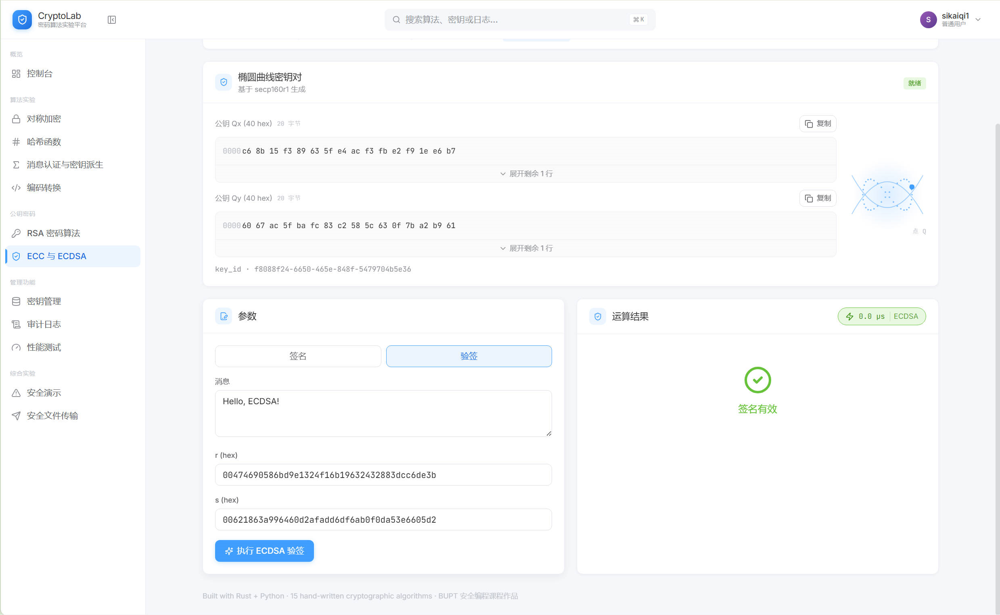

**图 4-9 ECDSA 签名与验签结果**

如图 4-9 所示， secp160r1 签名参数和验签状态，对应式 (3-16) 与式 (3-17)。它支撑的结论是项目不仅实现 ECC 密钥生成，还实现了面向消息的签名验证流程。

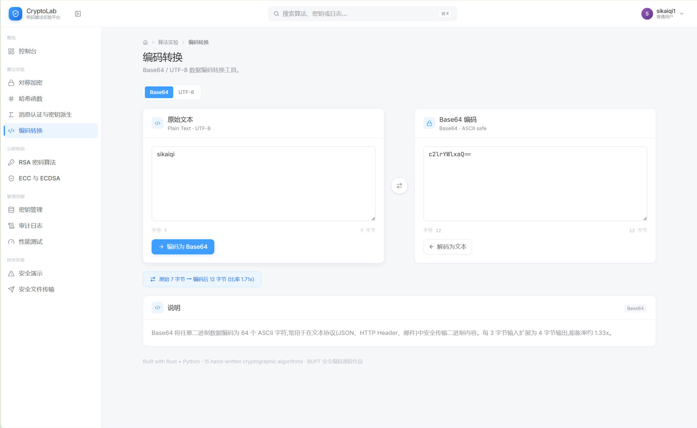

**图 4-10 Base64/UTF-8 编码转换**

如图 4-10 所示，文本输入、Base64 输出和编码转换结果，说明编码算法已接入 UI。它与 `base64.rs` 和 `utf8.rs` 的测试共同支撑第 3.2 节。

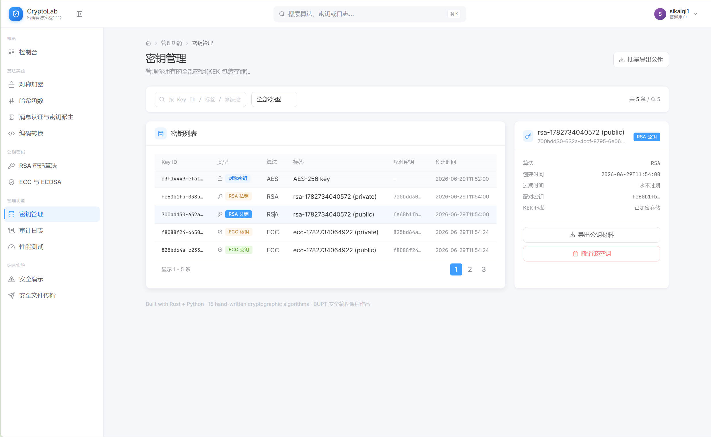

**图 4-11 密钥管理页面**

如图 4-11 所示，密钥列表、密钥类型、算法和详情区域，说明 key store 已作为用户可操作对象进入前端。报告需要注意不展示私钥明文，只展示 key id、公钥材料或脱敏字段。

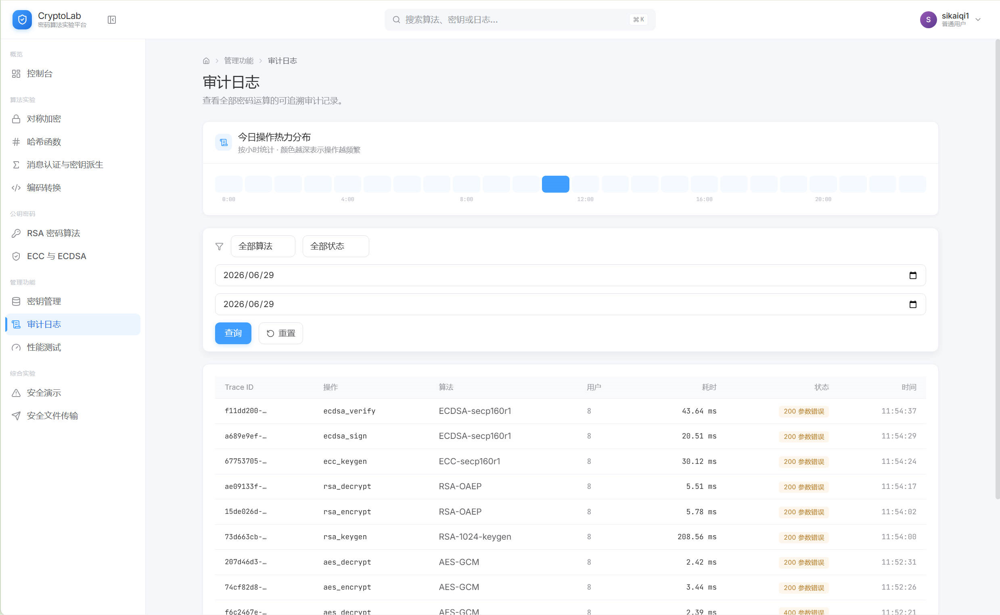

**图 4-12 审计日志列表**

如图 4-12 所示，审计热力图、过滤器和日志表格，支持 trace_id、算法、状态和耗时的可观测性结论。它对应 `operation_logs` 表和 `AuditMiddleware` 的实现。


**图 4-13 审计详情抽屉**

如图 4-13 所示，单条操作的 trace_id、状态码、算法、耗时和输入/输出 hash，说明审计记录保存的是可追踪摘要而非敏感明文。它支撑第 5.6 节关于 trace_id 贯穿的论述。

## 4.4 AES verbose / 教学模式中间过程

AES verbose 前端截图 `docs/report_assets/screenshots/frontend/P0_03_frontend_symmetric_aes_verbose_trace.png` 当前未发现，`FRONT_SCREENSHOT_CLASSIFICATION.md` 和 `SCREENSHOT_INDEX.md` 均将其列为待补拍。因此，本报告不能把前端 AES verbose 截图写成已采集。与此相对，项目已经提供三类替代证据：`docs/verbose_mode.md` 说明 verbose mode 范围和 FIPS 197 对照来源，`docs/aes_verbose_trace_fips197.json` 保存 AES-128 `001122.../000102...` 示例的每轮中间状态，`docs/report_assets/figures/fig5_aes_verbose_trace.png` 将这些状态和 timing 可视化。


**图 4-14 AES verbose trace 结果图**

如图 4-14 所示， AES round-level state、关键轮矩阵和每轮 timing，数据来自 FIPS 197 对照 JSON。它不能替代前端截图对 UI 的证明，但足以证明 Rust/API 层生成了真实中间过程数据，而不是只返回最终 ciphertext。

## 4.5 性能基准测试

性能分析使用 `docs/report_assets/data/fig4_benchmark_raw.csv` 和 `fig4_benchmark_summary.csv`，图 4-15 为分面展示。吞吐量计算如式 (4-1) 所示，其中 `bytes` 为输入字节数，`duration_s` 为耗时秒数。由于对称加密、哈希、HMAC/PBKDF2 和公钥操作处在不同数量级，报告采用分面比较，而不把所有算法压到单一坐标轴上。根据 summary CSV，AES ECB 平均约 101.58 MB/s，AES GCM 约 13.81 MB/s，SM4 ECB 约 87.13 MB/s，RC6 ECB 约 222.78 MB/s；SHA256 约 218.27 MB/s；PBKDF2-HMAC-SHA256 约 14.01 ms/op；ECDSA verify 约 34.79 ms/op。需要相对化说明的是，OpenSSL、BoringSSL 和部分 RustCrypto 后端可利用 AES-NI、PCLMULQDQ、SHA 扩展或平台汇编优化，而 CryptoLab 主要服务教学透明性与跨层验证，纯软件路径性能低于工业库属于预期现象。因此，图 4-15 的意义是比较项目内部不同算法数量级，而不是宣称自实现性能优于权威库。

$$
\mathrm{throughput}=\frac{\mathrm{bytes}}{\mathrm{duration\_s}\times 2^{20}}\ \mathrm{MB/s}
\tag{4-1}
$$


**图 4-15 Benchmark 性能结果图**

如图 4-15 所示，该图来自 `fig4_benchmark_performance.png`，每个算法至少 5 次重复测量，并保存 raw 与 summary CSV。图中公钥操作使用 ms/op，吞吐型算法使用 MB/s，避免把 ECDSA 与 SHA256 放在同一纵轴造成误读。

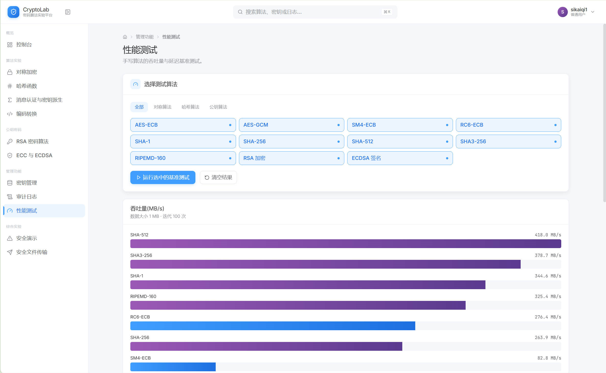

**图 4-16 Benchmark 前端结果**

如图 4-16 所示，前端 benchmark 页面中的算法选择、结果图和数据表，说明性能结果不仅保存在 CSV 中，也能被前端展示。由于 benchmark 是本机短时测量，正文只讨论数量级和相对趋势，不将其推广为通用性能排名。

## 4.6 安全漏洞演示模块

安全 demo 的目标是把第 1 章提到的工程误用风险转化为可观察实验。首先，ECB 图像泄露 demo 将结构化图像分别用 ECB 和 CBC 加密，并比较重复块比例；其次，ECDSA `k` 重用 demo 使用教学路径生成两条共享 nonce 的签名，再按式 (3-18) 和式 (3-19) 恢复私钥；再次，RSA 小指数 demo 展示 `e=3` 与短消息无填充时的立方根恢复边界；最后，PBKDF2 迭代影响 demo 显示迭代次数越高，派生耗时越长。需要强调的是，这些 demo 位于教学路径，生产路径仍使用 OAEP、PSS、RFC 6979、GCM 和参数校验。


**图 4-17 前端 ECB 图像泄露 demo**

如图 4-17 所示，前端安全演示页面、参数和 ECB/CBC 对比结果，说明工作模式选择对实际泄露有直观影响。它与式 (3-8)、式 (3-9) 和工作模式表共同支撑“ECB 仅适合教学，不适合保护结构化数据”的结论。


**图 4-18 安全演示效果图**

如图 4-18 所示，该图将 ECB 泄露图像、重复块比例和 PBKDF2 迭代耗时放在同一实验资产中，数据来自 `fig6_ecb_leak_metrics.csv` 与 `fig6_pbkdf2_iterations.csv`。图中的合成图像用于突出重复块泄露，不代表所有自然图像都同等明显。

为了补足安全 demo 的前端交互证据，图 4-19 和图 4-20 分别给出 ECDSA `k` 复用攻击结果与 PBKDF2 迭代影响页面。相较于图 4-18 的数据型总览，这两张截图直接展示用户在前端触发 demo 后获得的攻击输出、参数解释和耗时对比，因此能够说明漏洞/误用模块不是只存在于后端服务或静态图表，而是已经被接入可操作的页面流程。

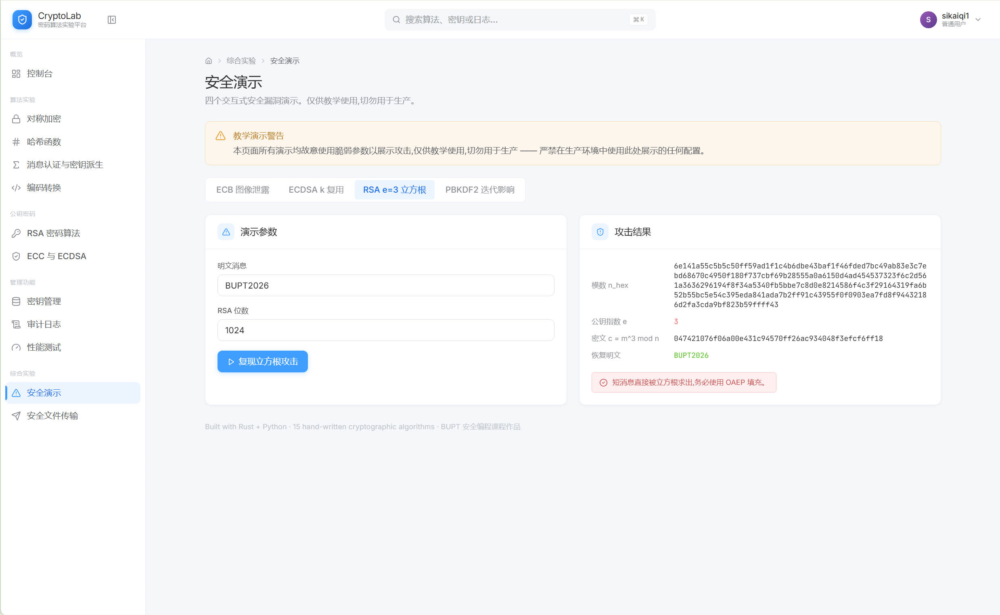

**图 4-19 ECDSA k 复用 Demo 前端结果**

如图 4-19 所示，前端安全演示页执行 ECDSA `k` 复用攻击后的结果，页面将两条共享 nonce 的签名、消息摘要关系和恢复出的私钥结论放在同一视图中。它支撑的结论是第 3 章关于确定性 `k` 与随机数治理的分析已经转化为可观察实验，用户能够直接看到签名随机数复用如何破坏私钥保密性。

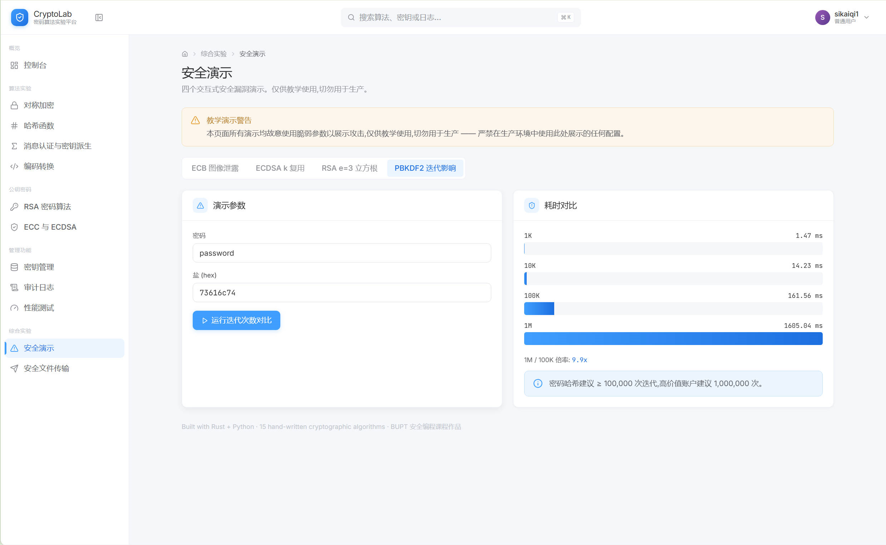

**图 4-20 PBKDF2 迭代影响 Demo 前端交互**

如图 4-20 所示， PBKDF2 迭代次数影响 demo 的前端结果，页面将不同 `iterations` 参数下的派生耗时和成本差异可视化呈现。它与图 4-7 的 PBKDF2 派生密钥截图互补：前者说明合法派生流程，后者说明参数选择对离线猜测成本的影响，从而强化“参数不是装饰项”的工程结论。

## 4.7 综合应用场景

综合应用场景是安全文件传输，目的是把多个算法串成一个端到端协议。发送方首先生成或选择 AES-256 会话密钥，然后用接收方 RSA-OAEP 公钥包装会话密钥；其次，用 AES-GCM 加密文件并生成认证标签；进而，用 SHA-256 计算文件摘要，再用发送方 ECDSA 私钥对摘要签名；最后，将包装密钥、密文、tag、摘要和签名打包为 envelope。接收方则用 RSA 私钥解包会话密钥，用 AES-GCM 解密并验证 tag，重算 SHA-256 摘要，并用发送方 ECDSA 公钥验签。

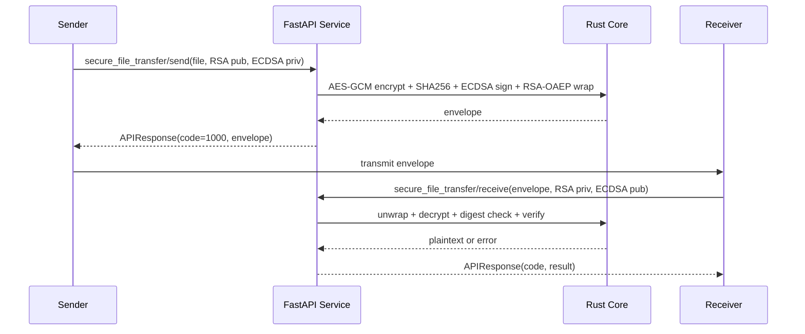
```mermaid
sequenceDiagram
  participant S as Sender
  participant API as FastAPI Service
  participant R as Rust Core
  participant T as Receiver
  S->>API: secure_file_transfer/send(file, RSA pub, ECDSA priv)
  API->>R: AES-GCM encrypt + SHA256 + ECDSA sign + RSA-OAEP wrap
  R-->>API: envelope
  API-->>S: APIResponse(code=1000, envelope)
  S->>T: transmit envelope
  T->>API: secure_file_transfer/receive(envelope, RSA priv, ECDSA pub)
  API->>R: unwrap + decrypt + digest check + verify
  R-->>API: plaintext or error
  API-->>T: APIResponse(code, result)
```

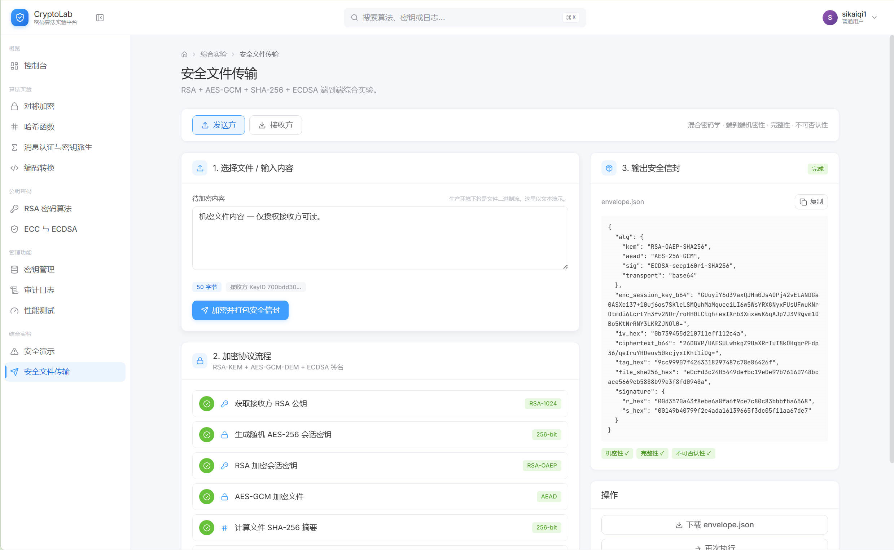

**图 4-21 安全文件传输发送流程**

如图 4-21 所示，前端场景页中的协议步骤和 envelope JSON，说明系统能把 AES、SHA-256、RSA、ECDSA 和 Base64 组合为完整应用。该截图支撑的结论是 CryptoLab 已超出单算法调用，具备跨算法编排和端到端展示能力。

发送流程只能证明 envelope 的生成，因此图 4-22 和图 4-23 继续展示接收方输入与验证结果。具体而言，接收端需要同时完成 RSA 私钥解包、AES-GCM 认证解密、SHA-256 摘要重算和 ECDSA 验签；如果只保留发送端截图，“端到端”证据会偏向前半程。补充接收与结果截图后，第 4.7 节可以更完整地说明综合场景覆盖发送、接收、验证和结果展示四个环节。

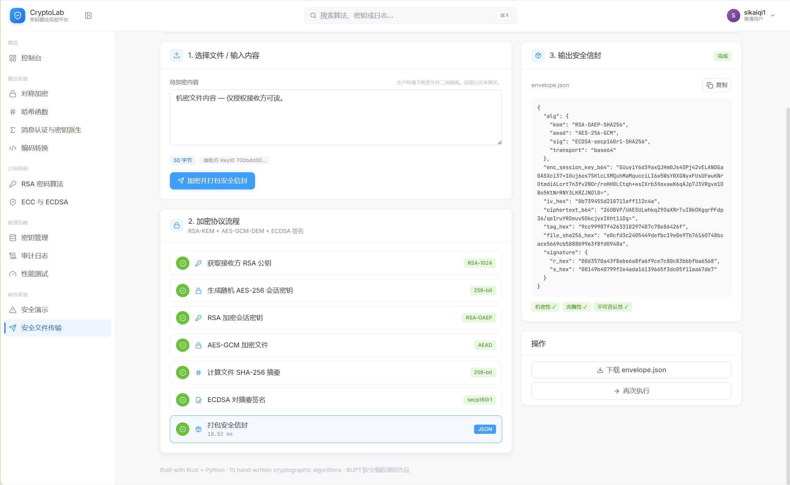

**图 4-22 安全文件传输接收方流程**

如图 4-22 所示，接收方页面对 envelope、接收方私钥和发送方公钥等输入的处理入口，说明综合场景不是只生成密文包，而是把解包和验签所需材料纳入同一前端流程。它支撑的结论是文件传输场景已经覆盖接收侧操作路径，能够从 UI 层复现服务端的协议编排逻辑。

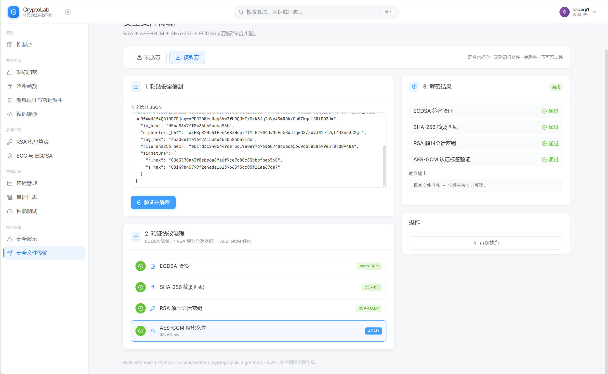

**图 4-23 安全文件传输接收与验证结果**

如图 4-23 所示，接收端完成解密、摘要校验和 ECDSA 验签后的结果状态，页面输出把明文恢复、完整性验证和签名验证放在同一结果视图中。它支撑的结论是安全文件传输示例具备完整闭环：发送方产生 envelope，接收方解析并验证 envelope，而不是仅展示单向加密结果。

# 第 5 章 接口设计与调用

## 5.1 接口设计原则

第 5 章承接第 4 章的运行证据，重点说明第三方程序如何通过接口调用 CryptoLab。接口设计遵循四个原则：首先，路径采用 `/api/v1` 版本前缀，便于后续兼容升级；其次，端点按 auth、symmetric、hash、encoding、pubkey、keys、audit、benchmark、demos、scenarios、metrics 功能域分组；进而，所有业务响应使用 `APIResponse` envelope，返回业务状态码、消息、数据和 trace_id；最后，错误处理通过 `StatusCode` 统一映射 HTTP 状态，避免不同路由以不同格式暴露失败。该设计与 FastAPI 的 OpenAPI 生成能力相匹配 [42]。

## 5.2 端点全景

根据 `docs/report_assets/data/api_endpoints.csv`，项目当前有 32 个 router 端点，且均有 handler、service 或测试证据。需要说明的是，4 个 demos 路由存在 handler/service/test，但未显式声明 `response_model`，因此 CSV 状态标为 `部分完成 (Partial)`；这不影响 demo 可用性，但属于接口契约严谨性不足，应在第 6 章局限性中承认。

**表 5-1 API 端点功能域汇总表**

如表 5-1 所示，该表按照认证、用户、算法、密钥、审计和系统观测等功能域汇总 32 个 API 端点的分布情况。

| 模块 | 端点数 | 代表路径 |
|---|---:|---|
| auth | 4 | `/api/v1/auth/login`、`/api/v1/auth/me` |
| symmetric | 3 | `/api/v1/symmetric/{algo}/encrypt` |
| hash | 3 | `/api/v1/hash/{algo}`、`/api/v1/hash/pbkdf2` |
| encoding | 2 | `/api/v1/encoding/base64/{op}` |
| pubkey | 8 | `/api/v1/pubkey/rsa/keygen`、`/api/v1/pubkey/ecdsa/verify` |
| keys/audit/metrics/benchmark | 6 | `/api/v1/keys`、`/api/v1/audit/logs` |
| demos | 4 | `/api/v1/demos/ecb_image_leak` |
| scenarios | 2 | `/api/v1/scenarios/secure_file_transfer/send` |

为避免评阅时必须跳转附录，表 5-2 进一步给出按功能域分组的完整 32 端点紧凑视图。该表不重复 handler、schema 和测试证据等附录字段，而是突出模块、方法、路径和当前契约状态；其中 demos 端点标为部分完成，是因为它们具备 handler/service/test 和前端调用证据，但 `api_endpoints.csv` 记录其未显式声明 `response_model`。

**表 5-2 API 端点完整紧凑表**

如表 5-2 所示，该表在正文中压缩展示 32 个端点，使接口覆盖范围可以在第 5 章直接阅读，附录 A 则保留完整 CSV 风格索引。

| 功能域 | 方法 | 路径 | 状态 |
|---|---|---|---|
| audit | GET | `/api/v1/audit/logs` | 已完成 (Complete) |
| auth | POST | `/api/v1/auth/login` | 已完成 (Complete) |
| auth | POST | `/api/v1/auth/logout` | 已完成 (Complete) |
| auth | GET | `/api/v1/auth/me` | 已完成 (Complete) |
| auth | POST | `/api/v1/auth/register` | 已完成 (Complete) |
| benchmark | GET | `/api/v1/benchmark/{algo}` | 已完成 (Complete) |
| demos | POST | `/api/v1/demos/ecb_image_leak` | 部分完成 (Partial) |
| demos | POST | `/api/v1/demos/ecdsa_k_reuse` | 部分完成 (Partial) |
| demos | POST | `/api/v1/demos/pbkdf2_iteration_impact` | 部分完成 (Partial) |
| demos | POST | `/api/v1/demos/rsa_low_exponent` | 部分完成 (Partial) |
| encoding | POST | `/api/v1/encoding/base64/{op}` | 已完成 (Complete) |
| encoding | POST | `/api/v1/encoding/utf8/{op}` | 已完成 (Complete) |
| hash | POST | `/api/v1/hash/hmac/{algo}` | 已完成 (Complete) |
| hash | POST | `/api/v1/hash/pbkdf2` | 已完成 (Complete) |
| hash | POST | `/api/v1/hash/{algo}` | 已完成 (Complete) |
| keys | GET | `/api/v1/keys` | 已完成 (Complete) |
| keys | DELETE | `/api/v1/keys/{key_id}` | 已完成 (Complete) |
| keys | GET | `/api/v1/keys/{key_id}/public` | 已完成 (Complete) |
| metrics | GET | `/api/v1/metrics` | 已完成 (Complete) |
| pubkey | POST | `/api/v1/pubkey/ecc/keygen` | 已完成 (Complete) |
| pubkey | POST | `/api/v1/pubkey/ecdsa/sign` | 已完成 (Complete) |
| pubkey | POST | `/api/v1/pubkey/ecdsa/verify` | 已完成 (Complete) |
| pubkey | POST | `/api/v1/pubkey/rsa/decrypt` | 已完成 (Complete) |
| pubkey | POST | `/api/v1/pubkey/rsa/encrypt` | 已完成 (Complete) |
| pubkey | POST | `/api/v1/pubkey/rsa/keygen` | 已完成 (Complete) |
| pubkey | POST | `/api/v1/pubkey/rsa/sign` | 已完成 (Complete) |
| pubkey | POST | `/api/v1/pubkey/rsa/verify` | 已完成 (Complete) |
| scenarios | POST | `/api/v1/scenarios/secure_file_transfer/receive` | 已完成 (Complete) |
| scenarios | POST | `/api/v1/scenarios/secure_file_transfer/send` | 已完成 (Complete) |
| symmetric | POST | `/api/v1/symmetric/keygen` | 已完成 (Complete) |
| symmetric | POST | `/api/v1/symmetric/{algo}/decrypt` | 已完成 (Complete) |
| symmetric | POST | `/api/v1/symmetric/{algo}/encrypt` | 已完成 (Complete) |
## 5.3 统一响应结构与状态码体系

统一响应结构由 `api_server/app/schemas/common.py` 定义，核心字段包括 `code`、`message`、`data` 和 `trace_id`。其中 `code=1000` 表示成功，200x 表示参数或编码错误，300x 表示密码操作失败，410x 表示 token 和登录错误，420x 表示密钥访问错误，500x 表示内部、限流、数据库或密码库错误。`status_codes.csv` 记录 28 项状态码和 HTTP 映射，例如 `PARAM_MISSING=2001/HTTP 400`、`DECRYPT_FAILED=3002/HTTP 400`、`AUTH_TOKEN_BLACKLISTED=4105/HTTP 401`、`RATE_LIMIT_EXCEEDED=5001/HTTP 429`。

**表 5-3 状态码分段语义表**

如表 5-3 所示，该表说明项目状态码以首位数字划分语义域的规则，并将其与统一响应结构和错误处理链路关联起来。

| 区间 | 语义 | 示例 |
|---|---|---|
| 1000 | 成功 | `OK` |
| 2001-2005 | 参数、编码、算法、padding | `ALGORITHM_UNSUPPORTED` |
| 3001-3004 | 加密、解密、签名、密钥匹配 | `SIGNATURE_INVALID` |
| 4101-4107 | 鉴权与登录 | `AUTH_TOKEN_EXPIRED` |
| 4201-4204 | 密钥访问 | `KEY_PRIVATE_ACCESS_DENIED` |
| 5000-5003 | 内部、限流、数据库、密码库 | `CRYPTO_LIB_ERROR` |

## 5.4 鉴权、限流与审计

鉴权流程如图 5-1 所示。首先，用户注册或登录后由 `issue_access_token` 签发 JWT；其次，访问受保护路径时 `AuthMiddleware` 解析 Bearer token、校验过期时间、检查 jti 是否在 `jwt_blacklist:{jti}` 中；进而，登出时服务端把 jti 写入缓存直到 token 剩余生命周期结束。限流由 `RateLimitMiddleware` 生成 `rate_limit:{ip}:{path_prefix}` key，并按普通接口和登录接口使用不同阈值。审计由 `AuditMiddleware` 在请求结束后写入 `operation_logs`，记录 trace_id、操作、算法、key_id、输入输出 hash、状态码和耗时。

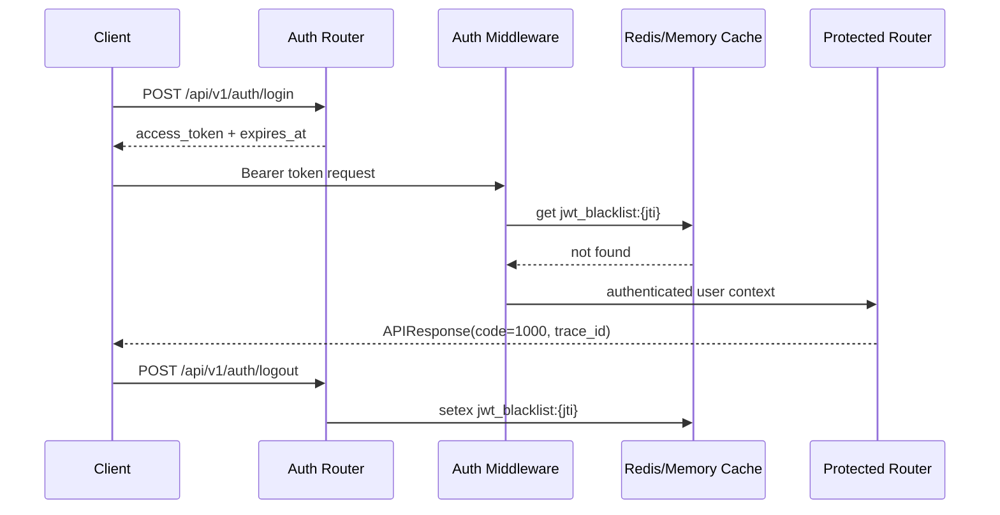
```mermaid
sequenceDiagram
  participant C as Client
  participant A as Auth Router
  participant M as Auth Middleware
  participant Cache as Redis/Memory Cache
  participant R as Protected Router
  C->>A: POST /api/v1/auth/login
  A-->>C: access_token + expires_at
  C->>M: Bearer token request
  M->>Cache: get jwt_blacklist:{jti}
  Cache-->>M: not found
  M->>R: authenticated user context
  R-->>C: APIResponse(code=1000, trace_id)
  C->>A: POST /api/v1/auth/logout
  A->>Cache: setex jwt_blacklist:{jti}
```

**图 5-1 JWT 鉴权与黑名单时序图**

如图 5-1 所示， CryptoLab 的 token 不是只在登录时生成，而是在每次受保护请求中被中间件校验，并在登出后通过 jti 黑名单失效。该流程支撑第 2.5 节的 Spoofing 缓解措施。

## 5.5 第三方调用范式

第三方调用可以使用 curl、Python 客户端或 Swagger UI。当前 `docs/report_assets/logs/screenshots/api_probe_noproxy.txt` 已保存禁用代理后的 API 探测日志，结论包括 OpenAPI `path_count=32` 和 SHA-256 API 成功响应 `code=1000`。Swagger `/docs` 页面 PNG 尚未采集，因此本报告在 checklist 中将其列为待补拍；然而，OpenAPI 日志已经能证明接口数量和关键 hash 调用可用。

```bash
curl -X POST "http://127.0.0.1:8000/api/v1/hash/sha256" \
  -H "Content-Type: application/json" \
  -d "{\"data\":\"BUPT CryptoLab\"}"
```

```python
import httpx

payload = {"data": "BUPT CryptoLab"}
resp = httpx.post("http://127.0.0.1:8000/api/v1/hash/sha256", json=payload)
body = resp.json()
assert body["code"] == 1000
print(body["data"]["digest_hex"], body["trace_id"])
```

前端 React 集成采用 `frontend/src/api/*.ts` 模块化封装，将路由请求转化为页面状态。具体而言，AES、Hash、HMAC、PBKDF2、RSA、ECDSA、keys、audit、benchmark、demos 和 scenarios 分别对应独立 API 模块或视图调用，前端截图第 4 章已经证明这些调用结果被展示在页面中。由此可见，接口设计不仅服务 Swagger 或命令行，也支撑真实 UI 工作流。

## 5.6 错误处理与可观测性

错误处理和可观测性依赖 trace_id 贯穿，这与 SRE 对请求可追踪性和故障复盘能力的强调一致 [48]。`TraceIDMiddleware` 从 `X-Trace-Id` 或 UUID 生成 trace_id，写入 `request.state.trace_id`，并在响应头返回；统一异常处理器将错误包装为 `APIResponse`，审计服务则把 trace_id 与输入/输出 hash、状态码、耗时写入数据库。数据流如图 5-2 所示。需要注意的是，metrics 表和 `/metrics` 端点已经存在，但本地运行数据可能稀疏，因此报告只说具备短时 benchmark 和指标模型，不把它描述成长期生产监控系统。

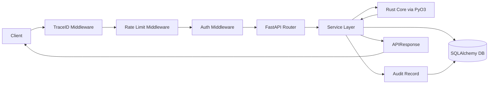
```mermaid
flowchart LR
  Client[Client] --> Trace[TraceID Middleware]
  Trace --> Rate[Rate Limit Middleware]
  Rate --> Auth[Auth Middleware]
  Auth --> Router[FastAPI Router]
  Router --> Service[Service Layer]
  Service --> Rust[Rust Core via PyO3]
  Service --> DB[(SQLAlchemy DB)]
  Service --> Audit[Audit Record]
  Audit --> DB
  Rust --> Service
  Service --> Response[APIResponse]
  Response --> Client
```

**图 5-2 请求-响应链路数据流图**

如图 5-2 所示，图中每个节点都有明确职责，因此错误可以在 schema、鉴权、限流、服务或 Rust core 任一层被拦截，并通过统一状态码返回。下一章将基于这些事实总结项目成果和局限。

# 第 6 章 总结与展望

## 6.1 工作总结

本项目围绕课程要求完成了从密码原语到 Web 系统的完整工程链路。首先，Rust core 覆盖 15 项算法并保存测试向量证据，其中 AES、SM4、SHA、HMAC、PBKDF2、RSA、ECC、ECDSA 等关键模块均有源码和测试支撑；其次，PyO3 将这些算法暴露为 Python 模块，FastAPI 将其组织成 32 个端点，React 前端将主要算法结果和安全 demo 展示为可截图材料。由此，系统已经满足“输入输出可见、执行结果可测、接口可调用”的课程核心要求。

从验证角度看，项目形成了较完整的证据链。Rust 测试记录为 `53 passed, 0 failed, 3 ignored`，API 在项目 `.venv` 下记录为 `254 passed, 1 deselected`，前端 TypeScript smoke 通过，图表 QA 报告显示 Fig.1-Fig.6 均 PASS。与此同时，报告没有回避裸 pytest 缺 `jwt`、Docker build 失败、metrics 数据稀疏等事实，而是把这些问题放入局限性和 checklist。这样的写法使交付物更接近工业技术报告的风格：用数据支撑结论，同时承认证据边界。

从系统设计角度看，Rust × Python 异构架构、KEK 信封加密、JWT 黑名单、Redis/内存限流、审计日志、trace_id 和统一状态码共同构成了工程化基础。与单文件作业相比，CryptoLab 的价值不只在算法数量，而在算法如何被服务化、被保护、被观察和被第三方调用。前端截图和 API 日志进一步说明，这些能力已经进入用户可操作界面和 HTTP 契约，而不是停留在内部函数。

## 6.2 主要创新点

第一项创新是以 Rust × Python 异构架构回应密码工程中的内存安全问题。工业级密码库在过去长期依赖 C/C++，Heartbleed 和 Cloudbleed 等事件说明边界检查、解析器和内存管理错误会直接放大为敏感数据泄露 [28][29]。近年来，Android 平台将 Rust 引入系统组件以降低新增内存安全漏洞比例，Microsoft Azure 安全团队把 Rust 纳入安全多租户和机密计算演进叙事，Linux kernel 也开始接纳 Rust 作为第二语言，Cloudflare 则公开说明使用 Rust 构建网络隧道组件的工程原因 [50][52][53][54]。CryptoLab 延续这一方向，把字节级算法、大整数运算和密钥敏感路径放入 Rust core，再用 PyO3 连接 Python/FastAPI，既保留课程需要的算法可解释性，也避免把所有风险集中在纯 Python 或 C ABI 胶水层中。

第二项创新是用三重验证体系回应“算法输出看似正确但证据不足”的问题。项目不仅运行单元测试，还将标准测试向量、第三方库对照和 HTTP/API 交叉验证整理为矩阵与图表。具体而言，`cross_validation_matrix.md` 与图 4-2 把每个算法族的证据层级可视化，RC6 与 ECDSA secp160r1 的第三方库缺口也被标为受限，而不是被隐藏。这样的验证方式更适合课程报告，因为它把“正确性”从一句测试通过扩展为可追溯证据，并使评分者能够沿着 CSV、日志、源码和截图复核关键结论。

第三项创新是把教学可视化集中放在最能解释结构的算法上。AES verbose 模式保存 FIPS 197 AES-128 示例的每轮中间状态，并生成 `aes_verbose_trace_fips197.json` 与图 4-14。相较把所有算法都做浅层动画，项目选择对 SubBytes、ShiftRows、MixColumns 和 AddRoundKey 做 round-level trace，而对 SHA-3/RIPEMD-160 等实现成本较高或教学收益较分散的算法采用标准向量和权威库差异分析。这样的取舍更接近工程决策：有限时间内优先把最能支撑评分和理解的过程证据做深。

第四项创新是把安全漏洞 demo 与正向综合场景放在同一系统中。项目提供 ECB 图像泄露、ECDSA `k` 重用、RSA 小指数和 PBKDF2 迭代影响四类 demo，同时提供安全文件传输场景。前者展示错误用法的风险，后者展示 RSA-OAEP、AES-GCM、SHA-256 和 ECDSA 如何组合成端到端流程。二者结合后，报告不只说明“应当使用安全模式”，还通过前端截图和数学推导展示错误参数、错误模式和错误 nonce 如何产生可复现实验结果。

第五项创新是把审计和可观测性纳入课程级密码平台。许多算法作业只输出密文、摘要或签名，而 CryptoLab 使用 trace_id、operation_logs、状态码、输入输出 hash 和审计详情抽屉，把密码操作转化为可追踪事件。与此同时，密钥材料采用 KEK 信封加密入库，私钥导出受到限制。虽然这不是生产 KMS，也没有长期 metrics 数据沉淀，但它已经把“算法实现”推进到“可调用、可审计、可复盘”的系统形态，更符合网络信息安全课程对工程实现与安全分析的双重要求。
## 6.3 局限性与不足

接口契约严谨性仍是第一类局限。RC6 当前只暴露 ECB/CBC，GCM 不暴露，因此它是算法项完成但模式覆盖不完整的状态；与此同时，4 个 demos 路由具备 handler、service、test 和前端截图证据，但 `api_endpoints.csv` 记录其未显式声明 `response_model`。这类问题对课程评分的影响主要体现在接口设计严谨性，而不是算法正确性；对生产系统而言，它会增加客户端类型推断和错误处理成本。后续应在 OpenAPI schema 中补齐 demo 响应模型，并在 UI/API 中明确限制 RC6 可选模式。

部署稳定性是第二类局限。项目已有 Docker compose config 通过日志，但 Docker build 当前仍有失败证据，失败原因在不同日志中涉及依赖解析或 Debian apt 502。该问题不会否定本地 Rust、API 和前端测试结论，却会影响“从零环境复现”的可信度；在生产工程中，构建失败意味着交付链路不可依赖。后续应固定基础镜像、配置可用镜像源、缓存 Rust/Python/Node 依赖，并保存一次成功 build 的完整日志，避免把本地环境成功误写成容器化成功。

观测数据成熟度是第三类局限。系统已经设计 `algorithm_metrics`、trace_id、operation_logs 和审计详情抽屉，但本地 metrics 数据较稀疏，前端 `npm test` 当前也是 TypeScript smoke check，而不是 Playwright 或组件测试。因此，报告可以说明具备观测模型和短时 benchmark 证据，却不能宣称已经形成长期监控能力。该局限对课程展示影响有限，但对工业运行影响较大，因为没有持续指标就难以及时发现性能退化、异常调用和前端回归。后续应在 benchmark 后写入趋势数据，并补关键 UI 自动化测试。

第三方对照局限是第四类局限。secp160r1 和 RC6 在现代主流库中的支持并不充分，导致部分验证只能采用 KAT-only 或受限第三方对照；AES、SHA、HMAC、PBKDF2 和 RSA 则有更成熟的 OpenSSL、RustCrypto、`hashlib` 或 `cryptography` 对照路径。该问题来自课程指定算法与现代生态之间的错位，并不等同于实现缺失。后续若要提高验证强度，可以补充更多论文向量、独立脚本复核和跨语言参考实现，同时在报告中继续保持“受限”标注，避免把测试覆盖写得超过实际证据。
## 6.4 未来工作

未来工作首先应补齐 RC6 模式覆盖或在 UI/API 中更明确地限制可选模式，其次应修复 Docker build 稳定性并保存成功构建证据。进而，前端应补拍 AES verbose 截图，并引入 Playwright 或组件测试覆盖关键 UI 流程；metrics 方面应在 benchmark 后持续写入并展示趋势；安全 demo 可进一步增加 padding oracle、nonce 重用和 JWT 误用案例。最后，报告排版阶段应继续统一图表编号、页眉页脚、字体和参考文献样式，使 Markdown 主稿能够稳定进入后续正式排版流程。

# 第 7 章 参考文献

[1] National Institute of Standards and Technology, FIPS 197, Advanced Encryption Standard (AES), 2023 update.

[2] National Institute of Standards and Technology, FIPS 180-4, Secure Hash Standard (SHS), 2015.

[3] National Institute of Standards and Technology, FIPS 202, SHA-3 Standard: Permutation-Based Hash and Extendable-Output Functions, 2015.

[4] National Institute of Standards and Technology, FIPS 186-5, Digital Signature Standard (DSS), 2023.

[5] National Institute of Standards and Technology, SP 800-38A, Recommendation for Block Cipher Modes of Operation, 2001.

[6] National Institute of Standards and Technology, SP 800-38D, Recommendation for Galois/Counter Mode (GCM) and GMAC, 2007.

[7] National Institute of Standards and Technology, SP 800-132, Recommendation for Password-Based Key Derivation, 2010.

[8] K. Moriarty, B. Kaliski, J. Jonsson, and A. Rusch, RFC 8017, PKCS #1: RSA Cryptography Specifications Version 2.2, IETF, 2016.

[9] H. Krawczyk, M. Bellare, and R. Canetti, RFC 2104, HMAC: Keyed-Hashing for Message Authentication, IETF, 1997.

[10] M. Nystrom, RFC 4231, Identifiers and Test Vectors for HMAC-SHA-224, HMAC-SHA-256, HMAC-SHA-384, and HMAC-SHA-512, IETF, 2005.

[11] K. Moriarty, B. Kaliski, and A. Rusch, RFC 8018, PKCS #5: Password-Based Cryptography Specification Version 2.1, IETF, 2017.

[12] S. Josefsson, RFC 4648, The Base16, Base32, and Base64 Data Encodings, IETF, 2006.

[13] F. Yergeau, RFC 3629, UTF-8, a transformation format of ISO 10646, IETF, 2003.

[14] T. Pornin, RFC 6979, Deterministic Usage of DSA and ECDSA, IETF, 2013.

[15] Certicom Research, SEC 2: Recommended Elliptic Curve Domain Parameters, Version 2.0, 2010.

[16] 中华人民共和国国家质量监督检验检疫总局 and 中国国家标准化管理委员会, GB/T 32907-2016, 信息安全技术 SM4 分组密码算法, 北京: 中国标准出版社, 2016.

[17] R. L. Rivest, A. Shamir, and L. Adleman, “A Method for Obtaining Digital Signatures and Public-Key Cryptosystems,” Communications of the ACM, 1978.

[18] W. Diffie and M. E. Hellman, “New Directions in Cryptography,” IEEE Transactions on Information Theory, 1976.

[19] N. Koblitz, “Elliptic Curve Cryptosystems,” Mathematics of Computation, 1987.

[20] V. S. Miller, “Use of Elliptic Curves in Cryptography,” CRYPTO, 1985.

[21] D. Johnson, A. Menezes, and S. Vanstone, “The Elliptic Curve Digital Signature Algorithm (ECDSA),” International Journal of Information Security, 2001.

[22] M. Bellare, R. Canetti, and H. Krawczyk, “Keying Hash Functions for Message Authentication,” CRYPTO, 1996.

[23] J. Daemen and V. Rijmen, The Design of Rijndael, Springer, 2002.

[24] G. Bertoni, J. Daemen, M. Peeters, and G. Van Assche, The Keccak Reference, 2011.

[25] X. Wang, Y. L. Yin, and H. Yu, “Finding Collisions in the Full SHA-1,” CRYPTO, 2005.

[26] M. Stevens et al., “The first collision for full SHA-1,” CRYPTO, 2017.

[27] A. K. Lenstra et al., “Ron was wrong, Whit is right,” IACR ePrint, 2012.

[28] MITRE, "CVE-2014-0160," Common Vulnerabilities and Exposures, 2014. [Online]. Available: https://cve.mitre.org/cgi-bin/cvename.cgi?name=CVE-2014-0160. Accessed: Jun. 30, 2026.

[29] Cloudflare, “Cloudbleed incident analysis,” Cloudflare Blog, 2017.

[30] M. Nemec et al., “The Return of Coppersmith’s Attack: Practical Factorization of Widely Used RSA Moduli,” ACM CCS, 2017.

[31] fail0verflow, “Console Hacking 2010,” 27C3, 2010.

[32] D. Brumley and D. Boneh, “Remote Timing Attacks are Practical,” USENIX Security, 2003.

[33] B. Schneier, Applied Cryptography, 2nd ed., Wiley, 1996.

[34] A. Menezes, P. van Oorschot, and S. Vanstone, Handbook of Applied Cryptography, CRC Press, 1996.

[35] J. Katz and Y. Lindell, Introduction to Modern Cryptography, 3rd ed., CRC Press, 2020.

[36] N. Ferguson, B. Schneier, and T. Kohno, Cryptography Engineering, Wiley, 2010.

[37] W. Stallings, Cryptography and Network Security: Principles and Practice, 8th ed. Hoboken, NJ, USA: Pearson, 2020.

[38] OpenSSL Project, “OpenSSL Documentation,” OpenSSL Project. [Online]. Available: https://docs.openssl.org/. Accessed: Jun. 30, 2026.

[39] BoringSSL Project, “BoringSSL Source and Documentation,” Google. [Online]. Available: https://boringssl.googlesource.com/boringssl/. Accessed: Jun. 30, 2026.

[40] RustCrypto Project, “RustCrypto: Cryptographic Algorithms in Rust,” GitHub. [Online]. Available: https://github.com/RustCrypto. Accessed: Jun. 30, 2026.

[41] PyO3 Contributors, “PyO3 User Guide,” PyO3 Project. [Online]. Available: https://pyo3.rs/. Accessed: Jun. 30, 2026.

[42] S. Ramirez, “FastAPI Documentation,” FastAPI. [Online]. Available: https://fastapi.tiangolo.com/. Accessed: Jun. 30, 2026.

[43] SQLAlchemy Project, “SQLAlchemy Documentation,” SQLAlchemy. [Online]. Available: https://docs.sqlalchemy.org/. Accessed: Jun. 30, 2026.

[44] Meta Open Source, “React Documentation,” Meta. [Online]. Available: https://react.dev/. Accessed: Jun. 30, 2026.

[45] Vite Team, “Vite Guide,” Vite. [Online]. Available: https://vite.dev/guide/. Accessed: Jun. 30, 2026.

[46] Docker Inc., “Docker Compose Documentation,” Docker Docs. [Online]. Available: https://docs.docker.com/compose/. Accessed: Jun. 30, 2026.

[47] OWASP Foundation, OWASP API Security Top 10, 2023.

[48] B. Beyer et al., Site Reliability Engineering, O’Reilly, 2016.

[49] Amazon Web Services, AWS Well-Architected Framework.

[50] Cloudflare, “Why we built BoringTun in Rust,” Cloudflare Blog, 2019. [Online]. Available: https://blog.cloudflare.com/boringtun-userspace-wireguard-rust/. Accessed: Jun. 30, 2026.

[51] National Institute of Standards and Technology, SP 800-57 Part 1 Rev. 5, Recommendation for Key Management: Part 1 - General, 2020. [Online]. Available: https://doi.org/10.6028/NIST.SP.800-57pt1r5. Accessed: Jun. 30, 2026.

[52] J. Vander Stoep and S. Hines, “Memory Safe Languages in Android 13,” Google Security Blog, 2022. [Online]. Available: https://security.googleblog.com/2022/12/memory-safe-languages-in-android-13.html. Accessed: Jun. 30, 2026.

[53] Linux Kernel Documentation, “Rust,” The Linux Kernel Documentation. [Online]. Available: https://docs.kernel.org/rust/. Accessed: Jun. 30, 2026.

[54] Microsoft Azure, “Embrace secure multitenancy, Confidential Compute, and Rust,” Microsoft Azure Blog, 2023. [Online]. Available: https://azure.microsoft.com/en-us/blog/microsoft-azure-security-evolution-embrace-secure-multitenancy-confidential-compute-and-rust/. Accessed: Jun. 30, 2026.

# 附录 A：完整 API 端点列表

**表 A-1 完整 API 端点列表**

如表 A-1 所示，该表完整转录 api_endpoints.csv 中的 32 个端点记录，用于支撑正文第 5 章的接口全景分析。

| module | method | path | status |
|---|---|---|---|
| audit | GET | `/api/v1/audit/logs` | 已完成 (Complete) |
| auth | POST | `/api/v1/auth/login` | 已完成 (Complete) |
| auth | POST | `/api/v1/auth/logout` | 已完成 (Complete) |
| auth | GET | `/api/v1/auth/me` | 已完成 (Complete) |
| auth | POST | `/api/v1/auth/register` | 已完成 (Complete) |
| benchmark | GET | `/api/v1/benchmark/{algo}` | 已完成 (Complete) |
| demos | POST | `/api/v1/demos/ecb_image_leak` | 部分完成 (Partial) |
| demos | POST | `/api/v1/demos/ecdsa_k_reuse` | 部分完成 (Partial) |
| demos | POST | `/api/v1/demos/pbkdf2_iteration_impact` | 部分完成 (Partial) |
| demos | POST | `/api/v1/demos/rsa_low_exponent` | 部分完成 (Partial) |
| encoding | POST | `/api/v1/encoding/base64/{op}` | 已完成 (Complete) |
| encoding | POST | `/api/v1/encoding/utf8/{op}` | 已完成 (Complete) |
| hash | POST | `/api/v1/hash/hmac/{algo}` | 已完成 (Complete) |
| hash | POST | `/api/v1/hash/pbkdf2` | 已完成 (Complete) |
| hash | POST | `/api/v1/hash/{algo}` | 已完成 (Complete) |
| keys | GET | `/api/v1/keys` | 已完成 (Complete) |
| keys | DELETE | `/api/v1/keys/{key_id}` | 已完成 (Complete) |
| keys | GET | `/api/v1/keys/{key_id}/public` | 已完成 (Complete) |
| metrics | GET | `/api/v1/metrics` | 已完成 (Complete) |
| pubkey | POST | `/api/v1/pubkey/ecc/keygen` | 已完成 (Complete) |
| pubkey | POST | `/api/v1/pubkey/ecdsa/sign` | 已完成 (Complete) |
| pubkey | POST | `/api/v1/pubkey/ecdsa/verify` | 已完成 (Complete) |
| pubkey | POST | `/api/v1/pubkey/rsa/decrypt` | 已完成 (Complete) |
| pubkey | POST | `/api/v1/pubkey/rsa/encrypt` | 已完成 (Complete) |
| pubkey | POST | `/api/v1/pubkey/rsa/keygen` | 已完成 (Complete) |
| pubkey | POST | `/api/v1/pubkey/rsa/sign` | 已完成 (Complete) |
| pubkey | POST | `/api/v1/pubkey/rsa/verify` | 已完成 (Complete) |
| scenarios | POST | `/api/v1/scenarios/secure_file_transfer/receive` | 已完成 (Complete) |
| scenarios | POST | `/api/v1/scenarios/secure_file_transfer/send` | 已完成 (Complete) |
| symmetric | POST | `/api/v1/symmetric/keygen` | 已完成 (Complete) |
| symmetric | POST | `/api/v1/symmetric/{algo}/decrypt` | 已完成 (Complete) |
| symmetric | POST | `/api/v1/symmetric/{algo}/encrypt` | 已完成 (Complete) |

# 附录 B：完整状态码表

**表 B-1 完整状态码表**

如表 B-1 所示，该表完整列出 status_codes.csv 中记录的业务状态码、名称和说明，便于后续排版生成表索引。

| code_name | value / HTTP | 说明 |
|---|---|---|
| OK | 1000 / HTTP 200 | Success |
| PARAM_MISSING | 2001 / HTTP 400 | Required parameter missing |
| KEY_LENGTH_INVALID | 2002 / HTTP 400 | Key length invalid |
| ENCODING_ERROR | 2003 / HTTP 400 | Encoding / decoding error |
| ALGORITHM_UNSUPPORTED | 2004 / HTTP 400 | Algorithm not supported |
| PADDING_INVALID | 2005 / HTTP 400 | Padding invalid |
| ENCRYPT_FAILED | 3001 / HTTP 400 | Encryption failed |
| DECRYPT_FAILED | 3002 / HTTP 400 | Decryption failed |
| SIGNATURE_INVALID | 3003 / HTTP 400 | Signature verification failed |
| KEY_MISMATCH | 3004 / HTTP 400 | Key mismatch |
| UNAUTHENTICATED | 4001 / HTTP 401 | Authentication required |
| TOKEN_EXPIRED | 4002 / HTTP 401 | Token expired |
| FORBIDDEN | 4003 / HTTP 403 | Forbidden |
| AUTH_TOKEN_MISSING | 4101 / HTTP 401 | Authorization token missing |
| AUTH_TOKEN_MALFORMED | 4102 / HTTP 401 | Authorization header malformed |
| AUTH_TOKEN_INVALID | 4103 / HTTP 401 | Authorization token invalid |
| AUTH_TOKEN_EXPIRED | 4104 / HTTP 401 | Authorization token expired |
| AUTH_TOKEN_BLACKLISTED | 4105 / HTTP 401 | Authorization token revoked |
| AUTH_LOGIN_FAILED | 4106 / HTTP 401 | Invalid username or password |
| AUTH_USERNAME_EXISTS | 4107 / HTTP 409 | Username already exists |
| KEY_NOT_OWNED | 4201 / HTTP 403 | Key not owned by current user |
| KEY_NOT_FOUND | 4202 / HTTP 404 | Key not found |
| KEY_TYPE_MISMATCH | 4203 / HTTP 400 | Key type mismatch |
| KEY_PRIVATE_ACCESS_DENIED | 4204 / HTTP 403 | Cannot export private or symmetric key material |
| INTERNAL | 5000 / HTTP 500 | Internal server error |
| RATE_LIMIT_EXCEEDED | 5001 / HTTP 429 | Too many requests |
| DATABASE_ERROR | 5002 / HTTP 500 | Database error |
| CRYPTO_LIB_ERROR | 5003 / HTTP 500 | Cryptographic library error |

# 附录 C：测试向量来源汇总

**表 C-1 测试向量来源表**

如表 C-1 所示，该表汇总各算法的向量来源、验证范围和对应证据位置，用作第 4 章正确性验证的附录支撑。

| algorithm | source | test file |
|---|---|---|
| Base64 | RFC 4648 | `rust_core/src/encoding/base64.rs` |
| UTF-8 | RFC 3629 / Unicode scalar widths | `rust_core/src/encoding/utf8.rs` |
| SHA1 | FIPS 180-4 | `rust_core/src/hash/sha1.rs` |
| SHA256/SHA2 | NIST / FIPS 180-4 | `rust_core/src/hash/sha2.rs` |
| SHA3 | FIPS 202 | `rust_core/src/hash/sha3.rs` |
| RIPEMD160 | Original RIPEMD-160 vectors | `rust_core/src/hash/ripemd.rs` |
| HMAC-SHA1 | RFC 2202 | `rust_core/src/hash/hmac.rs` |
| HMAC-SHA256 | RFC 4231 | `rust_core/src/hash/hmac.rs` |
| PBKDF2 | RFC 8018 / NIST SP 800-132 | `rust_core/src/hash/pbkdf2.rs` |
| AES | NIST SP 800-38A/38D; FIPS 197 | `rust_core/src/symmetric/aes.rs` |
| SM4 | GB/T 32907 | `rust_core/src/symmetric/sm4.rs` |
| RC6 | RC6 paper appendix | `rust_core/src/symmetric/rc6.rs` |
| RSA-1024 | RFC 8017 | `rust_core/src/pubkey/rsa.rs` |
| ECC-160 | secp160r1 domain checks | `rust_core/src/pubkey/ecc.rs` |
| ECDSA | FIPS 186 / RFC 6979 | `rust_core/src/pubkey/ecdsa.rs` |

# 附录 D：图表资产索引

**表 D-1 图表资产索引表**

如表 D-1 所示，该表列出报告正文引用的性能图、验证图和安全演示图，并标明资产路径与质量检查结果。

| Figure | 路径 | 数据源 | QA |
|---|---|---|---|
| Fig. 1 | `docs/report_assets/figures/fig1_validation_overview.png` | `fig1_validation_overview.csv` | PASS |
| Fig. 2 | `docs/report_assets/figures/fig2_algorithm_coverage_matrix.png` | `fig2_algorithm_coverage_matrix.csv` | PASS |
| Fig. 3 | `docs/report_assets/figures/fig3_cross_validation_evidence.png` | `fig3_cross_validation_evidence.csv` | PASS |
| Fig. 4 | `docs/report_assets/figures/fig4_benchmark_performance.png` | `fig4_benchmark_summary.csv` | PASS |
| Fig. 5 | `docs/report_assets/figures/fig5_aes_verbose_trace.png` | `fig5_aes_verbose_trace.csv` | PASS |
| Fig. 6 | `docs/report_assets/figures/fig6_security_demos.png` | `fig6_ecb_leak_metrics.csv`; `fig6_pbkdf2_iterations.csv` | PASS |

# 附录 E：截图资产索引

**表 E-1 截图资产索引表**

如表 E-1 所示，该表列出第 4 章使用的前端截图资产，并说明每张截图支撑的报告内容。

| 截图 | 路径 | 状态 |
|---|---|---|
| Dashboard | `docs/report_assets/screenshots/frontend/P0_01_frontend_dashboard.png` | 已归档 |
| AES-GCM | `docs/report_assets/screenshots/frontend/P0_02_frontend_symmetric_aes_gcm_encrypt.png` | 已归档 |
| AES verbose | `docs/report_assets/screenshots/frontend/P0_03_frontend_symmetric_aes_verbose_trace.png` | 未发现 |
| Hash | `docs/report_assets/screenshots/frontend/P0_04_frontend_hash_multi_digest.png` | 已归档 |
| HMAC | `docs/report_assets/screenshots/frontend/P0_05_frontend_hmac_sha256.png` | 已归档 |
| PBKDF2 | `docs/report_assets/screenshots/frontend/P0_06_frontend_pbkdf2_derive.png` | 已归档 |
| RSA | `docs/report_assets/screenshots/frontend/P0_07_frontend_rsa_operation.png` | 已归档 |
| ECB demo | `docs/report_assets/screenshots/frontend/P0_08_frontend_demos_ecb_leak.png` | 已归档 |
| ECDSA k 复用 demo | `docs/report_assets/screenshots/frontend/extra/P0_08c_frontend_demo_ecdsa_k_reuse_result.png` | 已归档 |
| PBKDF2 迭代影响 demo | `docs/report_assets/screenshots/frontend/extra/P0_08d_frontend_demo_pbkdf2_impact.png` | 已归档 |
| Audit logs | `docs/report_assets/screenshots/frontend/P0_09_frontend_audit_logs.png` | 已归档 |
| Benchmark | `docs/report_assets/screenshots/frontend/P1_01_frontend_benchmark_results.png` | 已归档 |
| Secure file transfer 发送 | `docs/report_assets/screenshots/frontend/P1_02_frontend_secure_file_transfer_send.png` | 已归档 |
| Secure file transfer 接收 | `docs/report_assets/screenshots/frontend/extra/P1_02b_frontend_secure_file_transfer_receive.png` | 已归档 |
| Secure file transfer 验证结果 | `docs/report_assets/screenshots/frontend/extra/P1_02c_frontend_secure_file_transfer_result.png` | 已归档 |
| Keys | `docs/report_assets/screenshots/frontend/P1_03_frontend_keys_store.png` | 已归档 |
| ECDSA | `docs/report_assets/screenshots/frontend/P1_04_frontend_ecdsa_sign_verify.png` | 已归档 |
| Encoding | `docs/report_assets/screenshots/frontend/P1_05_frontend_encoding_base64_utf8.png` | 已归档 |
| Audit detail | `docs/report_assets/screenshots/frontend/P1_06_frontend_audit_detail_drawer.png` | 已归档 |

# 附录 F：构建与运行说明

本地复现时应先进入项目根目录 `D:\Nnutural\Desktop\BUPT_6\SecureProgrammingTechnologyandCaseDevelopment\期中作业\CryptoLab`。统计材料建议使用 `python scripts\stats\generate_stats.py` 重新生成，测试材料可按 `STATS.md` 中列出的命令执行。需要注意的是，API 测试应使用 `api_server\.venv\Scripts\python.exe -m pytest --tb=no -q`，而不是裸 pytest；Docker build 需要在 Docker daemon、网络和镜像源稳定时重跑，当前报告只引用已有失败日志，不把它作为成功证据。


