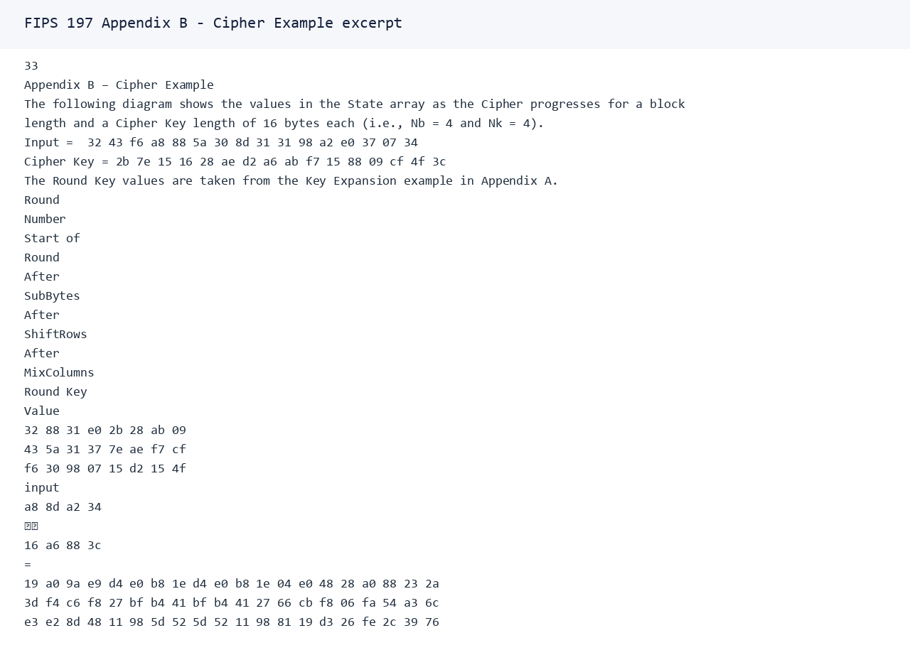
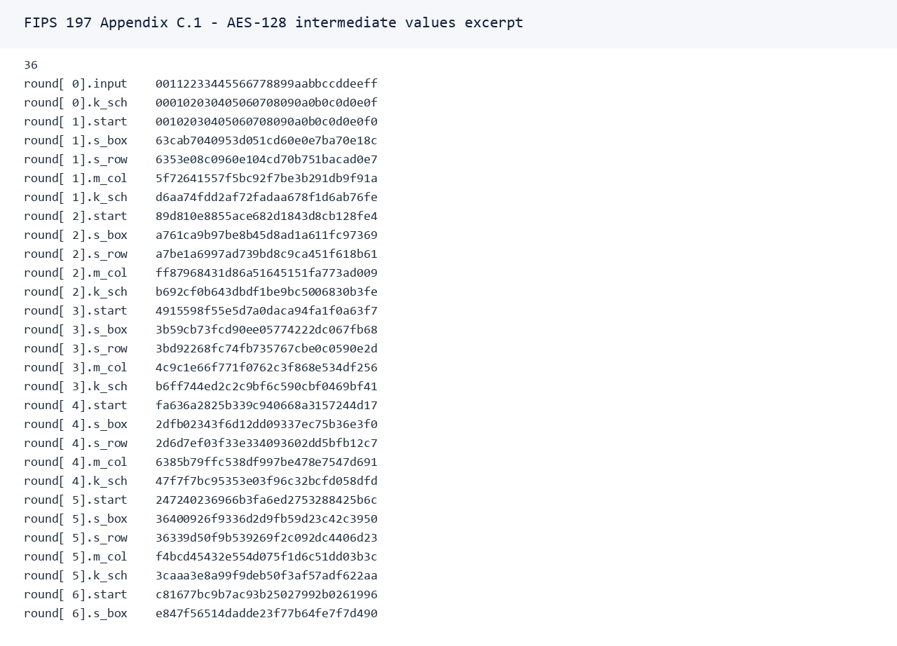

# AES Verbose Mode 对照说明

## 范围

本阶段实现的 verbose mode 仅覆盖 AES-128/192/256、ECB、单个 16 字节分组加密。它用于教学可视化，trace 中包含明文等价中间状态，因此后端不会把 trace 写入 audit log 或 metrics。

## 权威来源

- NIST FIPS 197 updated 2023: https://nvlpubs.nist.gov/nistpubs/FIPS/NIST.FIPS.197-upd1.pdf
- NIST FIPS 197 original PDF: https://tsapps.nist.gov/publication/get_pdf.cfm?pub_id=901427

用户指定的 `plaintext=00112233445566778899aabbccddeeff` 与 `key=000102030405060708090a0b0c0d0e0f` 是 FIPS 197 原版 Appendix C.1 的 AES-128 example vector。Appendix B 是 cipher example，但使用另一组示例输入。测试锁定的是本任务指定的 `001122.../000102...` 向量。

## 官方 PDF 片段

Appendix B cipher example 片段：



Appendix C.1 AES-128 intermediate values 片段：



## 自实现 Trace 输出

完整 JSON 输出见 [aes_verbose_trace_fips197.json](aes_verbose_trace_fips197.json)。

输入：

```text
plaintext = 00112233445566778899aabbccddeeff
key       = 000102030405060708090a0b0c0d0e0f
```

关键 state 对照：

| Round | after_add_round_key |
| --- | --- |
| 0 | 00102030405060708090a0b0c0d0e0f0 |
| 1 | 89d810e8855ace682d1843d8cb128fe4 |
| 2 | 4915598f55e5d7a0daca94fa1f0a63f7 |
| 3 | fa636a2825b339c940668a3157244d17 |
| 4 | 247240236966b3fa6ed2753288425b6c |
| 5 | c81677bc9b7ac93b25027992b0261996 |
| 6 | c62fe109f75eedc3cc79395d84f9cf5d |
| 7 | d1876c0f79c4300ab45594add66ff41f |
| 8 | fde3bad205e5d0d73547964ef1fe37f1 |
| 9 | bd6e7c3df2b5779e0b61216e8b10b689 |
| 10 | 69c4e0d86a7b0430d8cdb78070b4c55a |

测试 `symmetric::aes::trace::fips_197_aes128_trace_matches_every_intermediate_state` hard-code 了每轮 `after_sub_bytes`、`after_shift_rows`、`after_mix_columns`、`after_add_round_key`，运行结果与 FIPS 197 Appendix C.1 byte-level 完全一致。
